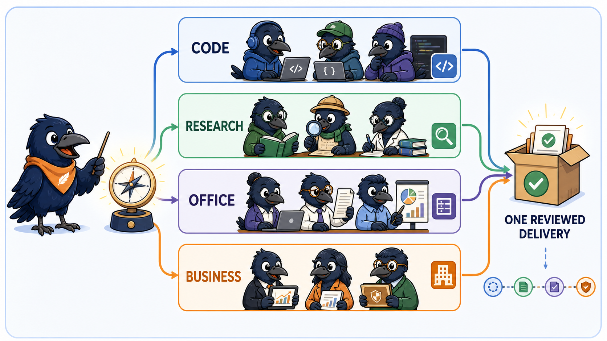

<p align="center">
  <strong>OpenCorvus</strong>
</p>

<p align="center">
  <strong>English</strong> | <a href="./README.zh-CN.md">简体中文</a>
</p>

<p align="center">
  <strong>Open-source orchestration for multi-agent work.</strong>
</p>

<p align="center">
  <a href="https://opencorvus.ai">Website</a> ·
  <a href="https://opencorvus.ai/docs">Documentation</a> ·
  <a href="#download-the-desktop-app">Downloads</a> ·
  <a href="#quick-start">Quick Start</a>
</p>

OpenCorvus runs agent work from a desktop application, Hypertext Transfer
Protocol (HTTP) application programming interface (API), or connected channel.
It assigns each Task to one fixed Expert Squad and, when the package requires
one, a declared workflow. It streams execution and stores messages, tool results,
Artifacts, and completion evidence. A Mission can coordinate several Tasks when
an outcome needs different squads or explicit dependencies.

> [!IMPORTANT]
> OpenCorvus is under active development. This README describes capabilities in
> the repository today. Output quality depends on the selected models, reachable
> sources, installed capabilities, and available evidence. Unattended work only
> runs while the local or hosted OpenCorvus runtime is online.

## Core model

| Object           | Role                                                                                                                        |
| ---------------- | --------------------------------------------------------------------------------------------------------------------------- |
| Mission          | Coordinates an outcome that spans multiple Tasks and records their dependencies.                                            |
| Task             | Owns one project-scoped unit of work, one fixed Expert Squad, any selected workflow, its Sessions, and lifecycle decisions. |
| Expert Squad     | Packages an agent roster, instructions, Skills, tools, Model Context Protocol (MCP) access, and any declared workflows.     |
| Workflow         | Declares the agents that run for a Task and their dependency order.                                                         |
| Artifact         | Stores a typed output or file snapshot with provenance so another agent or Task can read the exact result.                  |
| Host observation | Records facts such as file changes and command results independently of an agent's summary.                                 |

For a Task, the selected Expert Squad remains fixed; a selected workflow is also
fixed. Workers stream messages and tool calls, publish Artifacts when their
contract requires them, and pass exact Artifact references to downstream
workers. The Orchestrator uses those records and host observations for lifecycle
decisions. Unresolved limitations and blockers remain visible in agent messages.



## Quick Start

### Download the desktop app

Download one installer for your operating system from the
[latest GitHub Release](https://github.com/yangheng95/opencorvus/releases/latest),
or browse [all releases](https://github.com/yangheng95/opencorvus/releases).
The large per-platform artifacts shown on a GitHub Actions run are build
containers that hold several formats; public Releases expose every installer
as a separate download.

| Operating system    | Recommended asset                       | Alternatives                                       |
| ------------------- | --------------------------------------- | -------------------------------------------------- |
| Windows x64         | `OpenCorvus_<version>_x64-setup.exe`    | `.msi` for managed installation                    |
| macOS Apple silicon | `OpenCorvus_<version>_aarch64.dmg`      | `.app.tar.gz` archive                              |
| macOS Intel         | `OpenCorvus_<version>_x64.dmg`          | `.app.tar.gz` archive                              |
| Linux x64           | `OpenCorvus_<version>_amd64.AppImage`   | `.deb` for Debian/Ubuntu or `.rpm` for Fedora/RHEL |
| Linux ARM64         | `OpenCorvus_<version>_aarch64.AppImage` | `_arm64.deb` or `.aarch64.rpm`                     |

For terminal or headless use, the same Release publishes a complete
`opencorvus-<platform>.tar.gz` CLI runtime for every row. x64 platforms also
publish a `-baseline.tar.gz` variant for processors without Advanced Vector
Extensions 2 (AVX2).

Replace `<version>` with the version shown on the release, for example
`0.0.37-beta`. Download only the file you intend to install.

### Install from source

```bash
git clone https://github.com/yangheng95/opencorvus.git
cd opencorvus
bun install
bun run --cwd packages/opencorvus build
bun packages/opencorvus/src/index.ts doctor
```

The source build above is the repository-local installation path. Desktop
downloads are verified by the native GitHub Actions package matrix attached to
their release; a development Actions artifact is not a public installer feed.

### Start the server

Start the headless server in the repository where you want OpenCorvus to work:

```bash
OPENCORVUS_SOURCE=/path/to/opencorvus/packages/opencorvus/src/index.ts
cd /path/to/your/repo
bun "$OPENCORVUS_SOURCE" serve
```

Open the local Overlay at `http://127.0.0.1:7878/ui/`, or create a Task through
the HTTP API:

```bash
curl -X POST http://127.0.0.1:7878/task \
  -H "content-type: application/json" \
  -H "x-opencorvus-directory: $PWD" \
  -d '{
    "request": "Implement the requested change, validate it, and stop only when the result is ready for review or a real blocker is visible."
  }'
```

The server returns `202` with a `task_id`. Stream progress with Server-Sent
Events (SSE):

```bash
curl -N http://127.0.0.1:7878/task/<task_id>/events
```

> [!TIP]
> If you expose `opencorvus serve` beyond localhost, set
> `OPENCORVUS_SERVER_PASSWORD` first.

## Control OpenCorvus from Hermes Agent or OpenClaw

The repository includes a portable [`opencorvus` Agent Skill](./skills/opencorvus/SKILL.md).
It teaches an Agent Skills-compatible assistant how to inspect, configure, run,
and troubleshoot OpenCorvus; create and monitor Tasks; send follow-up input; and
review delivery evidence. Installing the skill does **not** install the
OpenCorvus runtime, so complete one of the installation paths above first and
copy the complete skill directory, including its [`references/`](./skills/opencorvus/references/)
files.

### Hermes Agent

From an OpenCorvus checkout:

```bash
mkdir -p ~/.hermes/skills/developer-tools
cp -R ./skills/opencorvus ~/.hermes/skills/developer-tools/opencorvus
hermes skills list
```

Start a new session or use `/reset`, then address the skill as a slash command:

```text
/opencorvus Check whether OpenCorvus is installed and healthy. Do not change anything.
```

### OpenClaw

Install the same local package into the active workspace:

```bash
openclaw skills install ./skills/opencorvus --as opencorvus
openclaw skills check
```

Start a new session, then invoke `$opencorvus` in the Control UI or
`/opencorvus` in messaging channels:

```text
Use $opencorvus to start OpenCorvus for /absolute/path/to/project, create a Task for the requested outcome, and report the task ID and observable progress.
```

Once invoked, the assistant selects the relevant packaged reference and controls
OpenCorvus through its current command-line interface (CLI) or HTTP API. You can
ask it to inspect an installation without changing it, configure a provider,
start a local or password-protected service, create or monitor a Task, send a
follow-up message, retry or replan work, cancel with explicit authority, and
inspect the board, events, Artifacts, and blockers before declaring completion.
For host-specific installation details, PowerShell commands, safe credential
handling, and complete operating examples, see the
[`skill-installation`](./skills/opencorvus/references/skill-installation.md) and
[`operations`](./skills/opencorvus/references/operations.md) references.

## Platform surfaces

| Surface                | Status        | What it provides                                                                                                                |
| ---------------------- | ------------- | ------------------------------------------------------------------------------------------------------------------------------- |
| Desktop Overlay        | Available     | Conversations, Missions, Tasks, Expert Squads, evidence, and delivery review                                                    |
| Headless HTTP API      | Available     | Task lifecycle routes and SSE progress streams                                                                                  |
| Slack gateway          | Available     | Start and operate orchestrated work from a Slack thread                                                                         |
| Multi-channel adapters | In repository | Slack, Telegram, Discord, Feishu, WhatsApp, Google Chat, Microsoft Teams, Line, Matrix, Mattermost, Signal, WeCom, and DingTalk |
| GitHub Action          | Available     | Repository automation described in [`github/README.md`](./github/README.md)                                                     |

Useful Task endpoints:

- `GET /tasks` with a project directory
- `GET /task/<task_id>` without a project directory
- `GET /task/<task_id>/board` without a project directory
- `POST /task/<task_id>/message` with the Task project directory
- `POST /task/<task_id>/retry` with the Task project directory
- `POST /task/<task_id>/replan` with the Task project directory
- `POST /task/<task_id>/cancel` with the Task project directory

### Coding CLI shortcuts

The desktop can discover installed Claude Code, Codex, Gemini Code, GitHub
Copilot, and GLM Code command-line interfaces and open one in a terminal at the
current project directory. This starts an interactive terminal command; it does
not assign the Task to an external executor.

### Slack

```bash
export SLACK_BOT_TOKEN=xoxb-...
export SLACK_APP_TOKEN=xapp-...
bun run --cwd packages/channel-runtime dev
```

The gateway starts work from the first message in a thread, mirrors planning and
delivery updates, accepts permission responses such as `allow`, `always`, and
`reject`, and carries operator follow-ups back into the Task.

## Development

```bash
# repository root
bun install

# core command-line interface and orchestrator
bun run --cwd packages/opencorvus typecheck
bun run --cwd packages/opencorvus test

# channel runtime adapters
bun run --cwd packages/channel-runtime test

# regenerate the JavaScript Software Development Kit (SDK)
bun ./packages/sdk/js/script/build.ts
```

## Limits

- OpenCorvus coordinates compatible models, tools, and executors; it does not
  make arbitrary third-party code compatible or safe.
- Persisted Tasks can be resumed, but no work executes while the owning runtime
  is offline.
- Results depend on model behavior, source access, installed capabilities, and
  the evidence available to the run.
- The project is in active development. Interfaces and packaged integrations may
  change between beta releases.

## Documentation and contributing

- Documentation: <https://opencorvus.ai/docs>
- Changelog: [`CHANGELOG.md`](./CHANGELOG.md)
- GitHub Action: [`github/README.md`](./github/README.md)
- Contributing: [`CONTRIBUTING.md`](./CONTRIBUTING.md)
- Support: [`SUPPORT.md`](./SUPPORT.md)
- Security: [`SECURITY.md`](./SECURITY.md)
- Code of Conduct: [`CODE_OF_CONDUCT.md`](./CODE_OF_CONDUCT.md)
- Third-party notices: [`THIRD_PARTY_NOTICES.md`](./THIRD_PARTY_NOTICES.md)

## Open-source acknowledgements

OpenCorvus evolved from the [OpenCode](https://github.com/anomalyco/opencode)
codebase and still carries explicitly synchronized OpenCode work in its model
provider, GitHub Copilot, and provider-plugin surfaces. We are grateful to the
OpenCode maintainers and contributors for that foundation.

Major runtime and distribution dependencies include:

- **Runtime and agent core:** [Bun](https://github.com/oven-sh/bun),
  [Vercel AI SDK](https://github.com/vercel/ai),
  [Hono](https://github.com/honojs/hono), and
  [Drizzle ORM](https://github.com/drizzle-team/drizzle-orm).
- **Open interoperability:** the official
  [Model Context Protocol TypeScript SDK](https://github.com/modelcontextprotocol/typescript-sdk),
  [MCP Apps](https://github.com/modelcontextprotocol/ext-apps), and
  [Agent Client Protocol TypeScript SDK](https://github.com/agentclientprotocol/typescript-sdk).
- **Desktop application:** [Tauri](https://github.com/tauri-apps/tauri),
  [SolidJS](https://github.com/solidjs/solid), and
  [Kobalte](https://github.com/kobaltedev/kobalte).
- **Execution and evidence:** [Playwright](https://github.com/microsoft/playwright),
  [CUA](https://github.com/trycua/cua), and
  [OfficeCLI](https://github.com/iOfficeAI/OfficeCLI).
- **Packaged command-line runtime:** [Node.js](https://github.com/nodejs/node)
  and [ripgrep](https://github.com/BurntSushi/ripgrep).
- **Interactive workbench:** [CodeMirror](https://github.com/codemirror/dev),
  [xterm.js](https://github.com/xtermjs/xterm.js),
  [Mermaid](https://github.com/mermaid-js/mermaid),
  [MapLibre GL JS](https://github.com/maplibre/maplibre-gl-js),
  [PDF.js](https://github.com/mozilla/pdf.js),
  [Reveal.js](https://github.com/hakimel/reveal.js),
  [Vega-Lite](https://github.com/vega/vega-lite),
  [Cytoscape.js](https://github.com/cytoscape/cytoscape.js), and
  [Univer](https://github.com/dream-num/univer).
- **Built-in capability sources:** the bundled design and interview Skills
  adapt ideas and protocols from
  [Taste Skill](https://github.com/Leonxlnx/taste-skill) and
  [Matt Pocock's Skills](https://github.com/mattpocock/skills). Their provenance
  and license files remain with the adapted Skills.
- **Documentation:** [Astro](https://github.com/withastro/astro) and
  [Starlight](https://github.com/withastro/starlight).

The repository manifests and [`THIRD_PARTY_NOTICES.md`](./THIRD_PARTY_NOTICES.md)
contain the complete dependency and notice records. Each upstream project keeps
its own license and trademarks.

## License

[MIT](./LICENSE)
