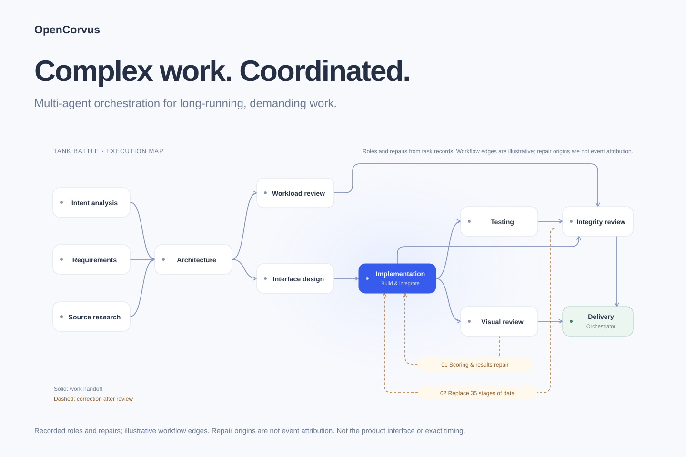

<p align="center">
  
</p>

<h3 align="center">The open-source harness for long-horizon agent work</h3>

<p align="center">
  <strong>Expert squads carry long, complex tasks forward, retain progress, and produce results you can check.</strong>
</p>

<p align="center">
  <a href="https://github.com/yangheng95/opencorvus/releases"></a>
  <a href="./LICENSE"></a>
  
  <a href="https://github.com/yangheng95/opencorvus/actions/workflows/typecheck.yml"></a>
  <a href="https://github.com/yangheng95/opencorvus/actions/workflows/codeql.yml"></a>
</p>

<p align="center">
  <a href="https://opencorvus.com"></a>
  <a href="https://bun.sh"></a>
  
  <a href="https://opencorvus.com/market/"></a>
  
</p>

<p align="center">
  <strong>English</strong> | <a href="./README.zh-CN.md">简体中文</a>
</p>

<p align="center">
  <a href="https://opencorvus.com">Website</a> ·
  <a href="https://opencorvus.com/start/quickstart/">Quickstart</a> ·
  <a href="https://opencorvus.com/download/">Download</a> ·
  <a href="https://opencorvus.com/market/">Expert Squads</a> ·
  <a href="https://opencorvus.com/concepts/long-horizon/">Long-horizon</a> ·
  <a href="https://opencorvus.com/concepts/squad-composition/">Composition</a> ·
  <a href="https://opencorvus.com/expert-squads/evolution/">Evolution</a>
</p>

---

OpenCorvus is an open-source harness for long, complex agent tasks. It brings models, tools, context and expert-squad coordination into one runtime.

- **Carry work forward:** research, implementation and independent review connect through clear responsibilities.
- **Retain progress:** task state and context support continued work and recovery after interruption.
- **Check the result:** tool calls, artifacts and review evidence stay in the work record.

## Task gallery

[Explore task inputs, models and coordination graphs](https://opencorvus.com/#gallery): CUDA training and a research paper with **GPT-5.6 Sol**, and a tank game with **DeepSeek V4 Flash**.

The tank-game case involved 19 acceptance requirements, source data for 35 stages and two correction rounds.



Roles and repair themes come from task records; edges illustrate the workflow and repair origins do not attribute events.
The task included an operator decision and has test-report and fidelity limits: [read the evidence](https://opencorvus.com/cases/tank-battle/).

## Quick Start

[Download the desktop app](https://opencorvus.com/download/) → configure a reachable model → choose a project and squad → submit a goal and acceptance criteria.

Or start from source:

```bash
git clone https://github.com/yangheng95/opencorvus.git
cd opencorvus
bun install
bun run --cwd packages/opencorvus build
bun packages/opencorvus/src/index.ts doctor
```

[Installation guide](https://opencorvus.com/start/install/) · [Expert Squads](https://opencorvus.com/market/)

Work requires an online runtime and reachable model provider. Results depend on the task, model and available evidence. Important permissions and publishing decisions remain yours.

## Further reading

The detailed material is now organized in the [blog](https://opencorvus.com/blog/):

- [Cases: coordinating expert squads](https://opencorvus.com/blog/squad-composition/)
- [Mechanisms: the long-horizon harness](https://opencorvus.com/blog/long-horizon/) · [Squad revisions](https://opencorvus.com/blog/squad-evolution/)
- [Research: AutomationBench](https://opencorvus.com/blog/automationbench/) · [The paper](https://opencorvus.com/blog/research/)
- [Practice: deployment and integrations](https://opencorvus.com/blog/deployment-and-integrations/) · [Choosing and boundaries](https://opencorvus.com/blog/choosing-and-boundaries/)

[Documentation](https://opencorvus.com/start/quickstart/) · [Contributing](./CONTRIBUTING.md) · [Issues](https://github.com/yangheng95/opencorvus/issues)

## Open-source acknowledgements

OpenCorvus evolved from the [OpenCode](https://github.com/anomalyco/opencode) codebase
and still carries explicitly synchronized OpenCode work in its model provider, GitHub
Copilot, and provider-plugin surfaces. We are grateful to the OpenCode maintainers and
contributors for that foundation.

Major runtime and distribution dependencies include:

- **Runtime and agent core:** [Bun](https://github.com/oven-sh/bun),
  [Vercel AI SDK](https://github.com/vercel/ai),
  [Hono](https://github.com/honojs/hono), and
  [Drizzle ORM](https://github.com/drizzle-team/drizzle-orm).
- **Open interoperability:** the official
  [Model Context Protocol TypeScript SDK](https://github.com/modelcontextprotocol/typescript-sdk),
  [MCP Apps](https://github.com/modelcontextprotocol/ext-apps), and
  [Agent Client Protocol TypeScript SDK](https://github.com/agentclientprotocol/typescript-sdk).
- **Desktop application:** [Tauri](https://github.com/tauri-apps/tauri),
  [SolidJS](https://github.com/solidjs/solid), and
  [Kobalte](https://github.com/kobaltedev/kobalte).
- **Execution and evidence:** [Playwright](https://github.com/microsoft/playwright),
  [CUA](https://github.com/trycua/cua), and
  [OfficeCLI](https://github.com/iOfficeAI/OfficeCLI).
- **Packaged command-line runtime:** [Node.js](https://github.com/nodejs/node) and
  [ripgrep](https://github.com/BurntSushi/ripgrep).
- **Interactive workbench:** [CodeMirror](https://github.com/codemirror/dev),
  [xterm.js](https://github.com/xtermjs/xterm.js),
  [Mermaid](https://github.com/mermaid-js/mermaid),
  [MapLibre GL JS](https://github.com/maplibre/maplibre-gl-js),
  [PDF.js](https://github.com/mozilla/pdf.js),
  [Reveal.js](https://github.com/hakimel/reveal.js),
  [Vega-Lite](https://github.com/vega/vega-lite),
  [Cytoscape.js](https://github.com/cytoscape/cytoscape.js), and
  [Univer](https://github.com/dream-num/univer).
- **Built-in capability sources:** the bundled design and interview Skills adapt ideas
  and protocols from [Taste Skill](https://github.com/Leonxlnx/taste-skill) and
  [Matt Pocock's Skills](https://github.com/mattpocock/skills). Their provenance and
  license files remain with the adapted Skills.
- **Documentation:** [Astro](https://github.com/withastro/astro) and
  [Starlight](https://github.com/withastro/starlight).

The repository manifests and [`THIRD_PARTY_NOTICES.md`](./THIRD_PARTY_NOTICES.md)
contain the complete dependency and notice records. Each upstream project keeps its own
license and trademarks.

## License

[MIT](./LICENSE)
