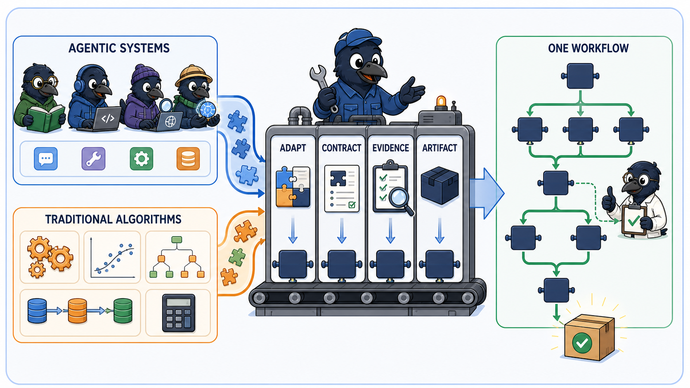

<p align="center">
  <strong>OpenCorvus</strong>
</p>

<p align="center">
  <strong>English</strong> | <a href="./README.zh-CN.md">简体中文</a>
</p>

<p align="center">
  <strong>Build an AI organization around the way you work.</strong><br>
  <em>Customize Expert Squads. Run long-horizon Missions. Turn specialist collaboration into reviewed delivery.</em>
</p>

<p align="center">
  <a href="https://opencorvus.ai">Website</a> ·
  <a href="https://opencorvus.ai/docs">Documentation</a> ·
  <a href="#quick-start">Quick Start</a>
</p>

OpenCorvus is an open-source Agent Harness for building a dedicated artificial
intelligence (AI) organization, not merely configuring another chatbot. Define
the specialists, tools, models, and working methods your work requires; give
them a real outcome; then let durable Missions coordinate the work across days,
stages, and domains.

Each specialist team remains accountable for its own Task. Research can inform
planning, planning can guide implementation, and independent reviewers can
challenge the result through accepted, traceable Artifacts instead of shared
hidden context. You get an organization shaped around your work and one visible
delivery trail from request to reviewed result.

> [!IMPORTANT]
> OpenCorvus is under active development. This README describes capabilities in
> the repository today. Output quality depends on the selected models, reachable
> sources, installed capabilities, and evidence available to the run.
> “Always-on” means the local or hosted OpenCorvus runtime remains online; a
> powered-off machine cannot continue executing work.

## Three reasons to build on OpenCorvus

### 1. Customize the organization, not just the prompt

An **Expert Squad** is a self-contained organizational unit: specialist roles,
instructions, Skills, tools, Model Context Protocol (MCP) servers, and a declared
workflow packaged together. Start with the built-in code, research, office, and
business squads, or use the Squad Software Development Kit (SDK) to create teams
for your own domain and standards.

Connect compatible models, coding agents, Agentic systems, deterministic tools,
optimization models, and traditional algorithms through explicit adapters and
self-contained packages:

**adapt → contract → evidence → Artifact**

OpenCorvus standardizes how capabilities enter a workflow and deliver results.
It does not pretend arbitrary third-party code is automatically compatible or
safe.

### 2. Keep long-horizon work coherent

Start with the outcome, not an agent topology. A durable **Mission** separates a
large objective into accountable **Tasks** and preserves requirements, decisions,
lineage, interactions, and accepted Artifacts as the work advances. A later
stage continues from reviewed evidence instead of asking you to reconstruct the
context or trust a summary from memory.

Tasks are resumable, recurring work retains its history, and real blockers stay
visible. When the local or hosted runtime remains online, OpenCorvus can keep
advancing unattended work beyond a single chat turn or desktop session.

### 3. Make Expert Squads collaborate as one delivery organization

Every Task keeps one fixed Expert Squad and one declared workflow, so ownership
never becomes ambiguous. The Mission coordinates the larger outcome: independent
teams can work in parallel, dependent teams begin after their required evidence
is accepted, and typed Artifacts carry exact sources and decisions between them.

That makes cross-domain collaboration concrete. A research squad can hand an
evidence dossier to a planning squad; a development squad can implement the
accepted plan; testing and review squads can independently inspect the result.
The final delivery retains the contribution and evidence of every stage.


### Delivery is the finish line

An agent stopping is not the same as a Task completing. OpenCorvus preserves
typed, content-addressed **Artifacts**, exact lineage, implementation and source
evidence, and independent review. If required evidence is missing, the blocker
stays visible instead of being presented as a successful delivery.

## Assemble an organization for the outcome

| Outcome                         | Expert Squad collaboration                                                            | Reviewable delivery                                                            |
| ------------------------------- | ------------------------------------------------------------------------------------- | ------------------------------------------------------------------------------ |
| Ship a repository change        | Requirements and architecture → development → testing and review                      | Implementation, validation, version-control evidence, and independent findings |
| Produce deep research           | Research charter → parallel source specialists → evidence synthesis → citation review | Source dossier, cited report, assumptions, and review evidence                 |
| Analyze a company or market     | Source research → financial or market analysis → risk audit                           | Dated evidence, scenarios, risks, and an independently challenged conclusion   |
| Create an editable presentation | Research and narrative → Office Artifact production → render and visual review        | PowerPoint Open XML Presentation (PPTX) package and exact reviewed file        |
| Operate recurring work          | Scheduled triage → domain squad → review or permissioned action                       | Visible target, run history, retained context, and action-required state       |
| Add your own specialty          | Squad SDK authoring → package validation → Mission assignment                         | A self-contained Expert Squad with exact identity, workflow, and capabilities  |

## One Mission, many specialists, one accountable result

```text
your long-horizon outcome
  → Mission owns the delivery chain
     ├─ Task A · Research Squad ──────┐
     ├─ Task B · Domain Squad ────────┼─ accepted Artifact evidence
     └─ Task C · Analysis Squad ──────┘
                                      ↓
                         Task D · Build Squad
                                      ↓
                       Task E · Independent Review
                                      ↓
                          one reviewed delivery
```

1. Send an outcome from the desktop, Hypertext Transfer Protocol (HTTP)
   application programming interface (API), Slack, or another connected channel.
2. Let the Mission identify the specialist stages and their acceptance
   boundaries.
3. Bind every Task to one Expert Squad and one declared workflow for its complete
   lifecycle.
4. Run independent specialists in parallel and dependent specialists only after
   their required evidence succeeds.
5. Hand typed Artifacts between squads instead of copying conclusions through
   orchestration prose.
6. Let independent specialists review the implementation, runtime, visual,
   source, and Artifact evidence their domain requires.
7. Deliver one result when the full evidence chain supports it; otherwise keep
   the real blocker visible.

## Quick Start

### Download the desktop app

Download one installer for your operating system from the
[latest GitHub Release](https://github.com/yangheng95/opencorvus/releases/latest),
or browse [all releases](https://github.com/yangheng95/opencorvus/releases).
The large per-platform artifacts shown on a GitHub Actions run are build
containers that hold several formats; public Releases expose every installer
as a separate download.

| Operating system    | Recommended asset                       | Alternatives                                       |
| ------------------- | --------------------------------------- | -------------------------------------------------- |
| Windows x64         | `OpenCorvus_<version>_x64-setup.exe`    | `.msi` for managed installation                    |
| macOS Apple silicon | `OpenCorvus_<version>_aarch64.dmg`      | `.app.tar.gz` archive                              |
| macOS Intel         | `OpenCorvus_<version>_x64.dmg`          | `.app.tar.gz` archive                              |
| Linux x64           | `OpenCorvus_<version>_amd64.AppImage`   | `.deb` for Debian/Ubuntu or `.rpm` for Fedora/RHEL |
| Linux ARM64         | `OpenCorvus_<version>_aarch64.AppImage` | `_arm64.deb` or `.aarch64.rpm`                     |

For terminal or headless use, the same Release publishes a complete
`opencorvus-<platform>.tar.gz` CLI runtime for every row. x64 platforms also
publish a `-baseline.tar.gz` variant for processors without Advanced Vector
Extensions 2 (AVX2).

Replace `<version>` with the version shown on the release, for example
`0.0.35-beta`. Download only the file you intend to install.

### Install from source

```bash
git clone https://github.com/yangheng95/opencorvus.git
cd opencorvus
bun install
bun run --cwd packages/opencorvus build
bun packages/opencorvus/src/index.ts doctor
```

The source build above is the repository-local installation path. Desktop
downloads are verified by the native GitHub Actions package matrix attached to
their release; a development Actions artifact is not a public installer feed.

### Start your assistant

Start the headless server in the repository where you want OpenCorvus to work:

```bash
OPENCORVUS_SOURCE=/path/to/opencorvus/packages/opencorvus/src/index.ts
cd /path/to/your/repo
bun "$OPENCORVUS_SOURCE" serve
```

Open the local Overlay at `http://127.0.0.1:7878/ui/`, or create a Task through
the HTTP API:

```bash
curl -X POST http://127.0.0.1:7878/task \
  -H "content-type: application/json" \
  -H "x-opencorvus-directory: $PWD" \
  -d '{
    "request": "Implement the requested change, validate it, and stop only when the result is ready for review or a real blocker is visible."
  }'
```

The server returns `202` with a `task_id`. Stream progress with Server-Sent
Events (SSE):

```bash
curl -N http://127.0.0.1:7878/task/<task_id>/events
```

> [!TIP]
> If you expose `opencorvus serve` beyond localhost, set
> `OPENCORVUS_SERVER_PASSWORD` first.

## Control OpenCorvus from Hermes Agent or OpenClaw

The repository includes a portable [`opencorvus` Agent Skill](./skills/opencorvus/SKILL.md).
It teaches an Agent Skills-compatible assistant how to inspect, configure, run,
and troubleshoot OpenCorvus; create and monitor Tasks; send follow-up input; and
review delivery evidence. Installing the skill does **not** install the
OpenCorvus runtime, so complete one of the installation paths above first and
copy the complete skill directory, including its [`references/`](./skills/opencorvus/references/)
files.

### Hermes Agent

From an OpenCorvus checkout:

```bash
mkdir -p ~/.hermes/skills/developer-tools
cp -R ./skills/opencorvus ~/.hermes/skills/developer-tools/opencorvus
hermes skills list
```

Start a new session or use `/reset`, then address the skill as a slash command:

```text
/opencorvus Check whether OpenCorvus is installed and healthy. Do not change anything.
```

### OpenClaw

Install the same local package into the active workspace:

```bash
openclaw skills install ./skills/opencorvus --as opencorvus
openclaw skills check
```

Start a new session, then invoke `$opencorvus` in the Control UI or
`/opencorvus` in messaging channels:

```text
Use $opencorvus to start OpenCorvus for /absolute/path/to/project, create a Task for the requested outcome, and report the task ID and observable progress.
```

Once invoked, the assistant selects the relevant packaged reference and controls
OpenCorvus through its current command-line interface (CLI) or HTTP API. You can
ask it to inspect an installation without changing it, configure a provider,
start a local or password-protected service, create or monitor a Task, send a
follow-up message, retry or replan work, cancel with explicit authority, and
inspect the board, events, Artifacts, and blockers before declaring completion.
For host-specific installation details, PowerShell commands, safe credential
handling, and complete operating examples, see the
[`skill-installation`](./skills/opencorvus/references/skill-installation.md) and
[`operations`](./skills/opencorvus/references/operations.md) references.

## Platform surfaces

| Surface                | Status        | What it provides                                                                                                                |
| ---------------------- | ------------- | ------------------------------------------------------------------------------------------------------------------------------- |
| Desktop Overlay        | Available     | Conversations, Missions, Tasks, Expert Squads, evidence, and delivery review                                                    |
| Headless HTTP API      | Available     | Task lifecycle routes and SSE progress streams                                                                                  |
| Slack gateway          | Available     | Start and operate orchestrated work from a Slack thread                                                                         |
| Multi-channel adapters | In repository | Slack, Telegram, Discord, Feishu, WhatsApp, Google Chat, Microsoft Teams, Line, Matrix, Mattermost, Signal, WeCom, and DingTalk |
| GitHub Action          | Available     | Repository automation described in [`github/README.md`](./github/README.md)                                                     |

Useful Task endpoints:

- `GET /tasks` with a project directory
- `GET /task/<task_id>` without a project directory
- `GET /task/<task_id>/board` without a project directory
- `POST /task/<task_id>/message` with the Task project directory
- `POST /task/<task_id>/retry` with the Task project directory
- `POST /task/<task_id>/replan` with the Task project directory
- `POST /task/<task_id>/cancel` with the Task project directory

### External coding executors

OpenCorvus includes its own executor and can dispatch to supported coding
command-line interfaces when they are installed and discovery is enabled:

```bash
export OPENCORVUS_AUTO_DISCOVER_EXECUTORS=1
```

Current executor display names are OpenCorvus (`opencorvus`), Codex (`codex`),
and Claude Code (`claude-code`). Selecting an undiscovered external executor is
rejected explicitly; OpenCorvus does not silently substitute another executor.

### Slack

```bash
export SLACK_BOT_TOKEN=xoxb-...
export SLACK_APP_TOKEN=xapp-...
bun run --cwd packages/channel-runtime dev
```

The gateway starts work from the first message in a thread, mirrors planning and
delivery updates, accepts permission responses such as `allow`, `always`, and
`reject`, and carries operator follow-ups back into the Task.

## Where OpenCorvus fits

| Category            | What it is best at                                  | What OpenCorvus adds                                                      |
| ------------------- | --------------------------------------------------- | ------------------------------------------------------------------------- |
| Agent frameworks    | Building custom agents and graphs                   | A user-facing Harness that owns long-running, cross-domain delivery       |
| Workflow automation | Connecting applications and explicit business logic | Evidence-led Tasks whose next step can depend on reviewed work            |
| Coding agents       | Working inside repositories                         | Code as one specialist path beside research, office, and business work    |
| General assistants  | Broad conversational help                           | Dedicated teams, durable context, exact lineage, and reviewable Artifacts |

## Development

```bash
# repository root
bun install

# core command-line interface and orchestrator
bun run --cwd packages/opencorvus typecheck
bun run --cwd packages/opencorvus test

# channel runtime adapters
bun run --cwd packages/channel-runtime test

# regenerate the JavaScript Software Development Kit (SDK)
bun ./packages/sdk/js/script/build.ts
```

## Frequently asked questions

### Does OpenCorvus replace my coding agent or model?

No. OpenCorvus is the Harness around compatible capabilities. It gives them
durable Tasks, specialist teams, permissions, remote channels, Artifact lineage,
review loops, and operator feedback so their work becomes observable and
reviewable.

### Is OpenCorvus only for code?

No. Code and Work are peer paths on the same Mission, permission, memory, and
Artifact substrate. The repository already includes research, office, business,
scheduled-work, channel, and specialist-package surfaces.

### Does it keep context between runs?

Yes. Tasks, requirements, dispatch lineage, interactions, Artifacts, acceptance
evidence, Session state, and project knowledge are persisted locally in SQLite.
Session-scoped and global memory and preferences can remain available to future
runs in the same project.

### Can it really work around the clock?

Yes, while its local or hosted runtime remains online. Tasks are durable and
resumable, but OpenCorvus cannot execute on a machine that has been shut down.

### Is it finished?

No. The core orchestration loop is implemented and the product surface continues
to expand. This README describes current repository capabilities, not every
planned integration.

## Documentation and contributing

- Documentation: <https://opencorvus.ai/docs>
- Changelog: [`CHANGELOG.md`](./CHANGELOG.md)
- GitHub Action: [`github/README.md`](./github/README.md)
- Contributing: [`CONTRIBUTING.md`](./CONTRIBUTING.md)
- Support: [`SUPPORT.md`](./SUPPORT.md)
- Security: [`SECURITY.md`](./SECURITY.md)
- Code of Conduct: [`CODE_OF_CONDUCT.md`](./CODE_OF_CONDUCT.md)
- Third-party notices: [`THIRD_PARTY_NOTICES.md`](./THIRD_PARTY_NOTICES.md)

## Open-source acknowledgements

OpenCorvus evolved from the [OpenCode](https://github.com/anomalyco/opencode)
codebase and still carries explicitly synchronized OpenCode work in its model
provider, GitHub Copilot, and provider-plugin surfaces. We are grateful to the
OpenCode maintainers and contributors for that foundation.

The current product also depends on many excellent open-source projects. The
following list highlights the projects that provide major product boundaries or
ship as key capabilities; it is intentionally not a copy of the complete
dependency graph.

- **Runtime and agent core:** [Bun](https://github.com/oven-sh/bun),
  [Vercel AI SDK](https://github.com/vercel/ai),
  [Hono](https://github.com/honojs/hono), and
  [Drizzle ORM](https://github.com/drizzle-team/drizzle-orm) power the runtime,
  streaming model integration, Hypertext Transfer Protocol (HTTP) application
  programming interface (API), and SQLite persistence layers.
- **Open interoperability:** the official
  [Model Context Protocol TypeScript SDK](https://github.com/modelcontextprotocol/typescript-sdk),
  [MCP Apps](https://github.com/modelcontextprotocol/ext-apps), and
  [Agent Client Protocol TypeScript SDK](https://github.com/agentclientprotocol/typescript-sdk)
  connect OpenCorvus to tools, interactive applications, and external coding
  agents.
- **Desktop application:** [Tauri](https://github.com/tauri-apps/tauri),
  [SolidJS](https://github.com/solidjs/solid), and
  [Kobalte](https://github.com/kobaltedev/kobalte) provide the native shell,
  reactive renderer, and accessible User Interface (UI) primitives.
- **Execution and evidence:** [Playwright](https://github.com/microsoft/playwright),
  [CUA](https://github.com/trycua/cua), and
  [OfficeCLI](https://github.com/iOfficeAI/OfficeCLI) underpin browser evidence,
  host-native Computer Use, and editable Office Artifact inspection and
  rendering.
- **Packaged command-line runtime:** [Node.js](https://github.com/nodejs/node)
  and [ripgrep](https://github.com/BurntSushi/ripgrep) are included in supported
  release closures for Node-based sidecars and fast repository search.
- **Interactive workbench:** [CodeMirror](https://github.com/codemirror/dev),
  [xterm.js](https://github.com/xtermjs/xterm.js),
  [Mermaid](https://github.com/mermaid-js/mermaid),
  [MapLibre GL JS](https://github.com/maplibre/maplibre-gl-js),
  [PDF.js](https://github.com/mozilla/pdf.js),
  [Reveal.js](https://github.com/hakimel/reveal.js),
  [Vega-Lite](https://github.com/vega/vega-lite),
  [Cytoscape.js](https://github.com/cytoscape/cytoscape.js), and
  [Univer](https://github.com/dream-num/univer) make the editor and interactive
  Artifact surfaces possible.
- **Built-in capability sources:** the bundled design and interview Skills
  adapt ideas and protocols from
  [Taste Skill](https://github.com/Leonxlnx/taste-skill) and
  [Matt Pocock's Skills](https://github.com/mattpocock/skills); their local
  provenance and license files remain with the adapted Skills.
- **Documentation:** [Astro](https://github.com/withastro/astro) and
  [Starlight](https://github.com/withastro/starlight) power the documentation
  site.

Thank you to every maintainer and contributor behind these projects and the
many smaller dependencies recorded in the repository manifests. Each upstream
project remains governed by its own license and trademarks. This acknowledgement
does not replace the license and notice files that accompany source and release
artifacts, and it does not imply endorsement or affiliation.

## License

[MIT](./LICENSE)
