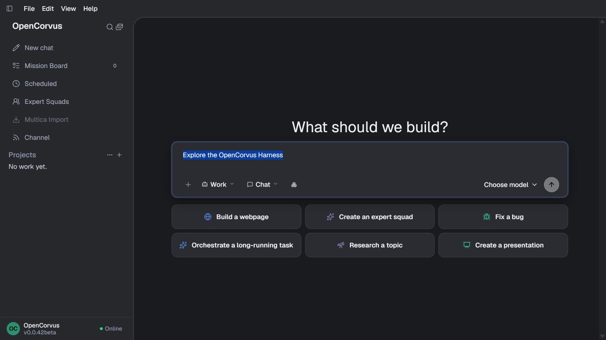
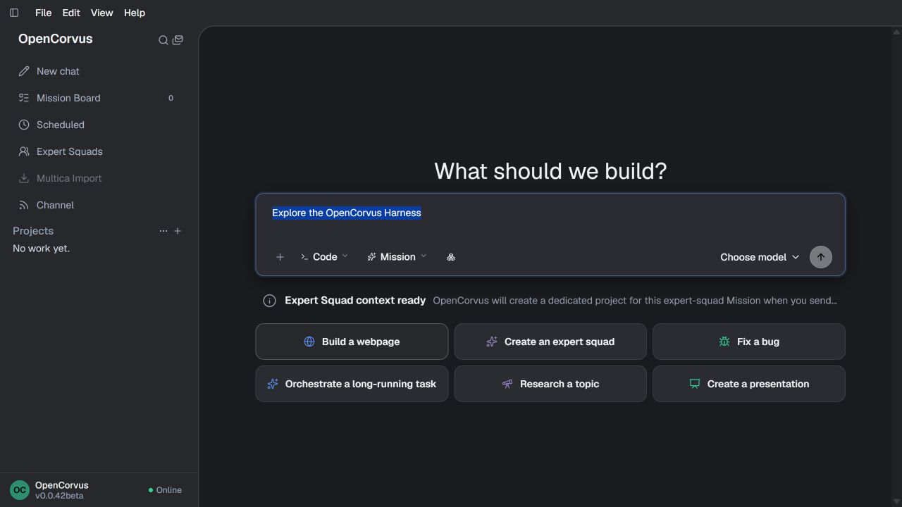

<p align="center">
  
</p>

<h3 align="center">面向长程任务的开源 Agent Harness</h3>

<p align="center">
  <strong>跑得久的工作、能核对的结果，以及会按你的反馈修订自己的专家团。</strong>
</p>

<p align="center">
  <a href="https://github.com/yangheng95/opencorvus/releases"></a>
  <a href="./LICENSE"></a>
  
  <a href="https://github.com/yangheng95/opencorvus/actions/workflows/typecheck.yml"></a>
  <a href="https://github.com/yangheng95/opencorvus/actions/workflows/codeql.yml"></a>
</p>

<p align="center">
  <a href="https://opencorvus.com/zh-cn/"></a>
  <a href="https://bun.sh"></a>
  
  
  
</p>

<p align="center">
  <a href="./README.md">English</a> | <strong>简体中文</strong>
</p>

<p align="center">
  <a href="https://opencorvus.com/zh-cn/">官方网站</a> ·
  <a href="https://opencorvus.com/zh-cn/start/quickstart/">快速开始</a> ·
  <a href="https://opencorvus.com/zh-cn/download/">下载</a> ·
  <a href="https://opencorvus.com/zh-cn/market/">专家团</a> ·
  <a href="https://opencorvus.com/zh-cn/concepts/long-horizon/">长程</a> ·
  <a href="https://opencorvus.com/zh-cn/concepts/squad-composition/">组合</a> ·
  <a href="https://opencorvus.com/zh-cn/expert-squads/evolution/">进化</a>
</p>

---

**Agent Harness** 是把模型变成 Agent 的运行层：循环、工具路由、上下文管理、记忆、
权限执行与故障恢复。长程能力是这整套系统的属性，不是模型单独的属性 —— 再强的模型，
放进一个会丢任务状态的 Harness 里，照样跑不彻底。

OpenCorvus 就是这样一套已经组装好、面向长程工作的 Harness。它随包提供覆盖五个主要
角色的流式 Agent 循环、43 个内置工具、87 个模型供应商的目录、可在重启后恢复的编排、
持久化的权限授权、项目与会话记忆、自动上下文压缩，以及 119 个可检查专家团。Agent
真正开始工作前，必须显式选择模型并配置一个可访问的供应商；目录是能力元数据，不是
隐藏的默认凭据或模型 fallback（后备路径）。

长程工作会在三个地方断，这里对每一处都给了答案：**跑不彻底**、**结果不能核对**、
**工作流永远不会变好**。把多支专家团组合起来，是极长任务之所以可行的原因；让专家团
按你自己的反馈修订，是第十次运行好过第一次的原因。

而下面的每一层都是配置面：换模型、收窄工具集、收紧权限规则、替换整支专家团，或者
直接用 SDK 驱动整个 Harness。

后端运行时与桌面前端都写在这个仓库里，底下没有套第三方 Agent 引擎。这不是什么值得
炫耀的事，而是「每一层都能换掉」的前提。它同样站在大量开源项目的肩膀上 —— Bun、
AI SDK、SolidJS、Tauri 都在其中。

<p align="center">
  <a href="https://github.com/yangheng95/opencorvus/raw/main/packages/web/public/media/opencorvus-demo.mp4"></a>
</p>

<p align="center"><sub>同一次真实运行里的两段：它画出的日线图，以及它发布的生态关系图与 Word 研究报告。<a href="https://github.com/yangheng95/opencorvus/raw/main/packages/web/public/media/opencorvus-demo.mp4">看完整运行</a> &mdash; 1 分 44 秒，桌面端 v0.0.47beta，无音轨。</sub></p>

<table>
  <tr>
    <td width="50%"></td>
    <td width="50%"></td>
  </tr>
  <tr>
    <td><strong>Work</strong> 把长篇交付与复核界面留在一起。</td>
    <td><strong>Mission</strong> 把同一份可见上下文变成责任清晰的协同工作。</td>
  </tr>
</table>

> [!IMPORTANT]
> OpenCorvus 仍在开发。本 README 只描述当前仓库已有能力。输出质量取决于所选模型、
> 可访问的数据源、已安装能力和本次运行取得的证据。无人值守任务只会在本地或托管的
> OpenCorvus 运行时在线时执行。

## 长程工作在哪里断

| 断在这里                                                                          | 对应的机制                                                                                                                                                                                                                                                                                           |
| --------------------------------------------------------------------------------- | ---------------------------------------------------------------------------------------------------------------------------------------------------------------------------------------------------------------------------------------------------------------------------------------------------- |
| **跑不彻底。** 某一步被跳过，进程死掉，或者任务进了终态而目标只完成了一半。       | Requirements 产出 `REQ-N` 条目，每条自带验收条件与明确的非目标；专家团的工作流声明谁依赖谁。物理归属是一份只追加的租约：进程消失后，协调器会在租约到期这个确定性时间点上精确终结被遗弃的 Turn，然后才取得后继激活。每一条被接受的输入都要过同一个全序归约，其中每种状态都有名字。                    |
| **结果不能稳定使用。** 报告成功了，拿到的却是一份没法核对的总结。                 | 交接是带来源和精确 locator 的类型化 Artifact，读取要跨一道只暴露「此前步骤已完成产出」的因果边界。宿主独立于 Agent 的自述记录文件变更与命令结果。事实核查、完整性复核与视觉 QA 是各有 Agent 的具名阶段；已限定类别的 Work Artifact（今天是可编辑演示文稿）要真的渲染、检查并拿到校验回执，才算交付。 |
| **工作流永远不会变好。** 第十次运行还在犯第一次的错，因为那次纠正随对话一起死了。 | 把你真正想要的说给专家团，它会据此起草一次修订；你接受，回执就是撤销凭据。或者跑一次带度量的进化实验室活动。没有你的确认，什么都不会安装。                                                                                                                                                           |

终态也不是终点。已进入 `completed`、`failed` 或 `cancelled` 的任务，收到你的消息就会重开，
在一轮新的执行里继续，上一轮作为不可变事实原样保留。这里没有单独的重试或重新规划控件 ——
一个只能靠专用词汇才走得出去的状态，就是一个你用普通动作离开不了的状态。

边界是真实的：无人值守的工作只在你的运行时在线时继续，产出仍取决于所选模型、可访问的来源和
拿到的证据。详见[长程工作在哪里断](https://opencorvus.com/zh-cn/concepts/long-horizon/)。

## 专家团组合起来

最长的工作不是一支队伍干更久，而是几支队伍各自负责一段，每一段交给下一段的都是能读的东西。

Mission 在启动时记录哪些专家团 ID 可用，之后再安装的能力不会静默扩大这个集合。子任务创建时，
从这个集合里解析出一个精确的包版本及其已选工作流，在该任务的生命周期内固定不变。组合发生在
Mission 层，归属仍留在任务层。

### 案例：从调研资料到一篇可投的论文

**6 支专家团 · 33 个具名角色**，全部是目录里已经能用的。

|     | 阶段 | 专家团                                                                                  | 角色 | 交出什么                                                                 |
| --- | ---- | --------------------------------------------------------------------------------------- | ---- | ------------------------------------------------------------------------ |
| 01  | 立题 | [科学研究设计](https://opencorvus.com/zh-cn/market/builtin/scientific-research-design/) | 4    | 证据地貌、竞争假设、严谨性与伦理判断，合成一份研究决策登记册。           |
| 02  | 取证 | [深度研究](https://opencorvus.com/zh-cn/market/builtin/deep-research/)                  | 6    | 多视角检索与证据策展，初稿与最终报告之间隔着一道独立引文复核。           |
| 03  | 分析 | [数据分析与商业洞察](https://opencorvus.com/zh-cn/market/builtin/data-analysis/)        | 7    | 口径对账与表现、分群并行分析，再交给没跑过分析的角色核查。               |
| 04  | 成稿 | [研究工作室](https://opencorvus.com/zh-cn/market/builtin/research-studio/)              | 5    | 可留存的证据收集、可复现的分析、计算之后的事实核查，以及模板化交付。     |
| 05  | 审稿 | [学术论文审查](https://opencorvus.com/zh-cn/market/builtin/academic-paper-review/)      | 8    | 文献、新颖性、逻辑、方法与图表，外加一个独立于它们的引文与幻觉审计角色。 |
| 06  | 物料 | [Office 交付](https://opencorvus.com/zh-cn/market/builtin/office-delivery/)             | 3    | 投稿物料由同一批来源生成，带真实图表和校验回执。                         |

先验技术证据、实时页面观察、第二语言，都能接在同一条链上：加上
[专利格局与现有技术](https://opencorvus.com/zh-cn/market/builtin/patent-landscape-prior-art/)（4）、
[浏览器研究与验收](https://opencorvus.com/zh-cn/market/builtin/browser-research-acceptance/)（3）、
[本地化与适配](https://opencorvus.com/zh-cn/market/builtin/localization-adaptation/)（4），
就是 **9 支专家团 · 44 个具名角色**。

要看的是它的形状，而不是单个阶段。这条链的六支里有四支各带一个角色，专职去怀疑不是自己做的那部分
工作 —— 深度研究的引文复核、数据分析的事实核查、研究工作室自己的事实核查，以及学术论文审查的引文与
幻觉审计。这正是一支长期跑下去的单一队伍拿不到的性质，无论提示词写得多小心。

### 其它已经能用的组合

| 组合         | 链条                                                                           | 角色 |
| ------------ | ------------------------------------------------------------------------------ | ---- |
| 交易尽调     | 并购尽职调查 → 法务会计调查 → 商事法务 → 税务合规 → 内部审计与控制保障         | 29   |
| 从事故到知识 | 服务可靠性与事件运营 → 数字取证事件调查 → 审查与调试 → 知识库运营              | 18   |
| 把东西发出去 | 产品管理 → 营销与增长战略 → SEO 与生成式引擎优化 → 产品视频制作 → 本地化与适配 | 26   |

在「一项交付可以被独立归属、独立验收、或被独立依赖」的地方拆；为拆而拆只会制造没有责任人的
协调成本。详见[专家团组合](https://opencorvus.com/zh-cn/concepts/squad-composition/)。

## 会修订自己的专家团

专家团是一个带版本的包，不是你改过一次的提示词。进入修订只有两条路径，而且它们的终点都是一次
必须由你给出的确认。

**从你说过的话来。** 说出一条长期有效的偏好 —— 一条下次同类任务还会适用的偏好 —— 宿主就会
复制当前已安装的精确版本、套用改动、把结果校验成一个可运行的包，并挂起一个携带这条偏好的候选 —— 起草的
Agent 被要求逐字复述而不是转述。能力面不得变宽：候选如果授予了这支专家团原本没有的 Tool、Skill、基础角色或引用，
会被拒绝。声称改写过某条冲突指令的，宿主会拿字节来核：声明了改写却只做追加，候选会被拒绝 —— 追加会
让更老更具体的那条指令继续生效，这正是「修订之后好像什么都没变」的常见原因。

**从度量结果来。** 进化实验室会在**任何候选被撰写之前**，先冻结目标版本、用例、评分器、环境、
臂序、预算和变异面，然后跑对照臂，产出完整性审查与对比建议，全部是带类型、可持久化的 Artifact。

有三种操作会改变已安装的包 —— `feedback_revision`、`promotion`、`restoration` —— 每一种都需要
一条绑定到那个精确项目、任务与根 Session 的真实操作者消息，并携带该次变更的确切确认文本。
OpenCorvus 不会在后台改自己的专家团：这里没有自主重写循环，也没有任何修订会因为某个指标动了
就安装。一个目标持有过的每一个版本都会留在列表里；恢复是针对这份列表的撤销动作——它引用一份此前的
变更回执，把目标退回那份回执亲眼见过的版本。
详见[专家团怎么进化](https://opencorvus.com/zh-cn/expert-squads/evolution/)。

## 随包提供

| 能力           | 内置内容                                                                                                                   |
| -------------- | -------------------------------------------------------------------------------------------------------------------------- |
| **模型供应商** | 内置目录解析 87 个供应商、2,579 个模型并支持本地运行时；运行 Agent 前必须显式选择模型并配置可访问的供应商。                |
| **工具**       | 43 个内置工具，浏览器与计算机控制作为默认能力块提供。                                                                      |
| **专家团**     | 公开目录中共 119 个 —— 4 个已内置可直接使用，115 个可导入。                                                                |
| **Agent 角色** | 五个主要角色：`coding`、`chat`、`work`、`control`、`mission`。                                                             |
| **聊天渠道**   | Slack、Discord、Telegram、飞书、钉钉、企业微信、WhatsApp、Line、Signal、Matrix、Mattermost、Microsoft Teams、Google Chat。 |
| **接入界面**   | 桌面应用、带服务器发送事件（SSE）的 HTTP API，以及定时自动化。                                                             |

## Harness 逐层可见

每一层都随 Harness 交付，同时每一层也都是配置面。只有显式配置模型和可访问的供应商后，Agent 工作才会开始。

| 层             | 随包内容                                                             | 可替换为                             |
| -------------- | -------------------------------------------------------------------- | ------------------------------------ |
| **Agent 循环** | 五个主要角色运行在带类型工具结果的流式循环上。                       | `agent`、提示词覆盖                  |
| **工具**       | 43 个内置工具，外加模型上下文协议（MCP）服务与插件。                 | `tools`、`mcp`、`plugin`             |
| **模型**       | 一个内置目录包含 87 个供应商、2,579 个模型；不会隐式选择模型或凭据。 | `model`、`small_model`、`provider`   |
| **上下文**     | 自动压缩与逐轮上下文预算，让长程运行始终留在窗口内。                 | 模型与预算配置                       |
| **记忆**       | 项目与会话记忆，具备检索、组织与显式注入能力。                       | `instructions`、记忆配置             |
| **权限**       | 每一次副作用执行前，都要经过一道持久化的允许／询问／拒绝授权。       | `permission` 规则、shell 作用域      |
| **专家团**     | 119 个可检查的专家团；任务锁定一个精确版本，不会静默切换。           | `expert_squads`、自行编写            |
| **持久化执行** | 进程租约、事件日志与协调器，在重启后恢复已归属的工作。               | 平台保证                             |
| **校验**       | 完整性复核、事实核查与视觉 QA 作为具名阶段运行。                     | 验收配置                             |
| **证据**       | 宿主观测独立记录文件变更与命令结果，不依赖 Agent 的自述总结。        | 平台保证                             |
| **接入界面**   | 桌面端、带 SSE 的 HTTP API、13 个聊天渠道、定时自动化。              | SDK、插件 API、Agent Client Protocol |

## 快速开始

### 下载桌面安装包

从 [GitHub 最新 Release](https://github.com/yangheng95/opencorvus/releases/latest)
下载适合当前系统的一个安装包，也可以查看
[全部版本](https://github.com/yangheng95/opencorvus/releases)。GitHub Actions 运行页里
体积较大的平台 artifact 是同时容纳多种格式的构建中转容器；公开 Release 会把每个
安装包作为独立文件提供下载。

| 操作系统         | 推荐文件                                | 其他格式                                           |
| ---------------- | --------------------------------------- | -------------------------------------------------- |
| Windows x64      | `OpenCorvus_<version>_x64-setup.exe`    | 适合集中部署的 `.msi`                              |
| macOS Apple 芯片 | `OpenCorvus_<version>_aarch64.dmg`      | `.app.tar.gz` 压缩包                               |
| macOS Intel      | `OpenCorvus_<version>_x64.dmg`          | `.app.tar.gz` 压缩包                               |
| Linux x64        | `OpenCorvus_<version>_amd64.AppImage`   | Debian/Ubuntu 使用 `.deb`，Fedora/RHEL 使用 `.rpm` |
| Linux ARM64      | `OpenCorvus_<version>_aarch64.AppImage` | `_arm64.deb` 或 `.aarch64.rpm`                     |

用于终端或无头运行时，同一个 Release 还会为每个平台提供完整的
`opencorvus-<platform>.tar.gz` 命令行界面（Command-Line Interface，CLI）运行时；
x64 平台同时提供适用于不支持高级矢量扩展 2（Advanced Vector Extensions 2，AVX2）
处理器的 `-baseline.tar.gz` 版本。

把 `<version>` 替换成 Release 页面显示的版本，例如 `0.0.59-beta`。只需下载实际要
安装的那一个文件。

### 从源码安装

```bash
git clone https://github.com/yangheng95/opencorvus.git
cd opencorvus
bun install
bun run --cwd packages/opencorvus build
bun packages/opencorvus/src/index.ts doctor
```

上面的源码构建是仓库内安装路径。桌面下载由对应 Release 的 GitHub Actions 原生
打包矩阵验证；开发运行里的 Actions artifact 不是公开安装包下载渠道。

### 启动服务

在希望 OpenCorvus 工作的仓库中启动无头服务：

```bash
OPENCORVUS_SOURCE=/path/to/opencorvus/packages/opencorvus/src/index.ts
cd /path/to/your/repo
bun "$OPENCORVUS_SOURCE" serve
```

打开本地 Overlay `http://127.0.0.1:7878/ui/`，或通过 HTTP API 创建 Task：

```bash
curl -X POST http://127.0.0.1:7878/task \
  -H "content-type: application/json" \
  -H "x-opencorvus-directory: $PWD" \
  -d '{
    "request": "实现所需改动，完成验证，并在结果可以接受审阅或出现真实阻塞后停止。"
  }'
```

服务会返回 `202` 和一个 `task_id`。通过服务器发送事件（Server-Sent Events，SSE）
持续接收进度：

```bash
curl -N http://127.0.0.1:7878/task/<task_id>/events
```

> [!TIP]
> 如果要在本机之外暴露 `opencorvus serve`，请先设置
> `OPENCORVUS_SERVER_PASSWORD`。

## 定制成你自己的

内置默认值只是起点，不是边界。配置集中在一个项目文件中，以下全部是可选项。

| 你想要…              | 配置项                                               |
| -------------------- | ---------------------------------------------------- |
| 换模型或供应商       | `model`、`small_model`、`provider`                   |
| 增加或收窄能力       | `tools`、`mcp`、`plugin`                             |
| 改变谁可以做什么     | `permission` 规则（允许／询问／拒绝）与 shell 作用域 |
| 重新定义某个 Agent   | `agent` 配合 `prompt` 或 `prompt_append`             |
| 替换或覆盖专家团     | `expert_squads`                                      |
| 补充项目上下文与规范 | `instructions`                                       |
| 增加可复用操作       | `command`、`formatter`、`keybinds`                   |

除配置之外，还有三条扩展路径让 Harness 本身保持开放：

- **JavaScript SDK** —— [`packages/sdk/js`](./packages/sdk/js)，并提供
  [OpenAPI 描述](./packages/sdk/openapi.json)，用于在你自己的代码中驱动 Task。
- **插件 API** —— [`packages/plugin`](./packages/plugin)，用于自定义工具、产物生成器
  与证据来源。
- **开放协议** —— 用 Model Context Protocol 服务扩展能力，用 Agent Client Protocol
  把 OpenCorvus 嵌入其他客户端。

你也可以把专业知识封装成可检查的专家团 —— 角色、工作流、Skills、工具、选择说明、
版本与摘要一起交付 —— 并通过仓库贡献。参见[专家团作者路径](https://opencorvus.com/zh-cn/publish/)。

## 让 Hermes Agent 或 OpenClaw 通过 Skill 控制 OpenCorvus

仓库内置了可移植的 [`opencorvus` Agent Skill](./skills/opencorvus/SKILL.md)。它会教
兼容 Agent Skills 的助理检查、配置、运行和排查 OpenCorvus，创建并跟进 Task，发送
后续输入，以及审阅交付证据。安装 Skill **不会**安装 OpenCorvus 运行时，因此请先
完成上面的任一安装流程，并复制包含 [`references/`](./skills/opencorvus/references/)
在内的完整 Skill 目录。

### Hermes Agent

在 OpenCorvus checkout 中执行：

```bash
mkdir -p ~/.hermes/skills/developer-tools
cp -R ./skills/opencorvus ~/.hermes/skills/developer-tools/opencorvus
hermes skills list
```

启动新会话或执行 `/reset`，然后用斜杠命令点名 Skill：

```text
/opencorvus 检查 OpenCorvus 是否已经安装且健康。不要修改任何内容。
```

### OpenClaw

把同一个本地包安装到当前 workspace：

```bash
openclaw skills install ./skills/opencorvus --as opencorvus
openclaw skills check
```

启动新会话，然后在 Control 用户界面中使用 `$opencorvus`，或在消息频道中使用
`/opencorvus`：

```text
使用 $opencorvus 为 /absolute/path/to/project 启动 OpenCorvus，针对我的目标创建一个 Task，并报告 task ID 和可观察进度。
```

Skill 被调用后，助理会选择包内对应 reference，并通过 OpenCorvus 当前的命令行界面
（Command-Line Interface，CLI）或 HTTP API 完成操作。你可以让它只读检查安装，
配置模型提供商，启动本地或密码保护的服务，创建或跟进 Task，发送后续消息，重试或
重新规划工作，在得到明确授权后取消 Task，并在宣告完成前检查 board、events、
Artifact 和真实阻塞。宿主专用安装细节、PowerShell 命令、安全凭据处理与完整操作
示例见 [`skill-installation`](./skills/opencorvus/references/skill-installation.md) 和
[`operations`](./skills/opencorvus/references/operations.md)。

## 核心模型

| 对象         | 作用                                                                               |
| ------------ | ---------------------------------------------------------------------------------- |
| Mission      | 协调由多个 Task 组成的目标，并记录 Task 之间的依赖关系。                           |
| Task         | 管理一项项目内工作、一个固定的专家团、已选工作流、相关 Session，以及生命周期决策。 |
| Expert Squad | 把 Agent 阵容、指令、Skill、工具、模型上下文协议（MCP）访问和已声明的工作流打包。  |
| Workflow     | 声明一个 Task 要运行的 Agent 及其依赖顺序。                                        |
| Artifact     | 保存带来源信息的类型化输出或文件快照，供其他 Agent 或 Task 读取同一份结果。        |
| 宿主观察     | 独立记录文件改动、命令结果等事实，不依赖 Agent 的文字总结。                        |

一个 Task 选定专家团后不会中途更换；如果选了工作流，工作流也保持不变。Worker 以流式
方式发送消息和工具调用，在契约要求时发布 Artifact，并把精确的 Artifact 引用交给下游
Worker。Orchestrator 根据这些记录和宿主观察处理生命周期决策。未解决的限制和 blocker
保留在 Agent 的可见消息中。


## 平台入口

| 入口          | 状态       | 提供的能力                                                                                                               |
| ------------- | ---------- | ------------------------------------------------------------------------------------------------------------------------ |
| 桌面 Overlay  | 可用       | Conversation、Mission、Task、专家团、证据与交付审阅                                                                      |
| 无头 HTTP API | 可用       | Task 生命周期路由和 SSE 进度流                                                                                           |
| Slack 网关    | 可用       | 从 Slack 话题串启动并操作编排工作                                                                                        |
| 多频道适配器  | 仓库内已有 | Slack、Telegram、Discord、飞书、WhatsApp、Google Chat、Microsoft Teams、Line、Matrix、Mattermost、Signal、企业微信和钉钉 |
| GitHub Action | 可用       | 参见 [`github/README.md`](./github/README.md) 中的仓库自动化说明                                                         |

常用 Task 端点：

- `GET /tasks`，需要项目目录
- `GET /task/<task_id>`，不需要项目目录
- `GET /task/<task_id>/board`，不需要项目目录
- `POST /task/<task_id>/message`，需要 Task 项目目录
- `POST /task/<task_id>/retry`，需要 Task 项目目录
- `POST /task/<task_id>/replan`，需要 Task 项目目录
- `POST /task/<task_id>/cancel`，需要 Task 项目目录

### Coding CLI 快捷入口

桌面端可以发现已安装的 Claude Code、Codex、Gemini Code、GitHub Copilot 和 GLM Code
命令行界面（Command-Line Interface，CLI），并在当前项目目录的终端中打开所选 CLI。
这只会启动一条交互式终端命令，不会把 Task 分配给外部执行器。

### Slack

```bash
export SLACK_BOT_TOKEN=xoxb-...
export SLACK_APP_TOKEN=xapp-...
bun run --cwd packages/channel-runtime dev
```

网关可以从话题串第一条消息启动工作，同步规划与交付更新，接收 `allow`、`always`
和 `reject` 等权限回复，并把操作者的后续消息送回 Task。

## 开发

```bash
# 仓库根目录
bun install

# 核心命令行界面与编排器
bun run --cwd packages/opencorvus typecheck
bun run --cwd packages/opencorvus test

# 频道运行时适配器
bun run --cwd packages/channel-runtime test

# 重新生成 JavaScript 软件开发工具包（Software Development Kit，SDK）
bun ./packages/sdk/js/script/build.ts
```

## 限制

- OpenCorvus 只负责编排兼容的模型、工具和执行器，不会让任意第三方代码自动兼容或安全。
- 持久化 Task 可以恢复，但运行时离线期间不会执行工作。
- 结果取决于模型行为、来源访问、已安装能力和本次运行可取得的证据。
- 项目仍在开发；Beta 版本之间的接口和随包集成可能变化。

## 文档与贡献

- 产品文档：<https://opencorvus.com/zh-cn/start/quickstart/>
- 更新日志：[`CHANGELOG.md`](./CHANGELOG.md)
- GitHub Action：[`github/README.md`](./github/README.md)
- 贡献指南：[`CONTRIBUTING.md`](./CONTRIBUTING.md)
- 使用支持：[`SUPPORT.md`](./SUPPORT.md)
- 安全策略：[`SECURITY.md`](./SECURITY.md)
- 社区行为准则：[`CODE_OF_CONDUCT.md`](./CODE_OF_CONDUCT.md)
- 第三方声明：[`THIRD_PARTY_NOTICES.md`](./THIRD_PARTY_NOTICES.md)

## 开源致谢

OpenCorvus 从 [OpenCode](https://github.com/anomalyco/opencode) 代码库演进而来，
当前模型 Provider、GitHub Copilot 和 Provider 插件中仍保留了明确标注、持续同步的
OpenCode 工作。感谢 OpenCode 的维护者和贡献者奠定了这部分基础。

主要运行时和分发依赖包括：

- **运行时与 Agent 核心：** [Bun](https://github.com/oven-sh/bun)、
  [Vercel AI SDK](https://github.com/vercel/ai)、
  [Hono](https://github.com/honojs/hono) 和
  [Drizzle ORM](https://github.com/drizzle-team/drizzle-orm)。
- **开放互操作：** 官方
  [Model Context Protocol TypeScript SDK](https://github.com/modelcontextprotocol/typescript-sdk)、
  [MCP Apps](https://github.com/modelcontextprotocol/ext-apps) 和
  [Agent Client Protocol TypeScript SDK](https://github.com/agentclientprotocol/typescript-sdk)。
- **桌面应用：** [Tauri](https://github.com/tauri-apps/tauri)、
  [SolidJS](https://github.com/solidjs/solid) 和
  [Kobalte](https://github.com/kobaltedev/kobalte)。
- **执行与证据：** [Playwright](https://github.com/microsoft/playwright)、
  [CUA](https://github.com/trycua/cua) 和
  [OfficeCLI](https://github.com/iOfficeAI/OfficeCLI)。
- **随包交付的命令行运行时：** [Node.js](https://github.com/nodejs/node) 和
  [ripgrep](https://github.com/BurntSushi/ripgrep)。
- **交互式工作台：** [CodeMirror](https://github.com/codemirror/dev)、
  [xterm.js](https://github.com/xtermjs/xterm.js)、
  [Mermaid](https://github.com/mermaid-js/mermaid)、
  [MapLibre GL JS](https://github.com/maplibre/maplibre-gl-js)、
  [PDF.js](https://github.com/mozilla/pdf.js)、
  [Reveal.js](https://github.com/hakimel/reveal.js)、
  [Vega-Lite](https://github.com/vega/vega-lite)、
  [Cytoscape.js](https://github.com/cytoscape/cytoscape.js) 和
  [Univer](https://github.com/dream-num/univer)。
- **内置能力来源：** 随产品提供的设计与访谈 Skill 分别改编自
  [Taste Skill](https://github.com/Leonxlnx/taste-skill) 和
  [Matt Pocock Skills](https://github.com/mattpocock/skills)。对应本地 Skill 仍保留来源与
  许可证文件。
- **文档：** [Astro](https://github.com/withastro/astro) 和
  [Starlight](https://github.com/withastro/starlight)。

完整依赖与声明见仓库清单和 [`THIRD_PARTY_NOTICES.md`](./THIRD_PARTY_NOTICES.md)。各上游
项目仍遵循自己的许可证和商标规则。

## 许可证

[MIT](./LICENSE)
