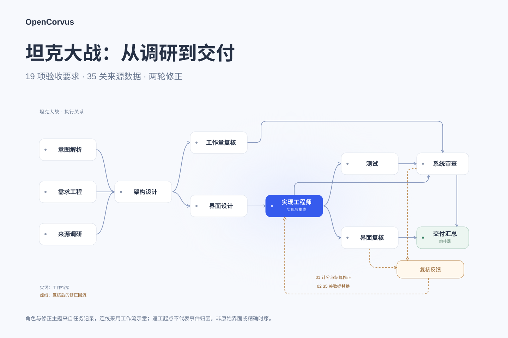

<p align="center">
  
</p>

<h3 align="center">面向长程任务的开源 Agent Harness</h3>

<p align="center">
  <strong>让专家团接力推进长程复杂任务，保留工作进度，交出可核对的结果。</strong>
</p>

<p align="center">
  <a href="https://github.com/yangheng95/opencorvus/releases"></a>
  <a href="./LICENSE"></a>
  
  <a href="https://github.com/yangheng95/opencorvus/actions/workflows/typecheck.yml"></a>
  <a href="https://github.com/yangheng95/opencorvus/actions/workflows/codeql.yml"></a>
</p>

<p align="center">
  <a href="https://opencorvus.com/zh-cn/"></a>
  <a href="https://bun.sh"></a>
  
  <a href="https://opencorvus.com/zh-cn/market/"></a>
  
</p>

<p align="center">
  <a href="./README.md">English</a> | <strong>简体中文</strong>
</p>

<p align="center">
  <a href="https://opencorvus.com/zh-cn/">官方网站</a> ·
  <a href="https://opencorvus.com/zh-cn/start/quickstart/">快速开始</a> ·
  <a href="https://opencorvus.com/zh-cn/download/">下载</a> ·
  <a href="https://opencorvus.com/zh-cn/market/">专家团</a> ·
  <a href="https://opencorvus.com/zh-cn/concepts/long-horizon/">长程</a> ·
  <a href="https://opencorvus.com/zh-cn/concepts/squad-composition/">组合</a> ·
  <a href="https://opencorvus.com/zh-cn/expert-squads/evolution/">进化</a>
</p>

---

OpenCorvus 是面向长程复杂任务的开源 Agent Harness：把模型、工具、上下文与专家团协作放在同一套运行层中。

- **接力推进**：调研、实现与独立复核按职责衔接。
- **保留进度**：任务状态与上下文支持持续工作和中断后的恢复。
- **结果可核对**：工具调用、产物与复核证据留在工作记录中。

## 一次真实任务

坦克大战案例涉及 19 项验收要求、35 关来源数据和两轮修正。



角色与修正主题来自任务记录；连线为工作流示意，返工起点不代表事件归因。
这次任务含人工决策，测试报告与还原程度仍有边界：[查看案例证据](https://opencorvus.com/zh-cn/cases/tank-battle/)。

## 快速开始

[下载桌面端](https://opencorvus.com/zh-cn/download/) → 配置可访问的模型 → 选择项目与专家团 → 提交目标和验收要求。

也可以从源码开始：

```bash
git clone https://github.com/yangheng95/opencorvus.git
cd opencorvus
bun install
bun run --cwd packages/opencorvus build
bun packages/opencorvus/src/index.ts doctor
```

[完整安装指南](https://opencorvus.com/zh-cn/start/install/) · [专家团目录](https://opencorvus.com/zh-cn/market/)

运行需要在线的本地服务及可访问的模型供应商；结果取决于任务、模型与可用证据。重要权限和发布决定仍由你掌握。

## 深入阅读

详细内容已按主题整理到[博客](https://opencorvus.com/zh-cn/blog/)：

- [案例：多专家团如何协作](https://opencorvus.com/zh-cn/blog/squad-composition/)
- [机制：长程 Harness](https://opencorvus.com/zh-cn/blog/long-horizon/) · [专家团修订](https://opencorvus.com/zh-cn/blog/squad-evolution/)
- [研究：AutomationBench](https://opencorvus.com/zh-cn/blog/automationbench/) · [论文](https://opencorvus.com/zh-cn/blog/research/)
- [实践：部署与集成](https://opencorvus.com/zh-cn/blog/deployment-and-integrations/) · [选型与边界](https://opencorvus.com/zh-cn/blog/choosing-and-boundaries/)

[文档](https://opencorvus.com/zh-cn/start/quickstart/) · [贡献指南](./CONTRIBUTING.md) · [问题反馈](https://github.com/yangheng95/opencorvus/issues)

## 开源致谢

OpenCorvus 从 [OpenCode](https://github.com/anomalyco/opencode) 代码库演进而来，
当前模型 Provider、GitHub Copilot 和 Provider 插件中仍保留了明确标注、持续同步的
OpenCode 工作。感谢 OpenCode 的维护者和贡献者奠定了这部分基础。

主要运行时和分发依赖包括：

- **运行时与 Agent 核心：** [Bun](https://github.com/oven-sh/bun)、
  [Vercel AI SDK](https://github.com/vercel/ai)、
  [Hono](https://github.com/honojs/hono) 和
  [Drizzle ORM](https://github.com/drizzle-team/drizzle-orm)。
- **开放互操作：** 官方
  [Model Context Protocol TypeScript SDK](https://github.com/modelcontextprotocol/typescript-sdk)、
  [MCP Apps](https://github.com/modelcontextprotocol/ext-apps) 和
  [Agent Client Protocol TypeScript SDK](https://github.com/agentclientprotocol/typescript-sdk)。
- **桌面应用：** [Tauri](https://github.com/tauri-apps/tauri)、
  [SolidJS](https://github.com/solidjs/solid) 和
  [Kobalte](https://github.com/kobaltedev/kobalte)。
- **执行与证据：** [Playwright](https://github.com/microsoft/playwright)、
  [CUA](https://github.com/trycua/cua) 和
  [OfficeCLI](https://github.com/iOfficeAI/OfficeCLI)。
- **随包交付的命令行运行时：** [Node.js](https://github.com/nodejs/node) 和
  [ripgrep](https://github.com/BurntSushi/ripgrep)。
- **交互式工作台：** [CodeMirror](https://github.com/codemirror/dev)、
  [xterm.js](https://github.com/xtermjs/xterm.js)、
  [Mermaid](https://github.com/mermaid-js/mermaid)、
  [MapLibre GL JS](https://github.com/maplibre/maplibre-gl-js)、
  [PDF.js](https://github.com/mozilla/pdf.js)、
  [Reveal.js](https://github.com/hakimel/reveal.js)、
  [Vega-Lite](https://github.com/vega/vega-lite)、
  [Cytoscape.js](https://github.com/cytoscape/cytoscape.js) 和
  [Univer](https://github.com/dream-num/univer)。
- **内置能力来源：** 随产品提供的设计与访谈 Skill 分别改编自
  [Taste Skill](https://github.com/Leonxlnx/taste-skill) 和
  [Matt Pocock Skills](https://github.com/mattpocock/skills)。对应本地 Skill 仍保留来源与
  许可证文件。
- **文档：** [Astro](https://github.com/withastro/astro) 和
  [Starlight](https://github.com/withastro/starlight)。

完整依赖与声明见仓库清单和 [`THIRD_PARTY_NOTICES.md`](./THIRD_PARTY_NOTICES.md)。各上游
项目仍遵循自己的许可证和商标规则。

## 许可证

[MIT](./LICENSE)
