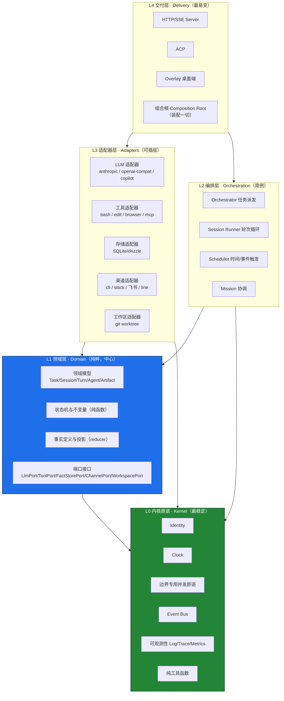
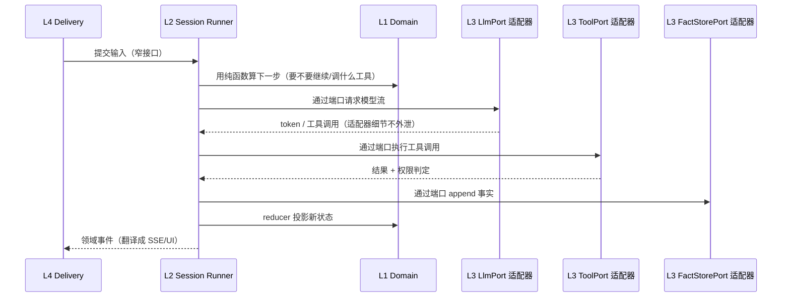

# OpenCorvus 目标框架设计

> 系列第三份，承接 [code-smell-report.md](code-smell-report.md)（诊断）与 [code-smell-remediation-plan.md](code-smell-remediation-plan.md)（整改）。
> 本文件回答一个探索性问题：**如果从零设计一个分层框架，它可能长什么样。** 它不是当前 Host 重构的实施计划，也不是架构事实源。Host 范围唯一正式计划是 [`2026-08-17-minimal-host-reform-plan-calibration.md`](../specs/records/2026-08/2026-08-17-minimal-host-reform-plan-calibration.md)：优先删除状态、gate、wrapper 和侧带 authority，不为了满足本图而新建层、包、端口或通用原语。
> 生成：2026-08-17

---

## 一、先认清这个系统的本质

抛开所有目录名，OpenCorvus 的领域本质是一句话：

> **一个事件溯源的多智能体任务编排运行时**（an event-sourced, multi-agent task orchestration runtime）。

它做四件事，其余都是这四件事的支撑：

1. **编排**：决定什么任务在什么时候、由哪个智能体、以什么权限去做（orchestrator / scheduler / mission）。
2. **推进会话**：驱动一个智能体与 LLM 的"输入→模型→工具→再输入"循环直到任务收敛（session / turn）。
3. **积累事实**：一切状态由不可变事实流投影而来，可重放、可审计、可恢复（engine / fact store）。
4. **连接内外**：接入外部世界的输入输出——人（CLI/桌面）、平台（Slack/飞书）、LLM 供应商、工具、文件系统。

**现有架构为什么失败？** 不是某个文件写得烂，而是这四件事**在结构上彼此纠缠**：编排逻辑里嵌着会话驱动，会话驱动里嵌着工具装配，事实存储的 SQL 定义散落在 19 个上层模块里、反过来让"底座"依赖"上层"。诊断报告里 42% 文件锁在一个循环依赖强连通分量、同一"产物"有 4 套存储、`scheduler` 一词三义——全都是**内核与外围没有分离**的直接症状。

所以新框架的第一性问题不是"用什么框架/库"，而是：**如何让编排内核保持纯净，把一切易变的外部性隔离在可插拔的边缘。**

---

## 二、设计哲学（十条原则）

每条原则都对应一个经典设计思想，并直接回应现有的一类病。这十条是后续所有结构决策的裁决标准。

| #   | 原则                                                       | 思想来源                                    | 回应的现有病                                                |
| --- | ---------------------------------------------------------- | ------------------------------------------- | ----------------------------------------------------------- |
| 1   | **依赖只指向更稳定、更抽象的方向**                         | 依赖倒置原则 / 稳定依赖原则                 | storage/protocol/control 反依赖 engine/session（DEP-03~05） |
| 2   | **领域内核纯净**：无 I/O、无框架、无提示词文案、无 SQL     | DDD 分层 / 洁净架构                         | engine 里硬编码 LLM 提示词（ENG-10）、sql 定义散落          |
| 3   | **深模块、窄接口、信息隐藏**：接口简单，实现复杂度藏在里面 | Ousterhout《软件设计哲学》/ Parnas 信息隐藏 | 4000 行上帝文件、90 个目录里 36 个只有 ≤2 文件              |
| 4   | **一个概念，一个模型，一处实现**                           | DRY 的本质（知识的单一权威表示）            | artifact 4 套存储、errorMessage 30+ 份、租约手写 24 处      |
| 5   | **端口隔离外部易变性**：LLM/工具/渠道/存储都在接口之后     | 六边形架构（端口与适配器）                  | provider 复制粘贴、mcp 与 tool 边界混乱                     |
| 6   | **显式依赖注入，无全局可变单例**                           | 组合根 / 控制反转                           | 模块级 `let`、DI 单例、测试钩子改全局状态                   |
| 7   | **让非法状态不可表示，把错误定义到不存在**                 | 类型驱动设计 / Ousterhout                   | `: any` 541 处、运行时断言弥补被 cast 掉的类型、吞错误      |
| 8   | **测试通过端口替身，生产代码零测试钩子**                   | 依赖注入的必然推论                          | 20+ 处 `*ForTest` 进生产热路径                              |
| 9   | **跨切面关注点是内核能力，不是各处手写**                   | 面向切面 / 平台化                           | 单飞锁 45 处、日志 console.log 111 处、租约多套             |
| 10  | **性能优化隔离在适配器，不渗入领域**                       | 关注点分离                                  | 投影逐行开查询的 N+1 蔓延到每个列表端点                     |

**一句话统摄**：把系统画成一个圆——圆心是不变的领域真理，越往外越易变、越可替换；依赖之箭永远从外射向圆心，绝不反向。

---

## 三、总体架构：端口与适配器 + 分层内核

五个同心层，依赖方向是**铁律**：只能从外向内。领域内核（L1）不知道任何具体的 LLM、数据库、渠道或 UI 的存在。



**依赖铁律（可用 lint/CI 强制）**：

- 箭头只能向下（向内）。**L1 领域绝不 import L2/L3/L4；L0 绝不 import 任何上层。**
- 适配器之间**互不依赖**（两个 LLM 适配器、两个渠道适配器彼此不知道对方）。
- 唯一知道"具体适配器"的地方是 **L4 的组合根**——它在启动时把适配器注入编排层。其余所有代码只见端口接口。
- 于是"底座反依赖上层"在这个模型里是**编译期违规**，而不是需要人肉发现的坏味道。

---

## 四、逐层职责

### L0 · 内核原语（Kernel）——最稳定的地基

系统里最不该变的东西。**不依赖任何上层**，被所有层依赖。

- **Identity**：ID 的生成与解析（对应现有 `id/`，但去掉 INF-20 的前缀吞并 bug——ID 方案唯一且自校验）。
- **Clock**：时间与定时的唯一来源（可注入，测试用假时钟——消灭现有测试里的墙钟断言 TST-16）。
- **具体并发原语**：只在共享资源的真实边界提供窄实现。持久 effect fence、Project FIFO 准入、serving 引用计数和进程内 single-flight 的不变量不同，不因都曾叫“锁/租约”而合成万能 `Lease`；仅合并已经由调用与故障证据证明同义的重复实现。
- **Event Bus**：进程内事件分发，带幂等与结算语义（现有 bus 设计意图是对的，保留并下沉为原语）。
- **可观测性**：Log/Trace/Metrics 的统一门面（消灭 111 处裸 `console.log`）。
- **纯工具**：`errorMessage`、`isRecord`、`canonicalDigest`、原子写文件……**每个恰好一份**（消灭 30+ 份 errorMessage）。

> L0 的判定标准：把它单独抽成一个 npm 包发布，不会缺任何依赖。

### L1 · 领域层（Domain）——纯粹的中心

系统的真理所在。**只依赖 L0，绝不含 I/O、SQL、提示词文案、HTTP。** 这是六边形的圆心。

- **领域模型**：`Task` / `Session` / `Turn` / `Agent` / `Artifact` / `Mission` 的类型与不变量。用类型让非法状态不可表示（回应原则 7）——例如 task 生命周期用判别联合，而非现有的 `status: string` + 运行时断言。
- **状态机与规则（纯函数）**：任务生命周期迁移、会话终止条件、权限判定——输入状态、输出新状态，无副作用，极易测试。
- **事实与投影**：定义有哪些不可变事实（fact）、如何从事实流投影出读模型（reducer 是纯函数）。**投影是"算什么"，怎么高效地查是适配器的事**（回应原则 10）。
- **端口接口**：领域声明"我需要外界为我做什么"，用接口表达，但不实现：

  | 端口                | 领域需要的能力                              | 现有对应            |
  | ------------------- | ------------------------------------------- | ------------------- |
  | `LlmPort`           | 给定消息流，产出 token/工具调用流           | provider/llm        |
  | `ToolPort`          | 执行一个工具调用，返回结果 + 权限判定       | tool/mcp            |
  | `FactStorePort`     | append 事实、replay 事实流、订阅            | engine/storage      |
  | `ChannelPort`       | 接收外部输入（ingress）、发送输出（egress） | channel             |
  | `WorkspacePort`     | 隔离一个工作区、检出、清理                  | worktree/project    |
  | `ArtifactStorePort` | 存取产物（**单一抽象**，消灭 4 套存储）     | artifact-catalog 等 |
  | `ClockPort`         | 现在几点、定时触发                          | scheduler 底层      |

### L2 · 编排层（Orchestration）——用例

系统"怎么工作"的编排逻辑。**依赖 L1 的领域接口与 L0，通过端口调用外界，不知道任何具体适配器。**

- **Orchestrator**：把任务派发给合适的智能体，推进 task 生命周期。它调 `LlmPort`/`ToolPort`，但不知道背后是 Anthropic 还是 bash——所以派发逻辑可以脱离真实 LLM 单测。
- **Session Runner**：驱动单个会话的 turn 循环（现有 `session/loop.ts` 4033 行的本质职责，但这里只有编排，工具装配、权限重建、预测压缩各自是可注入的协作者）。
- **Scheduler**：基于 `ClockPort` 与事实流触发任务（现有 scheduler 的时间/cron 语义，**只保留这一个语义**，不再一词三义）。
- **Mission**：跨多任务的长期目标协调。

> 编排层是"深模块"的典范：对外暴露"提交一个任务""推进一次"这样的窄接口，把整个编排复杂度藏在里面。

### L3 · 适配器层（Adapters）——可插拔的边缘

实现 L1 定义的端口。**依赖 L1 接口（依赖倒置）与 L0，彼此隔离。**

- **LLM 适配器**：每个 provider 实现 `LlmPort`。共性（重试、溢出识别、流解析）抽成共享基类或组合，**不再每家复制一份**（消灭 provider 复制粘贴与两套溢出判定 TOL-01）。
- **工具适配器**：bash/edit/browser/mcp 实现 `ToolPort`，统一的注册表 + 权限模型（消灭 tool 元数据 7 套旁路 TOL-08、mcp 与 tool 边界混乱）。
- **存储适配器**：SQLite/drizzle 实现 `FactStorePort`/`ArtifactStorePort`。**所有 SQL、所有索引、所有读模型性能优化都关在这里**——投影的 N+1 优化是适配器的内政，领域和编排层完全无感（回应原则 10，隔离 PERF 全区）。
- **渠道适配器**：CLI/Slack/飞书/LINE 实现 `ChannelPort`，签名校验、平台协议是各适配器内部细节，但走**统一的 ingress/egress 契约**（消灭渠道适配器里的 safeEqual 四份、飞书默认零校验 SEC-01）。
- **工作区适配器**：git worktree 实现 `WorkspacePort`，把锁、gitlink、检出封在里面（现有 `git.ts`/`worktree.ts` 的本质，但作为一个深模块，对外只给"隔离/检出/清理"三个动作）。

### L4 · 交付层（Delivery）+ 组合根

把系统暴露给人和机器，并在唯一的地方装配一切。

- **交付**：HTTP/SSE Server、ACP、Overlay 桌面端。它们把外部请求翻译成对编排层的调用，把领域事件翻译成 SSE/UI 更新。
- **组合根（Composition Root）**：**整个系统唯一 `new` 具体适配器、做依赖注入的地方**。启动时决定"用哪个 LLM 适配器、哪个存储后端、开哪些渠道"，把它们注入编排层。这消灭了现有的全局可变单例 DI（TOL-13）与散落的 `installedLoaders`。

---

## 五、核心机制在新框架里的归位

用几个最容易纠缠的机制，演示"每样东西各归其层"。

### 事件溯源（系统的骨骼）

现有病：事实的 SQL 定义散落 19 处、投影逐行开查询、engine 既存事实又混提示词。新框架三段分离：

- **L1 领域**：定义有哪些 fact 类型、reducer 如何从 fact 流投影出 Task/Session 状态——**纯函数，零 I/O**。
- **L0 内核**：`FactStorePort` 的抽象形状（append/replay/subscribe）。
- **L3 适配器**：SQLite 实现——表结构、索引、批量投影、游标分页全在这里。

于是 PERF 全区（N+1、假分页、全表扫描）变成**存储适配器的内部优化**，改它不碰领域一行代码；`task.closed` 常量漂移（SRV-01）不可能发生，因为 fact 类型只在领域定义一次。

### 一次 Turn 的控制流（依赖之箭如何流动）



编排层（O）只跟**端口**说话，从不 import 任何具体的 provider/tool/db。把三个适配器换成内存假实现，整个 turn 循环即可脱机单测——这是原则 8 的兑现。

### 工具系统（端口 + 适配器 + 统一权限）

- `ToolPort` 在 L1 定义：`execute(call) → result`，附一个**统一的权限判定**（回应现有 7 套元数据旁路）。
- bash/edit/browser/mcp 是 `ToolPort` 的适配器，各自把执行细节封成深模块。
- MCP 不再是与 tool 平行的另一套宇宙，而是"一类实现了 ToolPort 的适配器"——mcp 与 tool 的边界混乱由此消解。

### Artifact（一个概念一套存储）

现有病：同一"产物"4 套存储、共用 ID 前缀却互不可见。新框架：L1 只有一个 `Artifact` 领域概念 + 一个 `ArtifactStorePort`；4 套存储收敛为**该端口的一个适配器**（内部可按 blob/快照/内联分策略，但对外是同一抽象）。artifact-catalog 的模糊搜索、游标是适配器细节。

### 跨切面关注点（内核能力，而非各处手写）

可观测（日志/trace/metrics）可以是共享门面；并发、错误和权限则必须先确定真实边界。持久 effect fence、Project 准入、single-flight 与用户权限不是一个横切 primitive，分别使用满足自身不变量的窄机制。只有已经由调用和事故证据证明同义的重复才收敛，避免用一个通用抽象重新耦合所有路径。

---

## 六、模块内聚原则与目标包结构

### 内聚判定：按"领域能力"切，不按"技术种类"切

现有目录同时犯两个方向的错：既按技术切（`tool/`、`mcp/`、`provider/` 三个平行宇宙），又把单一功能碎切成孤岛（`explore/`、`question/`、`quicknote/`、`decision-log/` 各立一目录）。新框架的模块判定：

- **一个模块 = 一个高内聚的能力单元，对外是一个深接口。** 能力内部无论多复杂，对外只露必要的窄接口。
- **模块大小由内聚决定，不由行数决定**：一个真正单一职责的模块可以很大（一个深模块），但一个 4000 行做五件事的文件必须拆（SES-01）；反过来，一个只有胶水的 11 行 namespace 应该内联（HST-23）。
- **判据一问**：这个模块能用一句不含"和/以及"的话说清职责吗？不能就该拆或该合。

### 目标包结构

```
packages/
  kernel/                 # L0 · 无上层依赖，可独立发布
    identity/ clock/ bus/ observability/ fn/

  domain/                 # L1 · 纯领域，只依赖 kernel
    model/                #   Task/Session/Turn/Agent/Artifact/Mission 类型与不变量
    lifecycle/            #   状态机（纯函数）
    facts/                #   fact 定义 + reducer（纯函数）
    ports/                #   LlmPort/ToolPort/FactStorePort/ChannelPort/WorkspacePort/ArtifactStorePort/ClockPort

  orchestration/          # L2 · 只依赖 domain 接口 + kernel
    orchestrator/         #   任务派发与生命周期
    session-runner/       #   turn 循环
    scheduler/            #   时间/事件触发（唯一 scheduler 语义）
    mission/              #   长期目标协调

  adapters/               # L3 · 依赖 domain 接口（依赖倒置），彼此隔离
    llm/                  #   实现 LlmPort：anthropic / openai-compat / copilot
    tools/                #   实现 ToolPort：bash / edit / browser / mcp
    storage/              #   实现 FactStorePort/ArtifactStorePort：sqlite
    channels/             #   实现 ChannelPort：cli / slack / feishu / line
    workspace/            #   实现 WorkspacePort：git-worktree

  delivery/               # L4 · 依赖下层
    server/               #   HTTP/SSE/ACP
    overlay/              #   Tauri + SolidJS 桌面端

  runtime/                # L4 · 组合根：唯一装配适配器、启动系统的地方
```

每个包一个 `package.json`，包间依赖由 workspace 声明——**依赖方向直接写在包依赖图里，import lint 只是二道防线**。`kernel` 不 depend 任何本仓包；`domain` 只 depend `kernel`；`adapters/*` depend `domain` 但**不 depend 彼此**；`runtime` depend 一切。

---

## 七、新框架如何"结构性免疫"旧病

不是靠人肉 review 记住不要犯错，而是让错误在结构上无法表达。

| 旧病（报告 ID）                     | 现状                         | 新框架为何不可能                                                      |
| ----------------------------------- | ---------------------------- | --------------------------------------------------------------------- |
| 底座反依赖上层（DEP-03~05）         | storage/protocol 依赖 engine | `adapters/storage` 依赖 `domain` 接口，反过来物理不可能——包依赖图单向 |
| 42% 文件循环依赖（DEP-01）          | 一个巨型 SCC                 | 单向分层 + 端口倒置，环无处生成                                       |
| artifact 4 套存储（ART 区）         | 同概念多套                   | 领域一个 `Artifact` + 一个 `ArtifactStorePort`                        |
| 同义概念多套实现（如 errorMessage） | 30+ 份                       | 经证据确认同义后在稳定层保留一处；不同并发边界不强行合并              |
| `scheduler` 一词三义（ORC-06）      | 智能体/定时/协议混用         | 每个概念在唯一的层有唯一的名                                          |
| 4000 行上帝文件（SES-01 等）        | 一文件五职责                 | 深模块 + 单一职责判据                                                 |
| 测试钩子进生产（20+ 处）            | `*ForTest` 在热路径          | 端口替身，生产代码无注入点                                            |
| sql 定义散落 19 处                  | 领域被存储细节污染           | fact/schema 是存储适配器内政                                          |
| N+1 蔓延（PERF 全区）               | 投影逐行查询遍布             | 投影是领域纯函数，查询优化关在适配器                                  |
| `: any` 541 处                      | 类型系统被绕过               | 领域用判别联合让非法态不可表示                                        |
| 提示词混进 engine（ENG-10）         | 数据层含 LLM 文案            | 提示词是 LLM 适配器/编排层资产，领域不含文案                          |
| 飞书默认零校验（SEC-01）            | 渠道各写各的校验             | ChannelPort 统一 ingress 契约，校验是契约的一部分                     |

---

## 八、探索性迁移映射（非当前实施计划）

若未来某个已经独立批准的子系统确实需要这种分层，可用绞杀者模式（Strangler Fig）迁移，不能以本蓝图为由进行 big-bang 重写。当前 Host 改革首先删除无真实边界的机制；只有删除后仍被真实调用和变化轴证明需要的接口，才进入下列映射：

1. **先证明再抽取 kernel 与 ports**：只有已经存在多个真实实现或调用边界的 Identity/Clock/Bus/Observability/纯工具才可抽取；不预建接口，不建立通用 Lease。
2. **按依赖倒置切断反向边（整改 1-A）**：sql 下沉到 `adapters/storage`、protocol/control 瘦身——每切断一条反向边，就是让一个模块归位到正确的层。SCC 规模是进度度量。
3. **概念收敛即领域归位（整改 1-B）**：artifact 收敛到单一 `ArtifactStorePort`、scheduler 正名——这不只是去重，是把散落的领域概念收回 L1。
4. **拆上帝文件即划分深模块（整改 1-C）**：`session/loop.ts` 拆分的终态就是 L2 的 session-runner + 可注入协作者。
5. **适配器化外部性**：把 provider/tool/mcp/channel 逐个重构为端口的适配器，共性上提、彼此解耦。
6. **组合根收口**：把散落的 DI 单例、`installedLoaders`、模块级 `let` 收敛到 `runtime` 的唯一装配点。

**每一步都可独立交付、可回滚**，且每一步都让"依赖之箭更朝向圆心"。当反向依赖清零、每个概念只有一处实现、每个模块能一句话说清职责时，这份设计就从蓝图变成了现实——而防复发基建（包依赖图 + import lint + SCC 门禁）保证它不再退化回今天的样子。

> **本蓝图自己的判据**：若未来批准采用此分层，`domain/` 应能脱离数据库、LLM 和 HTTP 编译并运行领域测试。当前最小 Host 计划不以创建 `domain/` 包、层数或端口数作为成功指标。
