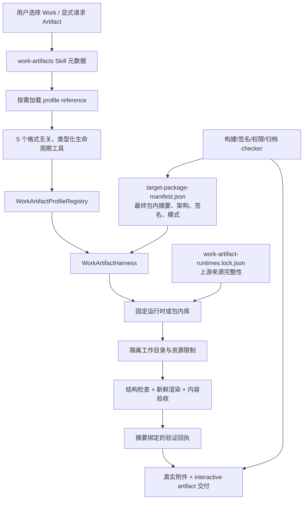

# Work Artifact Harness 与 Skill 基建统一方案

Status: design complete; implementation not started

## Recall

### 用户原始要求

- 调查 OpenCorvus 还缺哪些面向 Work 的工具 Harness，PDF 是明确例子。
- 参考成熟、受欢迎的开源方案，设计 OpenCorvus 自己的统一方案。
- 能力必须整合进安装包；二进制发行版必须处理默认文件权限。
- Skill 也是本轮方案中的重点基础设施，不能只设计工具或捆绑命令行程序。

### 验收指标

1. 给出现状、缺口、直接触发点、根因、旧方案未闭环原因和影响面证据。
2. 给出单一 Harness、单一能力目录、Skill、类型化工具、运行时锁、打包和验收的完整数据流。
3. 对每一类候选能力明确采用、延后或拒绝的开源方案与原因，不组成相互重叠的“工具拼盘”。
4. 给出 Windows、macOS、Linux 的二进制、共享库、数据文件、目录和秘密文件默认权限契约。
5. 给出可分阶段实施、可由真实 checker 验收、没有兼容双轨或 fallback 的迁移顺序。

### 硬约束

- 继续遵守 `specs/current/architecture/**`：发现、绑定、授权和执行是四个不同阶段。
- LLM（Large Language Model，大语言模型）只经类型化工具调用 Harness；不得获得原始命令、任意参数、任意文件路径或任意网络地址。
- Skill 负责逐步披露、工作方法、格式知识、质量检查和审阅指导；Harness 负责安全、资源限制、权限、运行时选择和结果真实性。
- 每项能力只有一个当前实现和一个事实来源；替换 Office 专用面后同步删除旧工具和旧 Skill，不保留兼容层。
- 所有 LLM 交互继续流式；产物、预览、验证回执和交付消息都由真实参与者产生。
- 本轮只产出调查与实施方案，不修改运行时代码或 UI（User Interface，用户界面），也不运行 UI 自动化测试。

### 已读资料与全仓搜索

- 当前架构：`specs/current/architecture/17-code-work-agent-platform.md`。
- 历史调查与实现记录：
  - `specs/records/2026-07/2026-07-29-work-artifact-mode-research.md`
  - `specs/records/2026-07/2026-07-29-conversation-backed-work-office-capability.md`
  - `specs/records/2026-08/2026-08-06-office-artifact-harness-strategy.md`
  - `specs/records/2026-08/2026-08-06-office-artifact-harness-implementation.md`
- 当前代码与打包路径：
  - `packages/opencorvus/src/work/harness.ts`
  - `packages/opencorvus/src/tool/office-artifact.ts`
  - `packages/opencorvus/src/office-artifact/presentation.ts`
  - `packages/opencorvus/src/skill/builtin/office-artifacts/SKILL.md`
  - `packages/opencorvus/src/skill/{skill,eligibility,required-tools,mounts}.ts`
  - `packages/opencorvus/src/tool/skill.ts`
  - `packages/opencorvus/src/capability/catalog.ts`
  - `packages/opencorvus/runtime/officecli.lock.json`
  - `packages/opencorvus/script/{build-artifact,build-runtime-binaries,runtime-executable-contract}.ts`
  - `script/{package-native-binary,package-linux-binary,check-release-assets}.ts`
- Overlay 已有 document、spreadsheet、presentation、file preview、media 等交互式渲染器，且已经依赖 `pdfjs-dist`。本轮缺口不是再造查看器，而是受控生成/转换、结构检查、逐页/逐帧渲染、审阅、精确摘要绑定和发行闭环。
- 全仓搜索确认当前生产闭环只有 PPTX（PowerPoint Open XML Presentation，PowerPoint 开放 XML 演示文稿）新建；DOCX（Word Open XML Document，Word 开放 XML 文档）和 XLSX（Excel Open XML Spreadsheet，Excel 开放 XML 工作簿）仍被 Skill 明确标为不可用。当前 HEAD 也没有覆盖 Office Artifact `inspect -> author -> validate -> deliver` 生命周期的聚焦正向测试。
- 独立 agent 首轮反馈：确认总体架构、仓库事实与选型可执行；要求补齐四项交付边界：签名后 package manifest 必须成为 Harness 的运行时摘要事实源；网络拒绝必须有逐运行时强制机制和外联拒绝 checker；归档必须覆盖 Windows 路径、Alternate Data Streams（备用数据流）、归一化碰撞和 reparse point（重解析点）；新 spec 因仓库忽略规则必须在提交时精确强制暂存。另要求 FFmpeg 实施时记录链接方式以及对应 LGPL 源码、修改、许可和可重新链接义务。第二轮复核确认内容问题均已闭环，只剩将被忽略的新 spec 与两个索引一并精确纳入任务提交；此项在提交前验证中完成。

## 1. 调查结论

OpenCorvus 当前不是“没有 Work 工具”，而是只有一个尚未泛化的 Office Artifact Harness 第一阶段：


这条链路做对了三个关键点：运行时固定版本和 SHA-256、进程环境隔离、交付时绑定候选文件摘要并重新验证。它没有闭环的地方是能力边界仍等于 `office + presentation`，Skill 也只是 PPTX 的工作说明，而不是可扩展的 Work 能力基础设施。

### 1.1 根因和影响链

| 层 | 当前事实 | 根因 | 影响 |
| --- | --- | --- | --- |
| 能力目录 | Work 默认只装载 `office-artifacts` | 没有机器可判定的 Work profile（能力配置）目录 | 无法回答某发行目标真正支持哪些格式、操作和验收等级 |
| Skill | 有名称、描述、平台、`required_tools`，正文可逐步加载辅助文件 | Skill 只引用工具 ID，没有引用已验收的 profile 修订 | “模型知道怎么做”与“安装包真的能做”无法形成可生成的证明矩阵 |
| 工具 | 四个 `office_artifact_*` 工具只接受 presentation | 生命周期抽象和格式能力绑定在一起 | 每加格式都容易复制一组工具或扩大单个 Office 实现 |
| 运行时 | 只有 `officecli.lock.json` | 没有统一运行时/数据资产清单 | 新增 PDF、数据、OCR（Optical Character Recognition，光学字符识别）时容易形成多套下载、校验、许可和路径逻辑 |
| 打包 | 会递归识别原生文件并统一为 `0755` | 二进制完整性检查与文件类别权限混在一起 | 可执行程序可运行，但共享库和普通数据也被授予多余执行位；新增 WASM、模型和字体后问题放大 |
| 验收 | PPTX 实现有验证与渲染逻辑 | 当前 HEAD 缺少生命周期聚焦测试和发行 profile 矩阵 | 代码存在不等于每个目标包内真实可用 |

旧路径没有根治的原因不是 OfficeCLI 选错，而是“成功的 PPTX 纵切片”没有被提升为格式无关的 profile、Skill、运行时与打包契约。继续单独增加 `pdf_tool`、`docx_tool`、`ocr_tool` 会把这个结构问题复制出去。

## 2. 缺失的 Work 能力地图

| 能力族 | 当前状态 | 目标能力 | 优先级 |
| --- | --- | --- | --- |
| 演示文稿 | PPTX 新建已存在；模板编辑未生产化 | 保持当前能力并迁入统一 Harness | P0 |
| PDF | Overlay 能看；没有受控生成、变换、结构/页面验收 | 生成、检查、合并、拆分、旋转、水印、表单处理、逐页渲染和文本提取 | P1 |
| 结构化数据 | Overlay 能展示表格；没有本地分析/转换运行时 | CSV/TSV/JSON/Parquet 的类型化分析、转换和交付 | P1 |
| 栅格图像 | 已打包 sharp/libvips，尚未作为 Work profile 闭环 | 检查、缩放、裁剪、转换、合成、预览与交付 | P1 |
| 安全归档 | 没有 Artifact 级归档 profile | 受限打包/解包、清单、路径和展开量校验 | P1 |
| Word/Excel | Skill 明确为不可用 | DOCX/XLSX 新建、检查、渲染和交付 | P2 |
| OCR | 无离线 OCR 运行时 | 图片和扫描 PDF 的离线识别、版面证据和可搜索输出 | P2 |
| 音视频 | Overlay 能播放；没有生产/转码闭环 | 探测、裁剪、转码、抽帧、波形/缩略图和交付 | P3 |
| 通用文档转换 | 无统一转换器 | Markdown/HTML/电子书等有限白名单转换 | 延后 |
| PDF 签名信任 | 无法律/长期信任验证 | 只可报告结构和工具可证明的签名事实 | 不宣称合规验证 |

## 3. 开源方案取舍

选择标准是：成熟度、许可证、离线能力、可固定版本、目标平台覆盖、机器可读输出、输入面可收窄、发行体积和已有能力复用。一个 profile 只能有一个生产实现；未通过真实语料库和发行矩阵验收的候选不得进入运行时目录。

### 3.1 采用

| Profile | 采用方案 | 理由 | 生产边界 |
| --- | --- | --- | --- |
| `office.presentation@1`，后续 `office.document@1` / `office.spreadsheet@1` | OfficeCLI | 已经进入当前包，Apache-2.0，现有 PPTX 路径证明可自包含和渲染 | P0 只迁移 PPTX；DOCX/XLSX 必须独立通过模板、字体、公式、图表和多页/多表语料库 |
| `pdf.document@1` 作者 | Typst | Apache-2.0，原生多平台发行，面向排版生成 PDF，支持 PDF/A 和 PDF/UA 输出选项 | Harness 接受类型化文档 AST 和受控模板，不接受任意 Typst 源码或网络依赖 |
| `pdf.document@1` 结构变换 | pdfcpu | Apache-2.0，Go 单文件 CLI，官方多平台资产和校验和，覆盖检查、优化、合并、拆分、水印、表单等 | 首期不把数字签名结果包装成法律、eIDAS、LTV 或长期信任结论；禁用远程图片和外部配置 |
| `pdf.document@1` 渲染/文本证据 | 现有 PDF.js | Apache-2.0，仓库已经依赖，无需再捆绑 Poppler、Ghostscript 或 MuPDF | 每页新鲜 PNG 和结构化文本证据；页数、像素和总字节受限 |
| `data.table@1` | DuckDB CLI | MIT，单一自包含可执行文件，CSV/JSON/Parquet 支持成熟，输出可机器解析 | 不开放任意 SQL；Harness 把类型化关系计划编译为查询，禁用外部访问、扩展安装和用户级初始化文件 |
| `image.raster@1` | 现有 sharp/libvips | 已经是包内运行时闭包，避免重复引入 ImageMagick | 只暴露有限的解码、几何、颜色和输出操作；对 SVG 等主动内容先做格式级限制 |
| `archive.bundle@1` | 自构建并固定 libarchive/bsdtar | New BSD，格式识别成熟，Windows/POSIX 可构建，许可证边界比 unRAR 组合更清晰 | 写入只允许 ZIP、TAR.GZ；读取按格式白名单，逐条解析为规范相对路径后再写入新建的空目录，限制条目数与展开字节；完整 Windows 拒绝集见 4.3 |
| `ocr.document@1` | Tesseract.js + `tesseract.js-core` + 官方 `tessdata_fast` | Apache-2.0，WASM（WebAssembly，网页汇编）避免平台可执行位，语言数据可离线固定 | PDF 先用 PDF.js 渲染；只打包验收过的语言模型。必须先证明 Bun/Node worker 与离线路径稳定，否则不发布该 profile |

### 3.2 延后或拒绝进入第一批安装包

- **qpdf**：Apache-2.0、低层结构变换非常成熟，但不渲染、不提取文本，与 pdfcpu 重叠。保留为 hostile-PDF benchmark（恶意/畸形 PDF 基准）的对照，不与 pdfcpu 同时成为生产事实源。
- **OCRmyPDF**：效果成熟，但依赖 Python、Tesseract、PDF 渲染器、字体和多个本地库；Ghostscript 路径还扩大许可证与不可信输入面。第一阶段不打包。
- **ImageMagick**：能力强，但默认策略面宽，仓库已有 sharp/libvips。避免重复图像栈和第二套 policy。
- **Pandoc**：格式多且有官方静态包，但 PDF 仍依赖外部引擎，GPL 发行义务和与 Office/Typst 重叠都更重。需求语料证明需要时再评估，不作为通用 fallback。
- **FFmpeg/ffprobe**：行业成熟，但上游只发布源码；发行二进制必须由 OpenCorvus 自建并固定 LGPL 配置，任何 GPL/nonfree 开关都会改变发行义务。P3 才增加最小 LGPL 构建，记录完整 `--buildconf`、静态/动态链接方式、对应源码、修改、许可证和最终用户可重新链接所需材料；只保留一个媒体实现。
- **原生 Tesseract**：识别引擎成熟，但官方跨平台二进制闭包不统一。若 Tesseract.js 不能通过目标平台真实 checker，应重新立项选定原生构建并替换候选，而不是运行时 fallback。

## 4. 目标架构



### 4.1 单一机器事实源：`WorkArtifactProfileRegistry`

新增一个由源码生成并在构建时验证的 profile registry。运行时 registry **只包含已在当前目标发行包中验收合格的 profile**，不保存 `planned` 或候选状态。

每个 profile 至少声明：

```ts
interface WorkArtifactProfile {
  id: "pdf.document@1" | "office.presentation@1" | string
  mimeTypes: readonly string[]
  operations: readonly ("inspect" | "author" | "transform" | "validate" | "deliver")[]
  toolSchemaRevision: string
  skillName: "work-artifacts"
  skillResources: readonly string[]
  runtimes: readonly string[]
  acceptanceProfile: string
  limits: {
    inputBytes: number
    outputBytes: number
    pagesOrFrames: number
    wallClockMs: number
  }
}
```

Profile registry 决定工具 schema、可见能力、Skill reference、运行时闭包和 checker。Skill 不自行宣称运行时能力，UI 也不从文件扩展名猜测支持等级。

### 4.2 五个统一生命周期工具

原有四个 `office_artifact_*` 工具在 PPTX 对等验收后一次性替换为：

1. `work_artifact_inspect`：把用户已授权的 Attachment/Artifact 引用解析为结构、页面/工作表/媒体流和安全事实。
2. `work_artifact_author`：从 profile 专属的类型化计划生成候选 Artifact。
3. `work_artifact_transform`：对精确来源摘要执行 profile 专属、有限枚举的变换。
4. `work_artifact_validate`：结构检查、内容检查和新鲜渲染，返回绑定候选摘要、运行时修订和证据摘要的不可混用回执。
5. `work_artifact_deliver`：只接受当前候选摘要及其验证回执，重跑最终检查，再发布真实附件和交互式 Artifact。

五个工具共享生命周期，但参数使用按 profile 区分的 discriminated union（带判别字段联合类型）。不提供原始命令、shell、任意文件系统路径、任意 URL、任意 XML/SQL/Typst 源码或任意 FFmpeg 参数。

### 4.3 Harness 执行边界

- 输入必须是当前 Task/Conversation 已授权的资源引用；Harness 自己解析受控路径。
- 每次调用使用新的任务局部目录、配置目录、缓存目录和临时目录，禁止读取用户主目录配置。
- Harness 启动运行时前必须用生成的 `target-package-manifest.json` 校验最终包内摘要、目标架构和平台签名；不得在运行时拿已经签名的文件与上游下载摘要比较。
- 默认无网络、无自动更新、无插件/扩展安装、无常驻服务。`network: denied` 不是描述性标记：每个 runtime adapter 必须声明并执行唯一强制机制，优先顺序是编译时移除网络协议/包解析器、引擎级关闭 external access 与扩展、只传入已打开的受控文件描述符；仍保留网络能力的进程必须进入目标平台可验收的网络沙箱，否则该 profile 不得 qualified。
- DuckDB 必须关闭 external access、扩展安装/自动加载和用户 init；Typst 禁止 package resolution 与 URL 资源；pdfcpu 禁止远程图片、CRL（Certificate Revocation List，证书吊销列表）和 OCSP（Online Certificate Status Protocol，在线证书状态协议）等外联路径；Tesseract.js 的 worker、core 和语言模型只能从包内摘要锁定路径加载。每个 adapter 的具体开关由实现期 spike 以当前版本官方契约确认，不能在本设计里猜参数。
- 由 ProcessSupervisor 统一实施超时、输出上限、子进程所有权、取消和结算；不得直接 `spawn` 后遗留进程。
- 解析不可信压缩包、PDF、媒体或图片时同时限制压缩前字节、解压后字节、条目、页/帧、像素、递归深度、CPU 时间和墙钟时间。
- 运行时输出先转为 Harness 自有类型，再进入消息和 Artifact；stderr 文案不能直接成为领域错误契约。
- 归档条目先按目标平台语义归一并比较，再落盘。所有平台拒绝绝对路径、`..`、空组件、符号/硬链接和设备条目；Windows 额外拒绝盘符、UNC、NTFS Alternate Data Streams、保留设备名、尾随点/空格，以及大小写或 Unicode 归一化后发生碰撞的名称。解包目标必须是本次新建的空目录，并在写入前后确认其祖先和目标都不是 reparse point/junction，禁止重复覆盖。

## 5. Skill 作为一等基础设施

### 5.1 一个 Skill 家族入口，而不是每个二进制一个 Skill

将内置 `office-artifacts` 替换为一个 `work-artifacts` Skill。它保持 Agent Skills 开放格式的 `SKILL.md + references + assets` 结构，并遵守渐进式披露：

```text
work-artifacts/
├── SKILL.md
├── references/
│   ├── common-lifecycle.md
│   ├── evidence-and-review.md
│   ├── office-presentation.md
│   ├── office-document.md
│   ├── office-spreadsheet.md
│   ├── pdf-document.md
│   ├── data-table.md
│   ├── image-raster.md
│   ├── archive-bundle.md
│   ├── ocr-document.md
│   └── media.md
└── assets/
    └── templates-and-small-static-resources
```

- `SKILL.md` 保持短小，只讲能力发现、通用生命周期、何时加载哪一个 reference，以及必须实际检查渲染结果。
- profile reference 讲格式语义、作者策略、审阅清单和错误修复方法，不讲二进制路径或权限实现。
- 大模板、字体、OCR 模型属于运行时/数据资产清单，不塞入 Skill 文本载荷。
- 内置 Skill 源目录只保存已 qualified profile 的 reference；未验收设计只留在 `specs/`，不得进入源 Skill 后再由生成器选择性隐藏。生成的 payload 是该源目录的完整、可验证投影，防止形成“源码 Skill”和“发布 Skill”两个事实源。

### 5.2 与 Agent Skills 兼容的绑定方式

不新增一批私有顶层 frontmatter 字段。Skill 使用标准 `metadata` 中一个字符串型命名空间引用：

```yaml
metadata:
  opencorvus.profile-set: work-artifacts@1
```

`work-artifacts@1` 的含义由机器拥有的 profile registry 定义。这样 Skill 仍可被其他 Agent Skills 实现读取，而 OpenCorvus 的安全和能力声明不依赖模型可编辑的 Markdown。

### 5.3 发现、绑定、授权、执行

| 阶段 | 唯一事实源 | 允许做什么 |
| --- | --- | --- |
| 发现 | Skill catalog + profile registry 摘要 | 告诉 Agent 有哪些工作方法和已安装 profile |
| 绑定 | PromptProfileResolver / Work Harness projection | 把 `work-artifacts` 和五个生命周期工具放进当前 Agent 上下文 |
| 授权 | 当前 permission 与 Task/Conversation 资源 authority | 决定某个真实输入和交付目标是否可访问 |
| 执行 | WorkArtifactHarness + runtime lock | 在隔离环境执行已枚举操作并产生真实证据 |

不得用关键词 gate 自动挑工具。用户进入 Work、显式选择 Skill、能力目录查询或 Agent 自然加载 Skill 都可以触发发现；host 不根据“PDF”“表格”等词替模型路由流程。

### 5.4 Skill 交付证明

构建时生成一张不可手写的资格矩阵：

```text
Skill profile-set
  -> profile id / tool schema revision
  -> runtime or packaged-library revision
  -> target asset and license
  -> focused lifecycle checker
  -> target package smoke result
```

矩阵任何一环缺失，该 profile 就不能进入发布 registry，也不能出现在发布 Skill 的能力摘要里。`required_tools` 继续控制 Skill 是否可用，但不再承担 profile 资格证明。

## 6. 统一运行时锁和打包

### 6.1 `work-artifact-runtimes.lock.json`

用一个生成/校验模型替换 OfficeCLI 专用锁和每个工具各自的下载逻辑。每项运行时记录：

- 名称、版本、上游仓库、tag、commit、许可证表达式和必须随包分发的 LICENSE/NOTICE。
- 每个目标的 URL、压缩格式、最大下载字节、SHA-256、解包后相对路径、文件类别和 smoke 参数。
- `network: denied`、`updates: disabled`、`resident: false`、配置/缓存目录策略。
- 网络策略必须引用对应 runtime adapter 的可执行 enforcement ID 和外联拒绝 checker；只有布尔标记而没有强制实现时构建失败。
- 构建来源。上游有可信二进制时使用固定上游资产；只有源码时记录可复现构建容器、编译器、配置和源码签名。
- WASM、字体、模板、OCR 模型进入同一锁的 `dataAssets`，但类别不是 executable。

安装包内生成 SPDX 或 CycloneDX SBOM（Software Bill of Materials，软件物料清单）和第三方许可汇总；lock 只证明下载/源码来源完整性，不替代最终包清单。权限归一、目标架构检查和签名完成后，构建器生成不可手写的 `target-package-manifest.json`，逐项记录最终包内相对路径、文件类别、签名后 SHA-256、架构、模式和签名身份。Harness 运行时只信任该最终 manifest；上游 lock 与最终 manifest 通过构建 provenance（来源证明）相连。

### 6.2 默认权限契约

当前递归识别原生文件并全部设置 `0755` 能防止“程序不可执行”，但权限过宽。新 manifest 必须把完整性发现和权限赋值分开：

| 类别 | POSIX 包内模式 | Windows | 说明 |
| --- | --- | --- | --- |
| 可执行程序/带 shebang 的实际入口 | `0755` | 保持普通文件；校验 PE、摘要和签名 | 只有 manifest 明确标为 executable 的文件拥有执行位 |
| `.so` / `.dylib` / `.node` 共享库 | `0644` | 普通只读数据语义 | 动态加载只需读取；仍进入原生闭包发现和 macOS 嵌套签名 |
| WASM、模型、字体、模板、LICENSE、NOTICE | `0644` | 普通文件 | 不授予执行位 |
| 包内目录 | `0755` | 正常 ACL 继承 | 允许读取与遍历 |
| 任务局部运行目录 | `0700` | 仅当前用户 ACL | 不复用包内目录写运行数据 |
| 临时配置、缓存、可能含输入内容的文件 | `0600` | 仅当前用户 ACL | 创建时显式模式，不依赖宽松 umask |

实施细则：

1. 下载前限制字节；下载后校验上游摘要；安全解包后校验路径和文件类别。
2. 复制到 staging 后按 manifest 显式归一权限；递归 magic/扩展名识别只做“有无漏登记”的闭包审计，不决定 chmod。
3. macOS 在权限归一后对可执行程序、共享库和 app 闭包签名，再验证 `codesign --verify --deep --strict`；Windows 若使用 Authenticode，也在来源摘要校验后签名。签名会改变字节，因此上游摘要只留在 runtime lock，签名后 staging 摘要写入生成的 target package manifest，不能混为同一个 hash。
4. POSIX 命令行发行使用能可靠保存模式的 `tar.gz`；Windows 使用 ZIP。若提供 AppImage、DEB、RPM 或 DMG，其包元数据也必须通过同一权限 checker。
5. 归档完成后读取归档头，逐项验证 manifest 中 executable 为 `0755`、共享库和数据为 `0644`；解包 smoke 后再运行 `--version` 或等价只读命令。
6. Windows 不模拟 POSIX chmod。验证目标是普通文件、target package manifest 中的签名后 SHA-256、PE 架构、Authenticode（如发行策略要求）以及能够由打包后的 OpenCorvus 启动。
7. 运行时只修复 OpenCorvus 自己包目录/临时目录中的模式，绝不递归 chmod 用户输入、项目或主目录。

### 6.3 目标矩阵

每个进入 registry 的 profile 必须覆盖当前公开发行目标，而不是只覆盖开发机：Windows x64、macOS x64/arm64、Linux x64/arm64。musl 只有在公开发行矩阵有对应资产和 checker 时才标为 qualified；不能因为 lock 中存在候选 URL 就对外宣称支持。

## 7. 实施阶段

### P0：把现有 PPTX 纵切片提升为基础设施

1. 新增 profile registry、统一 runtime lock schema 和生成的 qualification matrix。
2. 把现有 OfficeCLI 条目迁入新锁，保持精确版本、许可、摘要和隔离策略。
3. 实现五个格式无关工具与 Harness；用 `office.presentation@1` 证明完整生命周期。
4. 新增 `work-artifacts` Skill 和 PPTX reference；生成内置 Skill payload。
5. 新增聚焦正向测试：真实 inspect/author/transform（若 profile 声明）/validate/deliver 输出、摘要绑定、逐页预览和目标包 smoke。
6. 对等通过后同一提交删除 `office_artifact_*`、`office-artifacts` 和 Office 专用运行时装配，不保留别名或 fallback。

### P1：第一批新增能力

1. PDF：Typst + pdfcpu + 现有 PDF.js。
2. 结构化数据：DuckDB 类型化关系计划。
3. 栅格图像：现有 sharp/libvips。
4. 安全归档：固定版本 libarchive/bsdtar。

每个 profile 独立完成 hostile corpus、正常业务语料、资源上限、五目标 package smoke 和 Skill reference 审阅后才进入 registry。可以按 profile 分提交，但运行时不能暴露半成品条目。

### P2：Office 扩展和 OCR

- DOCX/XLSX 基于 OfficeCLI 的当前版本能力做新建与渲染闭环；先排除高保真模板编辑，直到参考语料证明可达标。
- OCR 使用 PDF.js 页面渲染 + Tesseract.js 离线 WASM + 固定语言模型。首批建议 `eng`、`chi_sim`、`chi_tra`，最终集合由大小和真实识别 benchmark 决定。

### P3：媒体

- 自建最小 FFmpeg/ffprobe LGPL 闭包；禁用 GPL/nonfree，保存完整构建配置、源码签名、SBOM 和目标包 smoke。
- profile 只暴露探测、有限编码预设、裁剪、抽帧和预览，不暴露任意 filtergraph 或协议 URL。

## 8. 验收与发布门槛

### 8.1 聚焦正向契约

- 每个 author/transform 请求都产生明确候选 Artifact、profile、摘要和运行时修订。
- validate 对同一摘要产生结构、内容、渲染证据和资源用量；每页/表/帧按 profile 生成可人工检查的真实预览。
- deliver 只发布与验证回执相同且最终复验通过的摘要，并产生真实附件与 interactive artifact。
- Skill catalog 能看到 `work-artifacts`，加载后能准确读取当前发行 registry 中 profile 对应的 reference。
- 缺少运行时、许可、目标资产、checker 或 Skill reference 时，构建器给出明确的 profile qualification 错误契约。

### 8.2 安全语料

- PDF：畸形 xref、深递归对象、压缩炸弹、外部关系/附件、加密、表单、字体缺失和超大页面。
- Office：宏、OLE、ActiveX、外部关系、公式/图表、字体替代、多页/多表和损坏 ZIP。
- 数据：schema 漂移、极宽表、嵌套 JSON、Parquet 畸形统计、超大字符串和公式注入交付。
- 图像/媒体：像素炸弹、损坏帧、超长时长、异常 metadata、主动格式和错误 codec。
- 归档：Zip Slip、绝对路径、符号/硬链接、设备条目、嵌套炸弹和重复覆盖；Windows 还覆盖盘符/UNC、NTFS Alternate Data Streams、保留设备名、尾随点/空格、大小写/Unicode 归一化碰撞和预存 reparse point/junction。

### 8.3 真实发行 checker

每个目标安装包在干净环境中执行：

1. 校验 runtime lock 的上游来源摘要、生成的 target package manifest、许可证、权限/ACL、架构和签名，并从签名后的包内路径实际启动 OfficeCLI 等每个 executable。
2. 从打包路径启动 OpenCorvus，而不是引用源码工作区依赖。
3. 对每个 qualified profile 跑一个小型真实生命周期，读取新生成预览并验证精确输出。
4. 正常样例断网运行，并对每个 runtime adapter 注入可观察的外联目标，确认在联网宿主上外联尝试也被强制拒绝；同时确认无用户级配置读取、无扩展安装。
5. 记录包体积增量、冷启动耗时、峰值内存、执行时间和失败类型；超过 profile 预算即不进入 registry。

## 9. 需要实现前量化的未知项

- OfficeCLI 当前版本对 DOCX/XLSX 新建、字体、公式、图表和渲染的真实质量尚未由本仓库语料证明。
- Typst、pdfcpu、DuckDB、libarchive 的最终固定版本和所有目标 SHA-256 要在实施时从 tag/发行资产重新核验，本记录不把调查日的 latest 当锁文件。
- Tesseract.js 在 Bun 与打包后 worker/WASM 离线路径上的稳定性未知，必须先做五目标 spike；未通过就不发布 OCR profile。
- 自建 libarchive 和未来 FFmpeg 的可复现交叉编译、代码签名、包体积与安全更新维护成本尚未量化。
- PDF.js 的现有 Node/Bun 渲染路径需要用扫描件、复杂字体、透明度和大页面语料验证，不能用 Overlay 能显示 PDF 代替生产验收。

## 10. 决策摘要

OpenCorvus 应建设一个 **Work Artifact Harness + 一个 `work-artifacts` Skill + 一个 profile registry + 一个 runtime lock + 一套发行 checker**。第一批不是“装更多命令”，而是先把现有 PPTX 闭环迁入共同基础设施，再以 PDF、结构化数据、栅格图像和安全归档逐项资格化。Skill 是模型工作方法和渐进披露的权威入口；机器 registry 和 Harness 是能力真实性、安全与运行时的权威入口。二者通过 profile-set 修订绑定，但互不冒充。

## 11. 调查来源

- Agent Skills 开放规范与渐进披露：<https://agentskills.io/specification>、<https://agentskills.io/skill-creation/optimizing-descriptions>
- pdfcpu 能力、许可证和发行资产：<https://pdfcpu.io/about/about/>、<https://pdfcpu.io/getting_started/usage/>、<https://github.com/pdfcpu/pdfcpu/releases>
- qpdf 能力边界：<https://github.com/qpdf/qpdf>、<https://qpdf.readthedocs.io/en/latest/json.html>
- PDF.js：<https://github.com/mozilla/pdf.js>
- Typst PDF 能力和发行：<https://typst.app/docs/reference/pdf/>、<https://github.com/typst/typst/releases>
- DuckDB CLI、安全配置和发行：<https://duckdb.org/docs/stable/clients/cli/overview>、<https://duckdb.org/docs/stable/configuration/overview>、<https://github.com/duckdb/duckdb/releases>
- Tesseract/Tesseract.js 离线 OCR：<https://github.com/tesseract-ocr/tesseract>、<https://github.com/naptha/tesseract.js/>、<https://github.com/naptha/tesseract.js/blob/master/docs/local-installation.md>、<https://github.com/tesseract-ocr/tessdata_fast>
- libarchive 与 7-Zip：<https://www.libarchive.org/>、<https://www.7-zip.org/license.txt>
- FFmpeg 能力、发行与许可证：<https://ffmpeg.org/about.html>、<https://ffmpeg.org/download.html>、<https://github.com/FFmpeg/FFmpeg/blob/master/LICENSE.md>
- OCRmyPDF 依赖和部署边界：<https://ocrmypdf.readthedocs.io/en/stable/installation.html>、<https://ocrmypdf.readthedocs.io/en/stable/cloud.html>
- ImageMagick 默认安全策略：<https://imagemagick.org/security-policy/>
- Pandoc 发行：<https://pandoc.org/installing.html>、<https://github.com/jgm/pandoc/releases>
