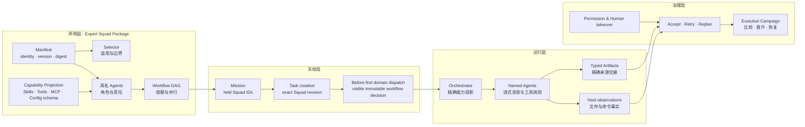

# OpenCorvus 宣传视频完整制作脚本方案

## Recall

### 用户原始要求

- 将现有宣传视频提纲细化为一份完整、可直接执行的脚本方案。
- 明确每一步如何拍摄，包括何时打开什么页面、执行什么操作、画面应该出现什么结果。
- 每一个页面或界面状态都必须配套口述词。
- 当前缺少示例与数据，所有示例、数据和身份信息先使用清晰、可检索、可替换的占位符。
- 覆盖 Chat / Work、Computer Use、Browser Use、PPT / DOC / PDF、看图修代码、定时任务、专家团定义与协议、自定义专家团、专家团协作、自进化、Mission 长任务、Autonomous 调度、Provider、Codex Auth、任务看板、Channel、Token 用量、安全与开放承诺、加入邀请。
- “专家团的定义和协议”需要绘制成可用于成片的图，而不是只用口述解释。

### 受众、目的与默认制作假设

- 核心受众：第一次了解 OpenCorvus 的开发者、技术负责人、独立创作者、AI Agent 工作流构建者。
- 核心目的：先建立“这是一个可控、可审查的 Agent 工作台”的认知，再用真实界面案例证明单 Agent 能力、专家团协作与长程运行能力，最后引导访问网站与 GitHub。
- 默认成片：中文普通话，桌面端 16:9，1440p 或 1080p，主版本约 12 至 14 分钟；每个章节保持模块化，后续可裁成 3 分钟和 60 秒版本。
- 录屏环境：简体中文界面、浅色或深色主题统一、桌面端，只拍隔离项目与测试账号，不操作用户正在使用的窗口。

### 验收指标

- 有完整的总时长、叙事结构、节奏、镜头编号、页面路径、操作步骤、画面结果、口述词、字幕、转场、素材和验收点。
- 用户提纲中的每一项均有明确归属，且所有 CASE 均提供可直接复制后替换占位符的演示提示词。
- 任何缺少事实数据的内容都使用统一格式的占位符，不编造用户数、性能提升、Token、费用、成功率或第三方背书。
- 对当前产品边界表述准确：Mission 协调多个 Task；Task 创建时固定一个精确专家团版本，所选工作流在首次领域 dispatch 前以可见、不可变决策固定；安装不等于激活；自进化的晋升与恢复需要显式授权；无人值守运行依赖运行时在线；官方 Provider 账本与本地账本只对账、不相加。
- 专家团定义图覆盖 package 声明、具名 Agent、Skill / Tool / MCP、工作流、运行时冻结、流式消息、类型化 Artifact、Host observation、权限与进化证据。
- 最终交付包含可编辑 DOCX，并经过逐页渲染与人工视觉复核。

### 硬约束

- 以 `specs/current/architecture/**` 为架构事实来源；README、公开网页与中文界面文案只用于解释当前产品表达和录屏路径。
- 不将 OpenCorvus 表述为“保证完全自治”“永久无人值守”或“自动安全”；质量依赖模型、来源、已安装能力和本次运行证据。
- 不展示真实 API Key、OAuth token、密码、私有仓库内容、个人邮箱、聊天记录或付费账单。
- 所有 LLM 画面只展示流式过程；不设计批量或隐藏消息路径。
- 不新增或运行 UI 自动化测试。文档验收使用 DOCX 渲染、逐页图像检查与结构审计。
- 本任务不修改产品代码、界面、公开网站或专家团 package；只新增脚本记录与文档交付物。

### 已读资料

- `AGENTS.md`
- `README.zh-CN.md`
- `specs/current/architecture/README.md`
- `specs/current/architecture/02-data.md`
- `specs/current/architecture/04-extensions.md`
- `specs/current/architecture/06-provider.md`
- `specs/current/architecture/task-control-plane.md`
- `specs/current/architecture/security-permission.md`
- `packages/overlay/src/i18n/zh-CN.json`
- `packages/overlay/src/components/ConfigDialogHost.tsx`
- `packages/web/src/components/Lander.astro`
- `packages/web/src/components/MissionPage.astro`
- `specs/records/2026-08/2026-08-14-default-browser-computer-capabilities.md`
- `specs/records/2026-08/2026-08-14-computer-use-scope-and-project-delete-settlement-repair.md`
- `specs/records/2026-08/2026-08-13-browser-mcp-live-view.md`
- `specs/records/2026-08/2026-08-12-random-expert-squad-self-evolution-e2e.md`
- `specs/records/2026-08/2026-08-09-autonomous-visual-review-dispatch.md`
- `specs/records/2026-08/2026-08-11-provider-usage-natural-cycle-dashboard.md`
- `specs/records/2026-08/2026-08-12-scheduled-random-isolation-e2e.md`
- `specs/records/2026-08/2026-08-13-cs012-channel-runtime-public-bootstrap.md`

### 全仓搜索结果

- Chat 与 Work 是独立的项目级能力分配面，Composer 按次选择模型；Browser 与 Computer 是当前原生对话能力。
- 首页当前建议入口包含做网页、创建专家团、改 Bug、长程编排任务、做调研与做 PPT，可直接作为录屏起点。
- Mission 看板按 Mission 为卡片，Task 为下属执行明细，具有待规划、进行中、待审核、待处理和已完成状态。
- 定时任务支持会话、项目与全局范围，支持当前检出或独立 worktree、模型、推理强度、时区、每日 / 工作日 / 每周 / RRULE，以及立即运行与运行历史。
- 专家团详情当前有概览、Agent 与能力、配置、进化历史等页面；安装、查看、项目启用、Session 覆盖和精确 package revision 是不同操作。
- Provider 页面支持目录、自定义 OpenAI 兼容 Provider、认证、模型刷新和最小连接测试；OpenAI Codex auth 通过统一 Provider 链路投影。
- 用量统计按自然周期聚合本地实测 Token 与成本，官方组织、账户或云控制面数据只进行对账。
- Channel 运行时目前覆盖 Slack、Telegram、Discord、飞书、WhatsApp、Google Chat、Microsoft Teams、Line、Matrix、Mattermost、Signal、企业微信和钉钉等适配器。

### 独立 agent 反馈

- 初始方案阶段：无。
- 文档完成后的独立只读审查结果将在本记录的“交付复核”中补充。

## 问题深度与影响面分析

### 可观察现象

当前输入只有章节标题和 CASE 名称，缺少时长、叙事推进、页面路径、操作动作、可见结果、旁白、占位数据、转场和拍摄前置条件，无法直接用于录屏或剪辑。

### 直接触发点

素材缺口不是单一“没有例子”，而是案例输入、界面状态、结果样式和口述词之间尚未建立逐镜头对应关系。

### 数据与控制流根因

原提纲把产品能力、架构解释、操作演示、价值承诺和行动号召混在同一层级；没有先定义受众问题，再用 UI 操作与运行证据回答，因此同一章节内无法判断该展示概念图、实时操作还是结果特写。

### 旧路径未根治原因

仅给每个标题补一段旁白仍不能解决拍摄问题，因为录屏者仍不知道需要准备哪些项目、图片、提示词、运行结果、页面状态和遮挡内容，也无法保证口述词与画面同步。

### 影响面

- 内容：产品定位、能力边界、七个 CASE、原则、承诺和 CTA。
- 产品事实：Chat / Work / Mission / Task / Expert Squad / Artifact / Provider / Scheduler / Channel / Usage。
- 拍摄：隔离项目、演示账号、窗口布局、敏感信息遮挡、结果预生成、失败备用镜头。
- 后期：章节卡、关键字幕、概念图动画、速度调整、鼠标高亮、局部放大和版本裁切。
- 文档：脚本手册、占位符字典、镜头清单、验收清单和专家团协议图。

### 明确排除

- 不替用户生成真实业务数据、客户背书、性能数字或伪造研究来源。
- 不替用户实际录屏、登录 Provider、连接外部 Channel、启动定时任务或公开发布视频。
- 不承诺当前未被代码、架构或真实运行记录支持的能力。

## 冻结方案

### 叙事主线

1. 用“一个人如何驾驭复杂 AI 工作”提出问题。
2. 用 Chat / Work 和 Browser / Computer 展示单次工作闭环。
3. 用可定制专家团与协议图解释能力如何被明确声明和审查。
4. 用 Mission 软件工程工作流展示多个专家团或 Task 如何在统一运行时协作。
5. 用自进化、长任务和自动触发展示系统如何持续运行，但保留证据与授权边界。
6. 用 Provider、看板、Channel 和 Token 统计展示日常可运营性。
7. 收束到安全、可控、自定义、开放，并给出网站、GitHub 和邮箱 CTA。

### 主版本章节与时间预算

- 00:00-00:35：冷开场、定位与背景。
- 00:35-03:35：全自研 Harness；Chat / Work、Browser / Computer 和三个基础 CASE。
- 03:35-05:45：专家团定义、协议与网页游戏开发专家团。
- 05:45-08:05：专家团集群协作与软件工程 Mission。
- 08:05-09:35：专家团自进化与调研专家团 CASE。
- 09:35-10:55：Mission 长任务与 Autonomous 自动触发 CASE。
- 10:55-12:15：Provider、Codex Auth、任务看板、Channel、Token 用量。
- 12:15-13:10：原则、承诺与加入邀请。

### 镜头卡标准字段

每个镜头卡固定包含：时间码与时长、页面 / 窗口、录制前状态、具体操作（静态页明确写“无需交互”）、屏幕预期、口述词和验收点。屏幕字幕、占位符与剪辑 / 转场在该镜头需要时单独列出；无交互的概念图也按一个独立“页面”处理并配口述词。

### 占位符协议

- 使用全大写方括号，例如 `[RESEARCH_TOPIC]`、`[PROJECT_PATH]`、`[TOKEN_TOTAL]`。
- 一个占位符只表示一种语义；同一语义在全文保持同名。
- 真实录制前必须完成全局替换，并再次搜索 `\[[A-Z0-9_]+\]`，未清零则不进入正式录制。
- 机密字段使用 `[REDACTED_API_KEY]`、`[PRIVATE_REPO_BLURRED]` 等不可替换的遮挡标记，提醒录制时永不展示明文。

### 专家团定义与协议图

图形按从左到右的四层绘制：

1. **声明层**：`expert-squad.jsonc`、identity / version / digest、selector、具名 Agents、workflow dependency graph、package Skills、Tools、MCP、scheduler guidance、configuration schema。
2. **冻结层**：Mission 持有允许的 Squad ID；创建 Task 时固定精确 package revision；首次领域 dispatch 前以可见、不可变决策选择 workflow；安装、查看和激活相互独立。
3. **运行层**：Orchestrator 投影精确能力；具名 Agent 流式产生消息与工具调用；下游通过类型化 Artifact 精确读取上游结果；Host observation 独立记录文件和命令事实。
4. **治理层**：权限规则、人工接管、验收 / 重试 / 重规划、Evolution Campaign、同上下文比较、显式晋升或恢复。

图中必须明确显示三条边界字幕：`Task 生命周期内不静默换团`、`安装不等于启用`、`证据不足不自动晋升`。

### DOCX 版式

- 文档类型：密集型录制执行手册。
- 设计预设：`compact_reference_guide`。
- 首页模板：`workshop_agenda`，用时间轴式信息条突出总时长、画幅、语言和主 CTA。
- 主体优先使用编号步骤、镜头卡、短表格和检查清单；长口述词使用独立段落，避免把全文塞进大表格。
- 专家团图使用 Word 原生固定几何表格 / 箭头式流程，确保可编辑；另附 Mermaid 结构文本供后期重绘。

## 拍摄前准备

### 录屏环境

1. 新建隔离演示项目 `[DEMO_PROJECT_NAME]`，路径显示统一替换为 `[DEMO_PROJECT_PATH]`；仓库只保留可公开的示例代码与虚构数据。
2. OpenCorvus 切换为简体中文；固定主题 `[THEME_LIGHT_OR_DARK]`；窗口设为 1600×900 或 1920×1080；系统缩放固定为 100%。
3. 浏览器只保留公开网页标签；清空历史地址、个人头像、书签栏、下载记录和通知。
4. Provider、Channel 和 OAuth 页面使用专门演示账号。API Key 永远不录入画面；只拍“已配置”状态或用后期遮罩覆盖。
5. 关闭桌面通知、邮件、聊天软件弹窗和自动更新提示；鼠标开启轻量点击高亮，但不使用大面积轨迹特效。
6. 为每个 CASE 预跑一次并保存成功结果；正式录制仍拍真实流式过程，等待段落可后期 4× 至 12× 加速。
7. 每个案例准备 A 线“真实执行录屏”和 B 线“已完成结果特写”；运行失败时停止该镜头，不把失败画面伪装成成功结果。

### 统一示例素材包

- `[RESEARCH_TOPIC]`：一个可以公开检索、能产出三到五条结论和一张图表的主题。
- `[RESEARCH_SOURCE_SET]`：至少 `[SOURCE_COUNT]` 个可公开访问来源，含发布日期和链接。
- `[BUG_SCREENSHOT]`：展示明确 UI 异常的图片，画面中不含真实客户或私有数据。
- `[BUG_REPO]`：能稳定复现 `[BUG_SYMPTOM]` 的小型公开演示仓库。
- `[GAME_NAME]`：网页游戏示例名；推荐使用单屏、可视化强、规则简单的 `[GAME_GENRE]`。
- `[SOFTWARE_FEATURE]`：可拆为需求、架构、实现、测试和复核的中等规模功能。
- `[EVOLUTION_DATASET]`：固定输入、固定评分标准、可重复运行的调研基准集。
- `[AUTONOMOUS_TRIGGER]`：可观察的前置证据，例如“实现 Artifact 已发布且真实页面可打开”。
- `[PUBLIC_WEBSITE]`：`https://opencorvus.com/zh-cn/`。
- `[GITHUB_REPO]`：`https://github.com/yangheng95/opencorvus`。
- `[CONTACT_EMAIL]`：正式发布前替换为公开联系邮箱。

### 录屏前必须填充的数据表

| 类别 | 必填占位符 | 填写要求 |
| --- | --- | --- |
| 品牌 | `[VIDEO_TITLE]`、`[RELEASE_VERSION]`、`[RECORD_DATE]` | 版本与录制日期必须和画面一致 |
| 调研 | `[RESEARCH_TOPIC]`、`[SOURCE_COUNT]`、`[FINDING_1]`、`[FINDING_2]`、`[FINDING_3]`、`[CHART_METRIC]` | 结论必须能回到公开来源 |
| Bug | `[BUG_SYMPTOM]`、`[EXPECTED_BEHAVIOR]`、`[ROOT_CAUSE]`、`[TEST_COMMAND]` | 结果必须能真实复现和验证 |
| 定时 | `[AUTOMATION_NAME]`、`[SCHEDULE_TIME]`、`[TIME_ZONE]`、`[TARGET_SCOPE]` | 正式录制前核对下一次运行时间 |
| 专家团 | `[GAME_NAME]`、`[SQUAD_ID]`、`[GAME_DESIGNER_ROLE]`、`[FRONTEND_ROLE]`、`[VISUAL_ROLE]`、`[TEST_ROLE]`、`[WORKFLOW_NAME]` | 名称与生成 package 一致 |
| Mission | `[MISSION_TITLE]`、`[SOFTWARE_FEATURE]`、`[TASK_COUNT]`、`[ACCEPTANCE_SET]` | Task 数量以真实看板为准 |
| 进化 | `[BASELINE_SCORE]`、`[CANDIDATE_SCORE]`、`[REGRESSION_COUNT]`、`[TOKEN_DELTA]` | 不得先写结果再补数据 |
| 用量 | `[TOKEN_TOTAL]`、`[INPUT_TOKENS]`、`[OUTPUT_TOKENS]`、`[COST]` | 只录演示账号与演示周期 |
| CTA | `[CONTACT_EMAIL]`、`[QR_WEBSITE]`、`[QR_GITHUB]` | 二维码正式发布前实机扫码 |

## 完整逐镜头脚本

### S01 · 冷开场：复杂工作不是一个聊天框（00:00-00:18，18 秒）

**页面 / 窗口**：黑场进入 OpenCorvus 公开主页首屏，再快速叠化到桌面应用的 Work、Mission 看板和专家团详情三个静止特写。

**录制前状态**：公开主页已加载；三个产品页面都准备好不含敏感信息的完成态。

**具体操作**：先让主页标题停留 3 秒；依次用 1.5 秒切到 Work 交付、Mission 看板、专家团 Agent 与能力页；最后回到应用首页。

**屏幕预期**：观众在 18 秒内看到“工作台—长任务—专家团”的产品范围，不出现终端或代码细节。

**口述词**：

> 当 AI 开始写代码、查资料、操作浏览器，真正困难的已经不是再多一个聊天框，而是：谁在做、能做什么、用什么证据交付，以及一个长任务如何安全地继续下去。OpenCorvus，就是为这件事做的开源 Agent 工作台。

**屏幕字幕**：`开放的 Agent 工作台 / 可见能力 / 可审查证据 / 长程任务`。

**验收**：音乐在“OpenCorvus”落点出现 Logo；首 18 秒不堆叠超过四行文字。

### S02 · 定位与背景：从对话到可控工作（00:18-00:38，20 秒）

**页面 / 窗口**：桌面应用首页，左侧项目导航可见，中间 Composer 可见。

**录制前状态**：`[DEMO_PROJECT_NAME]` 已注册，首页无残留草稿、通知或失败横幅；左侧快捷入口完整可见。

**具体操作**：点击 `[DEMO_PROJECT_NAME]`；鼠标依次掠过“新对话”“Mission 看板”“专家团”“定时”入口，不点击。

**屏幕预期**：界面语言、项目名和入口清晰，当前没有弹窗。

**口述词**：

> 在 OpenCorvus 里，你先连接真实工作区，再选择模型、Skill、工具、MCP 连接和权限。一次直接协作可以从 Chat 或 Work 开始；需要多个有明确责任的交付时，再交给 Mission。运行过程中的消息、工具结果、Artifact 和宿主观察都保持可见。

**屏幕字幕**：`Workspace + Model + Skill + Tool + MCP + Permission`。

**验收**：项目名与后续镜头完全一致；鼠标掠过入口时 tooltip 不遮挡旁白要强调的区域。

### S03 · Chat / Work 双模式（00:38-01:03，25 秒）

**页面 / 窗口**：设置 → 产品 → Chat；随后设置 → 产品 → Work。

**录制前状态**：Chat 与 Work 分别准备一组不同的 Skill / MCP 分配状态。

**具体操作**：打开 OpenCorvus 菜单 → 设置；点击“Chat”，滚动到“已分配 Skill”和“已分配 MCP 连接”；再点击“Work”，展示另一套分配。不要在正式录制时切换开关，避免改变后续案例环境。

**屏幕预期**：页面显示“这里的开关只影响当前项目中的 Chat / Work”，模型由 Composer 按次选择。

**口述词**：

> Chat 和 Work 不是同一个页面换了名字。Chat 适合快速、直接的协作；Work 面向调研、分析和可复核交付物。两种模式可以在同一项目里拥有不同的 Skill 与 MCP 能力分配，模型则在每次开始时选择。

**屏幕字幕**：`Chat：快速协作`；`Work：长篇交付与复核`。

**验收**：Chat 与 Work 的页面标题、项目作用域提示和能力差异必须同框可辨；不得把页面开关说成模型选择器。

### S04 · Browser Use 与 Computer Use（01:03-01:28，25 秒）

**页面 / 窗口**：新建 Work 对话的 Composer；右侧浏览器预览；Computer 控制条。

**录制前状态**：准备一个已建立 Browser / Computer 会话的公开网页任务；输入所有权初始为 Agent，页面无登录信息。

**具体操作**：在 Composer 中确认 Browser 与 Computer 为可用原生 Tool；打开已有浏览器任务结果；点击“接管控制”，移动一次鼠标或滚动页面，再点击“交还 Agent”。

**屏幕预期**：控制条明确从“当前由 Agent 控制桌面”变为“当前由你控制桌面”，再返回 Agent；浏览器预览保持同一页面。

**口述词**：

> Browser Use 让 Agent 在可见浏览器会话里导航、读取和验证；Computer Use 处理更广泛的桌面交互。控制权不是隐藏的：你可以随时接管，再明确交还给 Agent。每次交互都留在同一条可观察的工作线上。

**屏幕字幕**：`Agent 控制 ↔ 人工接管`。

**验收**：录屏中必须完整出现 Agent 控制、人类接管和交还 Agent 三个可见状态；同一浏览器页面和会话不得被替换。

### S05 · CASE 1 输入：调研并交付 PPT / DOC / PDF（01:28-01:58，30 秒）

**页面 / 窗口**：Work 首页。

**录制前状态**：`[REFERENCE_BRIEF]` 与 `[BRAND_ASSET]` 已脱敏并可公开；`[OUTPUT_FOLDER]` 为空；选定模型已通过连接测试。

**具体操作**：点击首页建议“做调研”或“做 PPT”，粘贴以下提示词；依次附加 `[REFERENCE_BRIEF]` 和 `[BRAND_ASSET]`；选择 `[MODEL_NAME]` 与 `[REASONING_LEVEL]`；点击发送。

**演示提示词**：

> 调研 `[RESEARCH_TOPIC]`。只使用可公开访问、能记录标题、机构、发布日期和 URL 的来源。先给出带证据的关键结论，再生成一份 `[SLIDE_COUNT]` 页 PPT、一份完整 DOC 和一份同内容 PDF。必须包含 `[CHART_METRIC]` 图表、风险与未知项、来源清单。所有数字先使用 `[DATA_PLACEHOLDER]`，待我确认后再替换。完成后逐份检查排版，并把文件放到 `[OUTPUT_FOLDER]`。

**屏幕预期**：用户消息、附件和模型选择都可见；Agent 开始流式响应。

**口述词**：

> 第一个例子，是一条完整的内容生产链。我给出调研主题、来源约束、交付格式和验收条件。OpenCorvus 不只是返回一段答案，而是让 Work 把研究、引用、图表和三种文件交付放在同一条可复核对话里。

**屏幕字幕**：`输入：主题 + 来源约束 + 格式 + 验收`。

**验收**：发送前暂停 2 秒，让附件名、模型、推理强度和完整提示词首尾都能被看清；输出目录不得已有同名结果。

### S06 · CASE 1 过程：真实浏览与证据（01:58-02:25，27 秒）

**页面 / 窗口**：对话流 + Browser Live View + 右侧 Artifact / 文件区域。

**录制前状态**：`[SOURCE_1_URL]` 与至少一个备用来源已确认可访问；浏览器缩放 100%，网页没有个人账号状态。

**具体操作**：跟随 Agent 打开 `[SOURCE_1_URL]`；停在来源标题、日期和关键图表；切到第二来源；展开一次工具结果，再收起；把长等待段后期加速。

**屏幕预期**：浏览器实际页面与对话中的来源引用一致，不展示无法打开或付费墙页面。

**口述词**：

> 调研过程可以直接看到。Agent 在真实网页中寻找证据，记录来源和时间，再把结论交给后续生成步骤。工具结果不是黑盒摘要；需要时，你可以展开查看它依据了什么。

**屏幕字幕**：`来源可见 / 工具结果可见 / 过程流式`。

**验收**：每个被口述的来源至少同框出现标题、机构或作者、发布日期中的两项；工具结果与浏览器 URL 可对应。

### S07 · CASE 1 结果：三种交付物逐一验收（02:25-02:55，30 秒）

**页面 / 窗口**：PPT 预览、DOC 预览、PDF 预览或文件工作台。

**录制前状态**：三份文件由同一次 Work 执行生成并已完成内部检查；预览器字体加载正常，文件名不含绝对私有路径。

**具体操作**：先打开 `[PPT_FILE]`，展示封面、目录和图表页；再打开 `[DOC_FILE]`，展示摘要与来源；最后打开 `[PDF_FILE]`，快速翻两页。每个文件停 5 至 7 秒。

**屏幕预期**：三个文件主题一致、引用一致，图表显示占位数据标识而不是伪造正式数字。

**口述词**：

> 最终产物可以逐份打开检查：PPT 负责叙事，DOC 保留完整分析，PDF 用于稳定分发。真正的验收不是“Agent 说完成了”，而是文件存在、内容一致、引用可追溯、页面也实际呈现过。

**屏幕字幕**：`PPT · DOC · PDF / 同源内容 / 分别验收`。

**验收**：PPT、DOC、PDF 各至少出现一个可辨识页面；标题、三条关键结论和来源版本一致；占位数据有明显标识。

### S08 · CASE 2 输入：根据图片诊断并修复代码（02:55-03:12，17 秒）

**页面 / 窗口**：Chat 首页。

**录制前状态**：`[BUG_REPO]` 已回到可稳定复现问题的演示 revision；`[BUG_SCREENSHOT]` 已脱敏；`[TEST_COMMAND]` 可在本机运行。

**具体操作**：点击“改 Bug”；附加 `[BUG_SCREENSHOT]`；粘贴提示词；确认当前项目是 `[BUG_REPO]`；点击发送。

**演示提示词**：

> 这张截图显示 `[BUG_SYMPTOM]`，期望行为是 `[EXPECTED_BEHAVIOR]`。请先在 `[BUG_REPO]` 中复现，追踪到数据或控制流根因，再修改代码并运行 `[TEST_COMMAND]`。最后打开真实页面验证修复，说明根因、改动文件和验收证据。不要只根据图片猜 CSS。

**屏幕预期**：图片缩略图、项目名和提示词完整可见；发送后 Agent 先读取与复现，不立即宣称根因。

**口述词**：

> 第二个例子从一张问题截图开始。我要求它先复现、再追根因、然后改代码，最后回到真实页面验证。图片是线索，不是结论。

**屏幕字幕**：`图片是线索，不是根因`。

**验收**：截图中的异常与项目实际复现一致；提示词明确包含期望行为、根因要求、测试命令和真实页面验收。

### S09 · CASE 2 过程与结果：代码、命令、页面同链路（03:12-03:35，23 秒）

**页面 / 窗口**：对话中的图片、文件 diff、终端结果、Browser Preview。

**录制前状态**：使用同一 Task 的成功运行；原始截图、修复 diff、测试结果和修复页面都已准备可追溯入口。

**具体操作**：依次展示 Agent 读取相关文件、修改 diff、运行 `[TEST_COMMAND]` 的成功退出码；打开修复后的页面；与原截图做 2 秒前后对比。

**屏幕预期**：diff 只含目标改动；测试结果和页面结果来自同一项目；控制台没有明显错误。

**口述词**：

> 诊断、修改、测试和视觉复核不需要散落在四个工具里。文件变化、命令退出状态和修复后的页面都能回到同一条会话。你看到的不只是“修好了”，而是它为什么坏、改了什么、怎样证明现在正确。

**屏幕字幕**：`截图线索 → 根因 → Diff → Checker → 真实页面`。

**验收**：测试命令显示真实退出状态；前后对比使用同一视口；不得只展示静态源码文案作为视觉验收。

### S10 · CASE 3：创建定时任务（03:35-04:00，25 秒）

**页面 / 窗口**：左侧“定时” → “新建自动化”。

**录制前状态**：`[TIME_ZONE]`、`[SCHEDULE_TIME]` 和目标项目已核对；不存在同名自动化；选定模型可用。

**具体操作**：点击“新建自动化”；填写名称 `[AUTOMATION_NAME]`；提示词粘贴下方内容；范围选 `[TARGET_SCOPE]`；工作区选 `[LOCAL_OR_WORKTREE]`；频率选 `[RECURRENCE]`；时间 `[SCHEDULE_TIME]`；时区 `[TIME_ZONE]`；模型 `[MODEL_NAME]`；点击创建。

**演示提示词**：

> 汇总 `[DEMO_PROJECT_NAME]` 最近的变更、未完成工作和风险，输出一份 `[REPORT_FORMAT]`。只读取当前项目，列出证据路径；如果没有新变化，明确写“本周期无新增”，不要编造进展。

**屏幕预期**：自动化列表出现新卡片，显示已启用和下一次运行时间。

**口述词**：

> 重复工作可以保存成定时自动化。你可以指定会话、项目或全局范围，选择当前检出或独立 worktree，并明确模型、推理强度、时区和重复规则。这里所有时间都落到可检查的计划，而不是一句模糊的“以后再做”。

**屏幕字幕**：`范围 + 工作区 + 频率 + 时区 + 模型`。

**验收**：创建后的“下一次运行”必须与输入频率、时间和时区一致；项目范围时至少选择一个目标项目。

### S11 · CASE 3 结果：立即运行与历史（04:00-04:15，15 秒）

**页面 / 窗口**：自动化详情。

**录制前状态**：S10 的自动化处于启用状态，目标运行时在线，已有足够时间完成一次短运行。

**具体操作**：点击“立即运行”；等待状态进入“运行中”；切到运行历史，展示一条“已成功”记录和新建可见对话入口。

**屏幕预期**：运行历史记录本次开始时间、成功状态和可打开的目标对话；失败次数不增加。

**口述词**：

> 创建后可以立即试跑，也可以查看每次运行历史。自动化产生的是可见对话，不是后台悄悄改完后只留一条通知。运行时必须在线，这也是长时间无人值守的真实边界。

**屏幕字幕**：`可见运行 / 可查历史 / 运行时需在线`。

**验收**：从历史打开的新对话必须属于本次自动化，且能看到原提示词与流式结果；不得用旧成功记录冒充本次运行。

### S12 · 专家团：从匿名 Agent 池到可检查能力包（04:15-04:38，23 秒）

**页面 / 窗口**：设置 → 共享资源 → 已安装专家团，打开一个内置专家团详情“概览”。

**录制前状态**：`[REFERENCE_SQUAD]` 已安装且详情可加载；选择指导、版本与声明哈希完整；当前不执行激活或卸载操作。

**具体操作**：从专家团列表打开 `[REFERENCE_SQUAD]`；依次停留用途、来源、版本、声明哈希和选择指导。

**屏幕预期**：概览页显示精确 package 身份与来源；查看详情不会改变项目或 Session 的生效选择。

**口述词**：

> 当工作需要稳定分工，OpenCorvus 不使用一个匿名 Agent 池。专家团是一份可以检查、安装、版本化的能力包：它声明用途、具名角色、工作流、Skill、工具、MCP 访问和调度指导。查看、安装和启用是三件不同的事。

**屏幕字幕**：`Expert Squad = 可检查、可版本化的能力包`。

**验收**：用途、版本和声明哈希至少各停留 2 秒；镜头不得把“内置”误读成“已为当前 Task 启用”。

### S13 · 专家团定义与协议图（04:38-05:13，35 秒）

**页面 / 窗口**：全屏动画图“专家团声明—冻结—运行—治理”。

**录制前状态**：使用本方案中的可编辑协议图作为唯一事实源；四层节点、箭头、术语和三条边界字幕已完成校对。

**具体操作 / 动画节拍**：

1. 0-8 秒：点亮声明层的 manifest、selector、Agents、workflow、Skills、Tools、MCP、configuration schema。
2. 8-16 秒：箭头进入 Mission 和 Task；先高亮“held Squad ID”“Task creation: exact revision”，再高亮“before first domain dispatch: immutable workflow decision”。
3. 16-26 秒：点亮 Orchestrator、流式消息、工具调用、类型化 Artifact 和 Host observation。
4. 26-35 秒：出现权限、验收、重试 / 重规划和 Evolution；最后锁定三条边界字幕。

**屏幕预期**：Task 创建与 workflow 决策是两个先后步骤；运行层同时显示 Artifact 与 Host observation 两种证据来源。

**口述词**：

> 一支专家团先在 package 里声明身份、版本、角色和依赖图，再明确每个角色能看到哪些 Skill、工具与 MCP。Mission 只持有允许使用的专家团身份；创建 Task 时，系统冻结精确专家团版本；首次领域 dispatch 前，再用可见、不可变决策固定工作流。运行中，具名 Agent 流式产生消息与工具调用，用类型化 Artifact 交接结果，宿主则独立记录文件和命令事实。权限、验收、重试和进化证据构成治理层：Task 中途不会静默换团，安装不等于启用，证据不足也不会自动晋升。

**屏幕字幕**：`声明 / 冻结 / 运行 / 治理`。

**验收**：四层顺序必须与口述完全同步；任何时刻不同时高亮超过五个节点。

### S14 · CASE 4A：定义网页游戏开发专家团（05:13-05:34，21 秒）

**页面 / 窗口**：应用首页 → “创建专家团”。

**录制前状态**：`[DEMO_PROJECT_NAME]` 已打开且可写；`[SQUAD_ID]` 未被同作用域 package 占用；四个角色名和工作流名已定稿。

**具体操作**：点击“创建专家团”；把目标发送到新建专家团 Mission。

**演示提示词**：

> 为 `[GAME_NAME]` 网页游戏创建一个项目级专家团 `[SQUAD_ID]`。角色至少包括：`[GAME_DESIGNER_ROLE]` 负责规则和体验；`[FRONTEND_ROLE]` 负责实现；`[VISUAL_ROLE]` 负责界面与动效；`[TEST_ROLE]` 负责可玩性和真实页面复核。声明一个 `[WORKFLOW_NAME]` 工作流：规则与验收 → 架构 → 可并行的实现与视觉资源 → 集成 → 测试与视觉复核。每个角色只投影必要 Skill、Tool 和 MCP；所有交互必须流式；输出完整 package、README、selector 和示例调用。

**屏幕预期**：发送后创建一条新专家团 Mission；项目上下文、完整用户请求和生成目标保持可见。

**口述词**：

> 专家团也可以由你定义。这里，我们为一个网页游戏描述角色、责任、依赖顺序和最小能力边界，然后让系统生成一份项目级能力包，而不是把分工写在一段无法验证的提示词里。

**屏幕字幕**：`角色 + 责任 + 依赖 + 最小能力边界`。

**验收**：输入中明确 package 作用域、四个角色、依赖图、能力最小化和完整输出要求；Mission 创建后标题与项目正确。

### S15 · CASE 4A 生成过程：包、角色与工作流（05:34-05:54，20 秒）

**页面 / 窗口**：专家团生成 Mission 对话与 Task 明细。

**录制前状态**：使用 S14 创建的同一 Mission；生成 Task 已成功发布 package 文件和校验结果。

**具体操作**：展示 Agent 生成 manifest、role prompts、Skill 与 workflow；打开生成文件树；停在 workflow dependency graph 的关键片段。

**屏幕预期**：角色名称、工作流名称和 package ID 与输入一致；无真实凭据。

**口述词**：

> 生成过程会把口头要求落实为可读取的文件：manifest 定义身份和投影，角色 prompt 说明责任，Skill 固化方法，工作流声明依赖。之后它可以被导出、审查、安装和复用。

**屏幕字幕**：`Manifest / Role prompts / Skills / Workflow DAG`。

**验收**：文件树至少显示 manifest、README、selector、四个 Agent prompt 和 package-local Skill；工作流角色与 S14 输入一致。

### S16 · CASE 4A 验收：安装不等于启用（05:54-06:12，18 秒）

**页面 / 窗口**：设置 → 已安装专家团 → `[SQUAD_ID]` → Agent 与能力。

**录制前状态**：`[SQUAD_ID]` 已项目级安装但不通过本镜头改变生效选择；详情投影加载成功。

**具体操作**：展示项目级包标记；切换“Agent 与能力”，展开四个具名角色及其 Skill / Tool / MCP；返回概览，展示“项目启用”状态，但不在正式录制中点击更改。

**屏幕预期**：项目级作用域、四个角色和各自能力投影清晰可见；查看详情前后生效选择不变。

**口述词**：

> 生成完成后，先检查，再决定是否启用。你可以看到每个角色真正获得了哪些能力，也能区分项目级和全局安装。安装一个专家团不会自动改变当前 Task，更不会偷偷扩大权限。

**屏幕字幕**：`先安装并检查 / 再显式启用`。

**验收**：角色能力与 manifest 一致；不点击“设为项目启用”或“会话覆盖”；镜头前后记录同一生效专家团。

### S17 · 专家团集群合作：统一运行时，不抹去责任（06:12-06:35，23 秒）

**页面 / 窗口**：公开 Mission 页面或产品内 Mission 看板空态，叠加简洁结构动画：Mission → Task A / B / C → 各自固定 Squad。

**录制前状态**：公开 Mission 页面可访问；结构动画中的 Task 与 Squad 关系已经按当前架构校对，不显示“超级 Agent”或共享可变身份。

**具体操作**：先展示 Mission 说明页“协调与执行保持分离”；再切回应用 Mission 看板。

**屏幕预期**：概念图清楚区分 Mission 的目标 / 依赖责任与各 Task 的执行 / 证据责任。

**口述词**：

> 通过统一运行时，内置和用户定义的专家团都能进入同一套编排。但是“成为整体”不等于混成一个超级 Agent。Mission 负责目标与依赖；每个 Task 创建时固定自己的专家团精确版本，并在首次领域 dispatch 前固定所选工作流；Session 和交付证据仍保留真实责任归属。

**屏幕字幕**：`Mission 协调结果 / Task 保留责任`。

**验收**：动画中每个 Task 只连接一个精确 Squad identity；Task 创建和 workflow 决策的时点说明与 S13 一致。

### S18 · CASE 4B：创建软件工程 Mission（06:35-07:00，25 秒）

**页面 / 窗口**：Mission 看板 → 创建 Mission → 通过 AI 创建。

**录制前状态**：目标项目已注册；`[SQUAD_SET]` 中的专家团均已安装并允许由本 Mission 持有；验收条件已由录制者复核。

**具体操作**：点击“创建 Mission”；选择项目 `[DEMO_PROJECT_NAME]`；选择 Mission 类型 `[MISSION_TYPE]`；选择持有的专家团 `[SQUAD_SET]`；在“告诉 AI 要做什么”粘贴提示词；点击“发送并创建”。

**演示提示词**：

> 在 `[BUG_REPO]` 中交付 `[SOFTWARE_FEATURE]`。验收条件：`[ACCEPTANCE_1]`、`[ACCEPTANCE_2]`、`[ACCEPTANCE_3]`。请把目标拆成责任明确、可独立验收的 Task；明确真实依赖与可并行边界；每个 Task 创建时从允许集合中固定一个专家团精确版本，并在首次领域 dispatch 前用可见决策固定工作流。完成实现、聚焦测试、真实页面复核和独立审查；保留风险、未知项和全部 Artifact 交接。

**屏幕预期**：新 Mission 出现在看板；项目、Mission 类型、目标和 held Squad 集合与表单一致。

**口述词**：

> 现在把一个软件工程目标交给 Mission。我们给出项目、目标、验收条件和允许使用的专家团集合。Mission 决定怎样拆成可独立负责、验收和重试的 Task，而不是按照文件数量或角色数量机械拆分。

**屏幕字幕**：`目标 + 验收 + Held Squads → Mission`。

**验收**：创建后立即核对项目、原始请求和持有专家团集合；后续新安装的专家团不得自动加入本 Mission。

### S19 · CASE 4B 看板：依赖、并行与状态（07:00-07:25，25 秒）

**页面 / 窗口**：Mission 看板与 Mission 详情。

**录制前状态**：准备一条真实连续记录：两个无前置依赖 Task 同时存在；一个下游交付尚未建 Task；上游完成后 Mission 再创建该下游 Task。

**具体操作**：打开 `[MISSION_TITLE]`；展示 `[TASK_COUNT]` 个已创建下属 Task；停在两个没有真实前置依赖、因此同时运行的 Task；在 Mission 规划区标出尚未创建的下游交付；切到上游 Task 完成，再展示 Mission 创建新的下游 Task；最后展示状态从“进行中”进入“待审核”的时间压缩片段。

**屏幕预期**：卡片标题、Task 数和状态与真实运行一致；不要用后期伪造状态。

**口述词**：

> 看板按 Mission 汇总结果，Task 保持为下属执行明细。没有真实前置依赖的交付可以并行创建和执行；需要上游决策或 Artifact 的下游 Task，不会先进入一个隐藏队列，而是在前置证据就绪后由 Mission 创建。每个已创建 Task 的状态、待输入项和失败都留在可见工作台上。

**屏幕字幕**：`前置证据就绪后再创建下游 Task / 无前置依赖才并行`。

**验收**：时间线可证明下游 Task 的创建时间晚于上游终态证据；不得展示 queued 或 waiting-dependency Task 生命周期。

### S20 · CASE 4B Task 内协作：Artifact 交接（07:25-07:48，23 秒）

**页面 / 窗口**：一个 Task 的对话、Agent 消息、Artifact 摘要和文件变化。

**录制前状态**：上游与下游属于同一 Task 工作流或具有合法跨 Task Artifact 可见性；`[ARTIFACT_NAME]` 的来源和读取记录完整。

**具体操作**：打开需求或架构 Task；展示一个 Agent 发布 `[ARTIFACT_NAME]`；点击来源查看；切换到下游实现 Task，展示其读取同一 Artifact 引用；最后展示 Host-observed diff 或命令退出状态。

**屏幕预期**：Artifact 的精确引用、来源 Agent / Session、下游读取和 Host observation 均可见，且指向同一交付事实。

**口述词**：

> Task 内部的协作也有明确交接。上游发布带类型和来源的 Artifact，下游读取的是同一份精确结果，不靠复制一段摘要猜测。文件变化和命令结果由宿主独立观察，Agent 的自述不能替代验收事实。

**屏幕字幕**：`Typed Artifact + Provenance + Host observation`。

**验收**：点击来源能回到真实生产者；下游读取的 Artifact ID / 名称一致；命令或 diff 证据来自目标项目。

### S21 · CASE 4B 收敛：审核、修复、完成（07:48-08:05，17 秒）

**页面 / 窗口**：待审核 Task、修复后证据、Mission 看板“已完成”。

**录制前状态**：准备一个真实独立审查发现 `[REVIEW_FINDING]`、对应修复和重跑证据；Mission 尚未在发现修复前进入完成态。

**具体操作**：展示独立审查发现 `[REVIEW_FINDING]`；切到修复 diff；展示重新验证；回到 Mission 看板，最终卡片进入“已完成”。

**屏幕预期**：审查发现、修复提交 / diff、新验证与最终完成按时间顺序出现；完成态晚于全部验收证据。

**口述词**：

> 独立审查发现问题时，任务回到真实责任方修复；改动之后，受影响的证据重新生成。只有依赖、验收和终态都收敛，Mission 才完成。这比一个 Agent 说“看起来没问题”更可靠。

**屏幕字幕**：`独立发现 → 责任方修复 → 新证据 → 完成`。

**验收**：修复后至少一个受影响 checker 重新运行；最终 Mission Task 计数与看板完成态一致。

### S22 · 专家团自进化：不是在线自改（08:05-08:30，25 秒）

**页面 / 窗口**：专家团详情 → 进化历史。

**录制前状态**：`[RESEARCH_SQUAD]` 有至少一个完整 Evolution Campaign；当前安装版本和候选版本可区分。

**具体操作**：打开 `[RESEARCH_SQUAD]` 的“进化历史”；展示 Campaign 列表、基线版本、候选版本、数据集、预算和评测证据。

**屏幕预期**：Campaign 身份、比较上下文、版本和证据完整性可见；浏览历史不会改变当前安装版本。

**口述词**：

> OpenCorvus 的专家团自进化，不是让正在工作的 Agent 随时改掉自己。它先冻结一次 Evolution Campaign，在同一上下文中比较基线与候选，保存运行轨迹、评测、成本、时长、Token 和回归证据。

**屏幕字幕**：`冻结 Campaign / 同上下文比较 / 永久证据`。

**验收**：基线、候选、数据集和预算同属一个 Campaign；不把进行中的在线 Agent 修改描述为自进化。

### S23 · CASE 4C：调研专家团的候选版本比较（08:30-09:05，35 秒）

**页面 / 窗口**：进化 Campaign 详情与对比指标。

**录制前状态**：准备真实但可公开的 `[EVOLUTION_DATASET]`；基线与候选都已跑完。

**具体操作**：点击一个 Campaign；依次展示综合分数 `[BASELINE_SCORE] → [CANDIDATE_SCORE]`、失败率、不可用率、Token 变化 `[TOKEN_DELTA]`、成本变化、回归项 `[REGRESSION_COUNT]` 和视觉复核；最后停在建议状态。

**屏幕预期**：所有指标来自同一比较上下文；不可用维度和未知项保持可见，不被总分遮蔽。

**口述词**：

> 例如，调研专家团的候选版本可以针对固定问题集重复运行。我们比较的不只是一项总分，还包括来源完整性、事实复算、失败率、Token、成本和回归。某个维度缺失，就明确标记未知，而不是把缺失当成通过。

**屏幕字幕**：`[BASELINE_SCORE] → [CANDIDATE_SCORE]`、`回归：[REGRESSION_COUNT]`、`Token：[TOKEN_DELTA]`。

**验收**：所有数值必须来自同一 Campaign 详情；正式录制前由第二人复核。

### S24 · CASE 4C：显式晋升与远期承诺（09:05-09:35，30 秒）

**页面 / 窗口**：进化详情“确认晋升”弹窗，随后取消；再展示历史 Receipt 区域。

**录制前状态**：使用演示 Campaign；当前版本可恢复；没有真实生产 package 会因本镜头被替换。

**具体操作**：点击“确认晋升”，让授权弹窗完整出现；不要完成外部写入，点击取消；展示已有演示 Receipt 或恢复记录。

**屏幕预期**：授权弹窗显示基线、候选和目标安装身份；取消后当前安装版本保持不变；Receipt 来自既有演示记录。

**口述词**：

> 即使候选被建议晋升，当前安装版本也不会自动改变。晋升或恢复需要用户明确授权，并留下 Package Manager Receipt。我们的远期承诺，是让更多专业团队拥有可重复、可比较、可回退的进化循环；不是承诺所有问题都会自动变好。

**屏幕字幕**：`建议 ≠ 自动晋升 / 用户授权 / 可恢复`。

**验收**：镜头前后 package digest 一致；没有实际执行晋升或恢复；已有 Receipt 不被剪成刚刚生成。

### S25 · Mission 长任务：持久边界与恢复（09:35-10:02，27 秒）

**页面 / 窗口**：一个跨多次 Session 的 Mission 时间线或 Task 列表。

**录制前状态**：`[LONG_MISSION_TITLE]` 具有多次真实 Session、至少一个待输入或恢复事件和可打开的历史证据。

**具体操作**：展示 `[LONG_MISSION_TITLE]` 从创建、多个 Task、一次等待输入、一次重试或重规划，到当前进度；点击一条历史消息或 Artifact 来源。

**屏幕预期**：事件按真实时间排序；重试或重规划保留已接受输入和历史；待输入状态明确由用户或权限请求触发。

**口述词**：

> 长程能力来自持久的 Mission、Task、固定权限和证据，不来自无限延长的单次模型回合。遇到失败时，重试和重规划保留已接受输入与历史；遇到真实权限或产品选择时，它会停下来请求你，而不是隐藏失败继续猜。

**屏幕字幕**：`持久状态 / 固定权限 / 显式恢复`。

**验收**：重试前后仍是同一 Task 身份或符合界面标明的恢复语义；不得剪掉失败或待输入事实。

### S26 · CASE 4D：Autonomous 触发自动化专家团调度（10:02-10:35，33 秒）

**页面 / 窗口**：Task 时间线 + 工作流依赖图 + Orchestrator 的可见 `dispatch_agent` 工具调用 + 新 Agent / worker。

**录制前状态**：选择一个工作流，其中视觉复核或测试节点依赖实现 Artifact；准备从上游未完成到证据就绪的连续录屏。

**具体操作**：先展示上游实现 Agent 发布 `[IMPLEMENTATION_ARTIFACT]`；切到 Orchestrator 的下一次可见流式回合，展示它读取真实前驱证据并调用 `dispatch_agent`；随后时间线出现 `[REVIEW_AGENT]` 的流式消息。不要把工作流依赖图剪成 Host 自动准入或自动 dispatch；如果出现权限请求，停留并展示人工决策入口。

**屏幕预期**：`dispatch_agent` 调用由 Orchestrator 消息自然产生，调用输入指向 `[REVIEW_AGENT]` 与真实前驱证据；Host 没有 queued / auto-admit 状态。

**口述词**：

> 这里的 Autonomous，指的是你不需要手工逐个点击角色。工作流声明了依赖，但 Host 不计算或自动准入 frontier；当 `[AUTONOMOUS_TRIGGER]` 这类真实证据出现，Orchestrator 在可见回合中读取证据、自然决策，再显式调用调度工具启动下一个具名 Agent。自主决策不等于绕过控制：权限、不可逆动作和证据不足仍然会停下来请求决定。

**屏幕字幕**：`Evidence → Orchestrator decision → dispatch_agent`；`自主决策 ≠ 自动越权`。

**验收**：原始连续时间线必须同时包含 Artifact 发布、Orchestrator 读取 / 决策、可见工具调用和新 Agent 流式消息；四者顺序不能靠后期调换。

### S27 · Provider 与 Codex Auth（10:35-10:58，23 秒）

**页面 / 窗口**：设置 → 共享资源 → Provider。

**录制前状态**：使用演示 Provider 与演示账号；剪贴板中没有 Key；OpenAI / Codex 认证状态可展示但账号标识已遮挡。

**具体操作**：展示“可用 Provider”和“自定义 Provider”；搜索 `[PROVIDER_NAME]`；展示“已配置”与模型数量；打开 OpenAI / Codex 认证入口但不展示账号或 token；返回后点击“测试”，展示“连接正常”。

**屏幕预期**：录制期间不粘贴 Key，不打开系统密码管理器。

**口述词**：

> 模型通过统一 Provider 链路接入。OpenCorvus 可以自动发现 Provider 目录，也支持自定义 OpenAI 兼容接口，并提供包括 OpenAI Codex 在内的认证插件。连接测试验证的是当前 Key 与模型是否真的可用；我们不会把“支持目录”说成任意第三方天然兼容。

**屏幕字幕**：`Provider 目录 / 自定义兼容接口 / Codex Auth / 连接测试`。

**验收**：整个镜头不出现 Key、token、邮箱或授权回调参数；连接测试结果与所选 Provider / 模型一致。

### S28 · 任务管理看板（10:58-11:15，17 秒）

**页面 / 窗口**：Mission 看板全屏。

**录制前状态**：看板包含至少三个不同真实状态的演示 Mission；筛选与搜索初始清空；任务计数已刷新。

**具体操作**：展示状态概览；按项目筛选 `[DEMO_PROJECT_NAME]`；搜索 `[MISSION_TITLE]`；展开卡片查看 Task 进度和待处理输入。

**屏幕预期**：项目筛选和搜索共同收敛到目标 Mission；卡片展示真实 Task 终态计数、执行中数量和待输入数量。

**口述词**：

> 当工作变多，看板用 Mission 汇总目标，用 Task 保留执行明细。你可以按项目筛选，查看进行中、待审核、待处理和已完成状态，也能直接看到还缺多少 Task、是否有人类输入在等待。

**屏幕字幕**：`Mission 汇总 / Task 明细 / 待输入可见`。

**验收**：筛选前后总数变化可解释；展开内容与目标 Mission 详情一致；不得用静态设计稿冒充实时看板。

### S29 · Channel 远程控制（11:15-11:35，20 秒）

**页面 / 窗口**：设置 → 共享资源 → 通道；随后切一张隔离 Slack / 飞书话题串演示图。

**录制前状态**：`[CHANNEL_NAME]` 使用隔离演示 workspace / tenant，凭据和公网地址已遮挡；话题串绑定到一条可公开的演示 Task。

**具体操作**：展示可用通道列表与 `[CHANNEL_NAME]` 的“已配置”；打开配置页只展示字段标签和文档入口；切到话题串，展示用户发出任务、OpenCorvus 回传进度、权限请求和用户回复 `[ALLOW_OR_REJECT]`。

**屏幕预期**：外部话题串的请求、进度和权限回复能在同一 Task 时间线中对应；通道配置页不回显 secret。

**口述词**：

> OpenCorvus 也可以通过 Channel 接收和回复工作。Slack、Telegram、Discord、飞书以及更多适配器使用同一条运行时链路。远程消息、进度和权限回复回到原 Task，而不是生成另一份平行状态。

**屏幕字幕**：`消息进入同一 Task / 权限回复可追踪`。

**验收**：话题串、Task ID 或标题的对应关系可验证；不得展示个人成员列表、真实客户消息或生产 webhook。

### S30 · Token 用量聚合与官方对账（11:35-12:02，27 秒）

**页面 / 窗口**：用量统计。

**录制前状态**：筛选到纯演示账号和 `[RECORD_DATE]` 所在自然周期；价格覆盖率、未定价与历史未知状态已核对。

**具体操作**：切换“今天 / 本周 / 本月”；展示 Token 总量 `[TOKEN_TOTAL]`、输入 / 输出 / 推理 / 缓存构成、Provider 占比、模型表和成本 `[COST]`；滚动到“官方数据源与对账”。

**屏幕预期**：周期切换后摘要、热力图、Provider / 模型贡献同步变化；官方数据源单独显示对账差异，不进入顶部本地总量。

**口述词**：

> 每次已完成的流式模型调用都会进入用量账本，按自然周期聚合输入、输出、推理、缓存、模型和 Provider。成本按调用发生时保存的价格计算。官方组织或云控制面的数据可能包含其他客户端，所以这里只对账，绝不和本地总量相加。

**屏幕字幕**：`实测 Token / 自然周期 / 官方只对账不相加`。

**验收**：顶部 Token 构成之和与本地总量契约一致；成本缺失或未定价项不得显示为确认免费；官方数字只出现在对账区域。

### S31 · 原则：安全、可控、自定义、开放（12:02-12:35，33 秒）

**页面 / 窗口**：四段快速蒙太奇：权限模式、Computer 人工接管、专家团 Agent 与能力、GitHub 源码。

**录制前状态**：四个页面均为公开或隔离演示状态；权限请求不指向真实不可逆操作；GitHub 页面已登录状态不可见。

**具体操作**：

1. 安全：展示权限请求的“允许 / 拒绝”界面，不做真实不可逆操作。
2. 可控：展示 Computer 的人工接管和 Task 的重试 / 重规划入口。
3. 自定义：展示专家团 manifest 与项目级 Skill / MCP 投影。
4. 开放：打开 `[GITHUB_REPO]` 的仓库首页与 MIT License。

**屏幕预期**：每个原则对应唯一一段真实画面和一个关键词；四段顺序与口述一致。

**口述词**：

> OpenCorvus 坚持四个原则。安全，是权限和敏感能力有明确边界；可控，是人可以接管、复核、重试和重规划；自定义，是模型、Skill、工具、MCP 和专家团都能按项目组合；开放，是核心运行时、SDK、协议和能力包可以被检查和共同改进。

**屏幕字幕**：`安全 / 可控 / 自定义 / 开放`。

**验收**：权限镜头显示可决定而非自动安全；自定义镜头显示项目作用域；开放镜头能看到仓库与 MIT License 的真实页面。

### S32 · 承诺与真实边界（12:35-12:52，17 秒）

**页面 / 窗口**：公开主页“真实边界”或 Mission 页面边界段落，背景使用慢速产品 B-roll。

**录制前状态**：边界段落与当前公开页面文案一致；B-roll 只使用前面已验收的产品画面。

**具体操作**：无需交互；镜头从公开边界段落缓慢推近，8 秒后叠化到消息、工具结果和证据的三个特写。

**屏幕预期**：边界文案可读至少 5 秒；B-roll 不出现新功能、新数字或新承诺。

**口述词**：

> 我们不会承诺每个任务必然自治、必然高质量，也不会把模型自述当成完成。我们的承诺，是让能力、责任、消息、工具、证据和人工决定尽可能可见，让复杂工作有机会被真正检查、恢复和持续改进。

**屏幕字幕**：`不隐藏边界 / 不伪造证据 / 持续改进`。

**验收**：口述没有“保证”“完全自治”“永久无人值守”等绝对承诺；背景画面均能在前文找到事实依据。

### S33 · 邀请加入（12:52-13:10，18 秒）

**页面 / 窗口**：品牌结束卡。

**录制前状态**：`[PUBLIC_WEBSITE]`、`[GITHUB_REPO]`、`[CONTACT_EMAIL]` 与两个二维码均已由另一设备验证；占位符清零检查已通过。

**具体操作**：依次出现网站、GitHub、邮箱；二维码最后 10 秒保持稳定；Logo 居中收尾。

**屏幕预期**：网站、GitHub、邮箱与二维码不重叠；结束卡至少保持 8 秒无运动，便于扫码和截图。

**口述词**：

> 如果你也在构建长期、可控、能被审查的 Agent 工作流，欢迎访问 OpenCorvus 官网，Star GitHub 仓库，或者通过邮箱告诉我们你的场景。一起把专业能力变成开放、可复用的专家团。

**屏幕字幕**：`[PUBLIC_WEBSITE]`；`[GITHUB_REPO]`；`[CONTACT_EMAIL]`。

**验收**：所有链接和二维码在另一台设备上验证；结束卡停留不少于 8 秒；邮箱仍为占位符时禁止发布。

## 专家团协议图的 Mermaid 重绘稿

后期在图底部始终保留：`Task 生命周期内不静默换团` · `安装不等于启用` · `证据不足不自动晋升`。

## 剪辑与声音规范

- 鼠标单次动作至少保留 0.6 秒；关键点击前停 0.3 秒，点击后停 0.8 秒。
- 文字输入统一使用真实输入或 1.5× 加速，禁止“瞬间出现整段提示词”而没有可见来源。
- 流式等待超过 4 秒时使用 4× 至 12× 加速，并在角标标注“已加速”；不得剪掉权限请求或错误后伪装连续成功。
- 页面切换优先使用硬切或 6 至 10 帧叠化；概念图进入使用节点依次点亮，不使用炫技 3D 转场。
- 旁白语速 240 至 270 汉字 / 分钟；产品名、Mission、Task、Expert Squad、Artifact、Browser Use、Computer Use 首次出现时屏幕同步给出中英文字段。
- 背景音乐在操作演示时降到旁白下 -24 至 -30 LUFS；点击音只用于关键确认，不为每次鼠标移动加音效。
- 所有统计数字在字幕中附 `演示数据` 或使用真实演示账号标签，避免被理解为产品总体指标。

## 录制日执行顺序

1. 先录所有稳定静态页：主页、设置、专家团详情、Provider、Channel、Usage、CTA。
2. 再录可重复的表单操作：定时任务创建、Mission 创建、人工接管与交还。
3. 再录三条短 CASE：调研输入、图片修复输入、自动化立即运行。
4. 单独安排 Mission 与进化长跑；录制完整过程并同步保存开始时间、Task ID、Campaign ID 和最终证据。
5. 最后补录结果特写、错误备用镜头、链接二维码和三条边界字幕。
6. 旁白使用最终画面时间码录制；若口述超过镜头时长，优先延长 B-roll，不加快到难以理解。

## 成片验收清单

- 用户提纲所有标题和 CASE 均能映射到一个或多个镜头编号。
- 每个页面或独立界面状态都有口述词；没有“只写操作、不解释价值”的页面。
- 所有提示词可直接复制，且没有真实密钥、客户名、私有路径或无法验证的数字。
- Chat、Work、Mission、Task 和 Expert Squad 的关系在全片中保持同一表述。
- “全 Provider”镜头没有暗示任意第三方天然兼容；Codex Auth 画面没有泄露凭据。
- Browser / Computer 画面展示真实控制权状态；人工接管与交还都出现。
- Mission 并行只展示没有真实前置依赖、可同时创建的独立交付；依赖上游证据的下游 Task 必须在前置就绪后才展示为新建。
- 自进化的候选比较来自同一 Campaign；晋升画面保留用户授权边界。
- 用量页明确“官方只对账、不相加”；成本与 Token 数来自当前演示周期。
- 自动化和长任务明确依赖本地或托管运行时在线。
- 所有二维码、网站、GitHub 和邮箱完成实机验证；占位符全局搜索为零后方可发布。

## 实施与验证顺序

1. 在本记录中完成全量逐镜头脚本正文、占位符字典、素材准备和验收清单。
2. 更新 `specs/README.md` 的最新记录入口。
3. 使用文档技能生成可编辑 DOCX，并运行样式、表格几何与标题层级结构检查。
4. 渲染 DOCX 为逐页 PNG，逐页查看 100% 画面，修复溢出、断页、表格压缩和中文字体问题。
5. 委托未参与实现的独立 agent 只读审查记录、DOCX、完整差异和验证证据。
6. 修复全部有效问题；有修改则重新渲染并再次独立审查，直到没有未解决发现。
7. 运行 `bun run docs:check`，检查 `git status --short`，创建范围清晰的提交。
8. 拉取并合并 upstream，检查 `upstream..HEAD`，完成必要复核后推送当前分支。

## 交付复核

### 已完成验证

- 内容覆盖检查：Markdown 与 DOCX 均包含 33 个镜头；每个镜头都有页面 / 窗口、录制前状态、具体操作或动画节拍、屏幕预期、口述词和验收点。
- 产品事实复核：第二轮独立只读审查确认 S19 的 Task 创建时点、S26 的 Orchestrator 可见 `dispatch_agent` 决策、专家团 revision 与 workflow 冻结时点均符合当前架构；未发现新的高 / 中严重度问题。
- 占位符检查：业务占位符统一为 `[A-Z0-9_]+` 形式；旧的范围与通配符写法已删除。
- DOCX 结构：Office Open XML ZIP 与全部 XML part 可解析；必需的 document、styles、numbering、header 和 footer part 均存在。
- 表格几何：4 张表的 `tblW`、`tblInd`、`tblGrid` 与每行 `tcW` 全部一致，宽度均为 9360 DXA，缩进与 start cell margin 均为 120 DXA。
- 可访问性审计：0 项 high、0 项 medium、0 项 low finding。
- 仓库检查：`bun run docs:check`、`git diff --check` 和 staged diff 检查通过。

### 未完成验证与影响

- 当前机器没有 LibreOffice / `soffice`，文档技能的标准 DOCX → PDF → page PNG 渲染器以 `FileNotFoundError [WinError 2]` 终止；因此没有逐页 PNG、可靠页数或人工 100% 视觉 QA 证据。
- 未启动或控制用户的 Microsoft Word 进程，也没有为本任务安装系统级软件。DOCX 的断页、溢出、字体替换和最终页面观感仍需在有 LibreOffice 或 Word 的环境中打开并逐页复核；本交付不得表述为“视觉验收通过”。
- 该限制不影响脚本内容、占位符、架构事实和 DOCX 结构检查结论，但正式录制前应把“打开 DOCX 逐页检查”作为第一项制作准备动作。

### 独立 agent 反馈

- 第一轮发现 3 项高严重度与 4 项中严重度问题：运行时自动 dispatch 误述、queued Task 误述、交付文件未入 Git、revision / workflow 时点混淆、逐卡字段不全、占位符漏检和视觉验收未记录。
- 修复后第二轮确认前 6 项关闭，且未发现新的高 / 中严重度产品事实问题；视觉验收限制已按上述“未完成验证与影响”如实记录。
