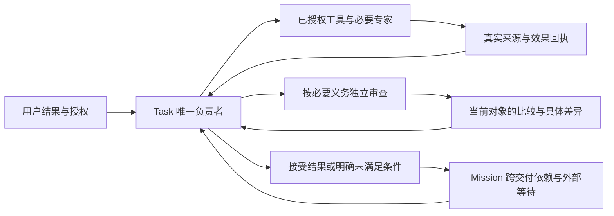

# Agent execution redesign: one accountable owner, evidence-based revision

状态：设计提案，尚未实施；不是当前架构事实，不宣称业务正确性或效率已达标。

## Recall

- 用户原话：“我要你从头思考，重新设计机制，理论上完备和高效”。此前要求参考其他产品，反对闭门造车、宽泛归因、不断补提示和以测试数量代替业务结果。
- 本轮交付：从基本约束推导一个完整执行机制，给出保证条件、反例、成本模型、与当前实现的替换关系及可证伪验收；不直接改生产代码，不发布版本。
- 现有 Harbor 四臂同十例保持冻结。28/40 时的局部结果不是新设计的验收，不混用旧运行、重抽模型或修改原分。
- 硬约束：业务语义由真实 agent 判断；Host 只管身份、权限、数据完整性、物理执行与恢复。复用 Task / Mission / Session、真实 Message / Tool 事实及 Artifact，不添加第二 ledger、业务路由状态机、隐藏消息或新审判角色。无委托。所有模型调用流式。
- 已读：AGENTS；当前 `03-control`、`task-control-plane`、`02-data` 的相关契约、`04-extensions`、平台及能力投影、项目记忆；Orchestrator / Mission 核心提示、dispatch schema / continuation projection、Mission completion schema；Harbor 完整登记及独立证据；OpenAI、Anthropic、Temporal 官方资料及固定 ZCode 调度源码。
- 搜索覆盖：创建和入站、控制 owner、包与工具投影、dispatch / continuation、证据读取、Task / Mission acceptance、取消与关闭、持久事实 / lease / recovery、包修订、Harbor queue。映射见下文。UI、发布、数据库迁移、模型切换、现有运行变更不属于本轮实现范围。
- 旧 M1–M6 清单和 G67 的“核心机制已修复”已被撤回，不作为本提案前提。当前正确职责已经存在，不能再次声称“无人被要求检查未知”。

## 1. 从目的推导，而不是从角色列表推导

用户需要的是：在授权范围内，使指定业务结果成立，并有足够证据解释它为何成立；遇到无法完成的部分，准确报告已完成效果、未满足条件和可继续条件。

最低必要工作只有四类：取得决定性信息、作出业务选择、执行必要效果、验证结果。调度、文件化计划、角色交接、报告归档都只是支持成本。它们只有在提供隔离、专业能力、持久性、并发或独立证据时才值得增加。

因此采用一个明确设计：**一个交付闭包一个负责者，一份原始义务来源，一个可追溯证据集合；按真实差异修订，按真实依赖并行。** 专家协作是负责者可使用的能力，不是每件事必须经过的层级。

“负责者”是现有包内承担该交付的 agent，被绑定到现有 Task 的唯一决策 Session；不是再增加一个 agent。需要专业分工时，其他现有包 agent 作为有边界的协作者进入。审查权限保持独立只读。Task 自始至终只有一个完成决定 owner。

## 2. 已证实的问题及其解释边界

| 证据 | 能确认什么 | 不能据此确认什么 |
| --- | --- | --- |
| 前五组 20 次：1,791 个逻辑模型活动，每例 46–143，中位 93；Orchestrator 239、Mission 328 | 31.7% 调用发生在协调身份；多层控制具有真实成本 | 不能把每次协调都算浪费，也不能假定换模型就解决 |
| Provider 活动区间在每个 trial 内合并后，占 Agent execution 阶段累计时间 89.1%；业务 API 平均每例约 35 秒 | 多轮模型往返是主要时间路径；这里包含模型、传输和重试等待 | 不是纯服务端推理计时，不是整个矩阵墙钟占比 |
| 自定义分组脚本逐 job `WaitForExit()`；前五组 28.0% 并发槽位时间空等 | 外层分组屏障浪费吞吐；原生 Harbor 队列已有并发信号量 | 不能用这个解释单个 Task 内的错误或全部长尾 |
| 第五组 MS：政策明示检查经理沟通，漏掉 Slack 延期；表头修复后仍接受错误逾期通知 | 续行实际存在，但反馈焦点未覆盖原始业务差异 | 不是缺少 review 指令或缺少 continuation |
| 第六组 TS / ME：初次找不到表，reviewer 找到真实源，原执行者续行完成缺失更新与邮件 | 同 Task 的具体反证反馈可以产生有效恢复 | 静态 Task 也恢复，不能归功于“自进化”标签 |
| 第四组缺少 Asana task GET；第五、六组 Sheets 表头行为与模型预期不一致 | 上游模拟器能力和业务验证方式确实影响收敛 | 不能把每个读失败都叫业务失败，也不能把成功回执扩成所有状态已验证 |

证据入口：[Harbor 登记与调查](2026-09-29-harbor-comparison-completion.md)；本机逐调用证据位于 `.tmp/harbor-factorial-20260929-protocol/independent-analysis-notes.md` 及注册的原生 trial 目录。上述是当前设计输入，不是完成的 40 次对照报告。

旧路径不能仅靠增加提示解决：当前 Orchestrator 已明示按原始义务、实质进展和具体反证决策，却同时被规定不得亲自产出、必须读参与者报告并重新发现/读取/选择 Artifact；Mission 又有一层 Task acceptance。正确原则与大量控制往返共存。问题需要在职责、信息传递和决定归属上收敛，而不只是重复正确原则。

## 3. 最小语义模型

以下是推理模型和现有记录的投影，不是新增数据库或业务状态机：

| 对象 | 含义与唯一来源 |
| --- | --- |
| `R` 原始请求 | 不可变用户 Message、附件及后续明确修订；委派是分配，不增加权限 |
| `O` 当前义务 | 从 R 和实际观察到的适用权威导出的结果、保留条件、必要验证；写在现有计划/交付 Artifact，保留出处 |
| `E` 证据 | 原始 Tool 输入、结果、错误及精确产物版本；带真实来源、范围、时间、因果关系 |
| `J` 判断 | 某 agent 对某义务和当前对象作出的比较；判断是可推翻的主张，不等于原始事实 |
| `U` 未解决部分 | 从 O、E、J 推导的未知、差异、外部等待；不保存另一份可变任务状态 |
| `X` 已发生效果 | 从现有写前请求与实际结果投影；包括错误效果、补偿、未知是否提交，不能只展示最终成功 |

完成关系为：每项当前必要义务都有适用证据支持、所有决定性反证已处理、已发生效果已结算，而且没有把未决义务悄悄删掉。Host 可以校验引用存在、版本与因果身份一致，不能证明自然语言 O 穷尽了 R，也不能判定业务比较必然正确。

义务变更只有两种合法来源：用户修订，或新读到的权威确实改变原任务的适用条件。实现者额外加一列、一个分类、一个证明 API，不能自行变成用户新增验收义务。额外变更若已造成副作用，则仍须如实结算其影响。

`unknown` 必须注明“哪个问题、哪个范围、已有哪些信息、缺少什么”。一次空查询不证明全局不存在；上游 agent 说未知也不建立约束。查明的事实、暂定解释和缺失信息分别表达。

一个更严格的判据是**可区分性**：若存在两个与现有证据相容的状态，一个满足必要命题、另一个不满足，就还不能据此接受该命题。下一次读取应区分这两个会改变决定的状态。实现中不枚举整个世界；负责者/审查者用一个具体反例说明“还缺什么证据”。例如，是否有批准延期会改变通知内容，必须调查；已提交回执证明的字段，不需要为一个未被要求的额外证明渠道无限搜索。

## 4. 单一负责者与最短执行路径



### Task

- 简单、同一权限域的交付直接由负责者读取、计算、执行和调用必要审查。去掉“纯调度 LLM → 完整执行 LLM → 纯调度 LLM”的强制中转。
- 技能、工具和包仍从既有单一 projection 授权；负责者不能借此获得原本未授权的工具。只读审查者不得得到写权限。
- 专业知识、上下文隔离或资源所有权确实需要分工时，再调用该精确专家。并行任务必须相互不消费尚未产生的决定/数据、不争写同一资源。
- 明确声明的独立审查和必要质量要求必须满足。减少控制层不等于取消审核，也不把多角色数量当审核质量。
- 每个调用的结果直接返回原 owner 的真实 Tool/result。一次结果包含下一决定所需的有限事实和精确引用；不能要求模型先搜索自己刚收到的产物才能知道它是什么。

### Mission

- 只管理一个长期结果下的交付边界、跨 Task 依赖、跨权限/包边界、外部事件和用户修订。一次明确交付不需要为了产品入口名称多套一个思考循环。
- Mission 接受 Task 的当前交付判断作为有来源的证明入口，检查自己的剩余跨交付义务及新的矛盾；不逐项重做 Task 已完成的相同比较。
- 实际新证据推翻 Task 结论时，仍通过现有 acceptance-resume / 同 Task 修复路径回到原 owner。不能把复用证明解释成永远信任子任务摘要。
- 等待状态由事件和既有 durable wake 管理。Agent 表达一次真实等待后释放执行资源；状态进度由已有事实投影供 UI 展示，不需要 Mission 每隔几轮问同样状态。

这是有意的架构替换：当前 Core 明令 Orchestrator 不生产任何交付，需与包 scheduler/worker 投影一起重设；不能只放宽一句 prompt 或偷偷暴露全部业务工具。具体 owner 绑定进入现有 Task 创建合同，不增加并行的主 agent 或另一套完成状态。

## 5. 证据一次采集，多方独立判断

独立性来自**独立的问题重建和比较**，不是不同名字，也不等于机械重复所有 API。

审查者直接获得：原请求、当前义务及出处、目标对象/版本、真实源与效果回执索引、发生过的错误/未决项。它可以读取同一不可变原始 Tool 结果，但不得把生产者摘要、计划或 PASS 当作源值。

| 所要证明的命题 | 最小有效证据 | 何时需要重新查询 |
| --- | --- | --- |
| 来源在 t 时刻的值、原来是否过载 | t 时刻实际原始读取，包含查询范围与分页完成情况 | 原记录不完整、来源变更、时效要求或新反证 |
| 同步 API 已提交某对象/效果 | API 契约、实际输入、完整成功回执、精确对象 | 回执只是 queued/preview、关键字段缺失、出现矛盾 |
| 当前状态仍满足条件 | 正确对象的当前读或接口明确保证的等价证据 | 必须按该时点重读；不能用旧回执代替 |
| 范围内没有其他对象或例外 | 对该命题足够的权威枚举/检索闭包、过滤/分页证据 | 狭窄关键词、未穷尽分页、新来源线索、负面主张有冲突 |
| 后续通知确实到指定目标 | 发送结果和身份/受众字段；需要送达时另用送达证据 | 不能把发送成功等同于收件人已读或现实效果 |

因此有效回执不会因一个并不存在的 GET 接口自动失效；反过来，字段存在和接口返回 200 也不会自动证明完整业务正确。证据适用范围必须与命题相同。

审查输出只需要：被比较的义务、当前观察、依据、结论、具体差异。原始事实引用已有 Tool / Artifact，不再强制生成“检查方法文档 → 重读方法文档 → 比较文档 → 再审批文档”的材料链。用户确实要求的报告照常产出。

修复后的复核覆盖 `受变更影响的义务闭包 + 保留条件 + 新反证`。仅在输入、外部状态或依赖没有变化的条件下复用原证明；不能把旧审查结果无条件背书新稿。

## 6. 纠错、探索与停止的统一规则

每次实质续行应在真实可见 guidance 中回答四件事：尚未满足哪项原义务；哪条原始证据显示差异；本次新操作能改变什么；哪些已有正确效果必须保留。没有新增可执行信息时，不把同义重问包装成新修复。

探索也需要明确问题和下一可用观察：先用原请求/真实权威给出的锚点，按实际接口读取；空结果只排除本次查询覆盖的范围。出现新锚点时才扩展相关查询，已解决事实不因“想更确定”反复发现。

| 当前事实 | 负责者的下一语义决定 | 物理运行义务 |
| --- | --- | --- |
| 有明确可修差异和合法操作 | 同 owner / 同 Task 精确修复；必要时续行原专家 | 沿现有 dispatch lineage 执行，保留前后回执 |
| 缺信息，但有未尝试的相关读路径 | 读取能区分候选解释的最小证据 | 独立读取可并行；不自动回放有副作用写入 |
| 权限/外部事件确实未到 | 显示缺口和确切恢复条件，进入等待或当前轮 blocked | 无常驻模型轮询；已有事件/Interaction 触发同实例恢复 |
| 操作已发出但结果未知 | 优先查明该效果是否发生 | 使用原 operation 身份，不能另发一笔“试试” |
| 原义务已满足，残余只是额外实现选择 | 处理额外变更的真实影响后结束，或明确它的限制 | 不生成新的强制需求维持运行 |
| 独立分支 A 被阻塞，B 可完成 | 继续 B，保留 A 未满足；整体不得假装全成功 | A 不占空闲 worker；不取消无关项目/Task |
| 用户修订或停止 | 以新输入修订或停止，记录已发生效果 | 当前 epoch/lease fence 阻止新写，旧已接受效果继续结算 |

“跳过”只能表示其他独立工作继续，不能把一个必要义务从完成条件中抹掉。业务未满足、运行器错误、操作结果未知和用户取消分别报告；不能都映射为一个失败或全都算 0 分。

## 7. 可以证明的保证，以及不能冒称的保证

### 机械安全性

沿现有 immutable facts + reducer + fenced lease：同一次输入只有一个 Task 身份，同一 scope 同时只有一个合法效果 owner，结果引用绑定精确对象与版本，旧 owner 不得提交新效果。状态只从事实投影。崩溃重启从未结算效果恢复，不从“最后一句话”重做业务。

外部 exactly-once（恰好一次）不能由本地数据库单独保证。只有外部接口支持稳定幂等键或可权威查询既有结果时，才能安全重试；否则未知结果必须保持未决。已有 `tool_part_request/outcome` 与 Provider request/outcome 保留，不重建第二日志。

### 控制完备性

每个开放执行都有三种去向之一：可执行工作、明确唤醒条件、明确未满足/需要外部处理。任何一个非终态若既无可运行 owner 又无唤醒来源，是可检查的运行时缺陷。已完成、取消及 blocked 后仍存在已接受副作用，则仍欠物理结算，不能因业务 verdict 清掉执行事实。

覆盖所有生产入口：Task API / CLI / Control / Channel、Mission 与 Scheduled Automation / Event；覆盖正常、取消、终态后查询、显式恢复、崩溃重启、多项目与并发副本。同一输入/occurrence 的承诺不得因入口不同而改变。

### 条件性业务可靠性

若原始义务完整、来源与时效真实、比较正确、执行回执符合接口语义，则完成判断是有根据的。这些语义前提必须由真实评测检验；结构合法不能证明它们。多个相同模型会共同漏读 Slack，添加 reviewer 不是数学正确性保证。

可保证的是把“完成”放在可反驳、可追溯的证据上，并定位哪个前提失败；不能保证任意开放世界中“永远找到所有关键事实”。

### 终止性与效率边界

设一次固定业务轮次的合法探索集合有限，已解决项只在相关来源/要求变化时重开，调度公平，外部操作按其有限恢复政策返回结果。在每步消耗尚未尝试的相关探索、解决一个差异，或进入带唤醒条件的等待时，可用有限剩余工作量证明该轮收敛。

证明义务必须显式成立：对固定授权/来源版本，令 T 为该轮有限的合法观察与效果转换集合，每个物理转换的允许尝试数由已接受政策给出；令 `ρ = Σ(t∈T) 剩余允许尝试数`。每个内部执行步消耗相应尝试；有实际新输入时才进入新的语义轮次。若业务策略每步都消费尚未完成的必要工作或进入有外部条件的等待，ρ 严格下降，内部执行不可能无限持续。该论证不授权人为给当前任务新设上限，也没有证明一个任意模型会自觉遵守有限 T。没有有限集合/有限政策时，只能保证运行时恢复和诚实状态，不能声称已经证明业务循环终止。

这不是对任意 LLM 的无条件证明：模型可以不断生成新问题，外部世界可以持续改变，必要修复也可能失败。在“无限探索、无有限资源边界、不可用 Host 判断业务进展”三个约束同时成立时，不能承诺固定时间内结束。

需要硬终止保证的部署必须由操作者在既有统一配置面显式选择有限执行政策；耗尽表示如实报告未完成，不表示任务做对。当前 benchmark 没有新增这类授权，本设计不设置、不启动任何新轮次/费用/总时长上限。已有物理重试、真正无活动、epoch 恢复边界保留。

不把一个“进度评分器”塞进 Host 判断是否值得继续。业务负责者说明继续依据，运行时只管其授权和事实完整性；无条件全局最优和无限期自主完成不是本提案承诺。

## 8. 效率设计与成本模型

```text
总成本 = 有用模型推理 + 必要独立核验 + 传输/持久化 + 协调往返 + 无效返工
墙钟下界 >= max(真实依赖关键路径, 总工作量 / 实际可用并发)
```

优化目标是降低“每个经独立证据接受的结果”的总成本和 P50/P95 延迟，同时控制漏判、误拒和副作用风险；不是单纯减少 token 或最大化官方得分。

- 明确任务的起步是负责者直接工作；不强制先经 Mission 再创建只负责派人的 LLM。
- 工具批次内，模型一次表达多个真正独立动作，Host 按已有执行/权限边界并行；后续依赖不能伪并行。成熟 API 有 batch 就用 batch，不新造一层领域执行 DSL（Domain-Specific Language，领域专用语言）。
- 上下文包含当前请求、必要约束、当前差异和证据定位；原始内容可直接按精确引用读取。历史摘要仅是索引，不覆盖原始权限或事实。
- 完整工具结果只存一次，跨 actor 共享精确只读引用；真实接收/读取在现有 Tool 中可见。复用数据不伪造一条“其他 agent 已替你读过”的消息。
- 未变化的事实不重新发现；已决定的权限不重新询问；已有明确结果不通过轮询 LLM 重新确认。
- 下一轮 benchmark 使用 Harbor 原生单队列承载注册的 case×arm，维持已授权并发上限，空位立即领取下一个注册槽位。配对与顺序通过预登记和分析保持，不再用全部等完的组屏障模拟控制。该变化不能追改当前运行。
- 实际 per-call token 用 provider-usage 逐行计算，assistant Message 可能累计多个模型活动，不能重复 join 放大；逻辑 activity、transport attempts、usage 与账单分别报告。

## 9. 自进化必须成为独立的离线假设检验

执行期纠错修的是这次业务结果；进化改变的是未来包行为。两者不共享“成功”的定义。

一个候选需要：来自真实失败的明确假设、有限修改面、原始对照、保持不变的资源/输入与评分、对未用于生成候选的保留案例检验、成本和副作用记录。正确率之外同时测误拒、漏判、有效纠错概率、完成时延及全成本。

生产者与审查者同时修改时，单次成功不能区分预防了错误还是审查纠正了错误。验证纠错能力需要预登记的固定失败产物与固定来源，让负责者/审查者面对同一问题；验证总体收益再做端到端对照。原事实、历史分数及已关闭任务不可重写。

候选不在运行中热替换既有 Task 的包。任务绑定保持不可变；候选通过声明的验收后才供新的 Task 使用。升级、回退和授权走现有 package lifecycle，不创建隐藏晋级器或第二配置面。

## 10. 与成熟实现的对应关系

| 已实际读取的一手资料 | 采用的原则 | 本项目不据此声称 |
| --- | --- | --- |
| [OpenAI Agents SDK：Orchestration and handoffs](https://developers.openai.com/api/docs/guides/agents/orchestration) | 先确定谁拥有最终回复/决定；有控制权转交与 manager 调用专家两种不同关系 | 不能把 SDK 模式当成本机 Codex 的内部实现，也不需要两种模式层层叠加 |
| [Anthropic：Building effective agents](https://www.anthropic.com/engineering/building-effective-agents) | 从最简单结构开始；额外结构以可测收益为理由，评价循环需要明确标准 | 不宣称简单结构必然更准确，不复制其中与本项目约束冲突的 Host 业务 gate |
| [Temporal：Activity Definition](https://docs.temporal.io/activity-definition) | 效果恢复依赖幂等性与真实结果；完成记录与外部执行次数不同 | 不安装第二 workflow engine，不承诺无幂等外部系统 exactly-once |
| [ZCode 固定提交的 AskScheduler](https://github.com/zai-org/ZCode/blob/29628c9acdb81b703bbd4080c207a0e7ce5e276e/apps/zcode-cli/packages/dynamic-workflow/src/engine/scheduler.ts) | 每 actor 顺序、独立 actor 并发、结果与历史复用有严格因果边界 | 不复制其独立 journal / synthetic 消息 / 默认轮次上限，不把它当已跑过本案例的证据 |
| 本机 Harbor 0.23.0 `harbor/trial/queue.py` | 原生队列持有并发 permit 与 trial 生命周期，不需要额外分组屏障 | 不自建评分、重试器或新的任务队列 |

这些资料校准机制选择；上面的义务/证据/停止模型、替换方案和验收都是针对本项目的设计推导。

## 11. 替换面与影响审计

| 现有唯一 owner / 实现 | 提议的处理与必须保留的边界 |
| --- | --- |
| `prompt/core/orchestrator-core.txt`、`orchestrator/agent.ts` | 把纯调度与生产者的强制认知分离替换为单一 Task 负责者；不添加并行 root；旧禁止生产职责与新投影同批删除 |
| `expert-squad/prompt-profile-resolver.ts`、runtime-template / tool-pool、package manifest 与 scheduler overlay | 一个固定包明确 lead 的工具和可委派成员；改统一 SDK schema / projection / 安装验证，保留权限交集和只读 review |
| `orchestrator/dispatch-agent-tool.ts`、`dispatch-turn-projection.ts`、`engine/agent-coordination-*` | 保留现有 lineage / initial / continuation，传明确差异与证据；收敛有效 schema 与模型可见输入，避免要求继承时又逼模型重复全文 |
| `read_agent_message` / Artifact reader / Task completion | 直接消费精确原始证据和必要产物；消除当前决策内的重复查找/注册链，不放宽跨 Task、版本、因果或秘密边界 |
| `prompt/core/mission-core.txt`、`mission/completion.ts`、acceptance ledger / resume | 只承担跨交付判断与新矛盾处理；现有 ledger 保留唯一身份来源，删去重复的逐项验收要求，不新增 acceptance registry |
| Task ingress / cancellation / Mission closure / SessionWake / Protocol | 复用现有事实归约、租约、幂等和唤醒；此次延迟数据没有证明需重写持久调度器 |
| Session context / compaction / Project memory | 提供有限当前上下文与可寻址原事实；记忆不是权限、当前外部状态或新的任务事实源 |
| Expert Squad evolution / immutable package binding | 离线候选与成对实验，当前任务不热换；删除被替换的提示契约，不保留新旧职责双路径 |
| Harbor generator / native job config | 下一登记采用单原生队列；当前 protocol 根及闭合历史只读 |
| API、SDK、Schema、docs、UI、release | owner projection 改动需一并公开契约更新；UI 只投影现有事实且手工验收；实现另行发布，不凭本文直接升级已有 DB |

主要风险：减少控制层后包工具权限是否扩大；复用证据是否过期；“差量复核”是否遗漏受影响义务；单 owner 是否成为大任务瓶颈；不可靠外部效果是否被误重试。每项都必须有对应正向验收，而不是以 prompt 字符串存在为通过。

## 12. 实施顺序与验收承诺

1. **先固定契约与反例。** 本文为可评审提案。把物理不变量与业务判断分开，用现有四臂的原始失败链审查本设计；完成下面的来源/状态/验收语义测试定义。不能先批量改所有提示。
2. **替换最小执行闭环。** 同批实现单 owner 的创建绑定、工具投影、真实结果直达、审查差异与同 lineage 修复；删除被替换的纯中转职责。同步 SDK/schema/docs，当前架构在真实实现验证后更新，不能仅因提案将它改成“已实现”。
3. **合并跨交付控制与恢复。** 接通 Mission 只读增量判断与事件等待，贯通全部入口、取消、崩溃、终态查询、多项目隔离；复用当前控制平面，不另造调度权威。
4. **先功能后收益。** 原 checker 验证真实调用/持久化/恢复；再独立预登记业务试验。完整记录旧失败与全部费用，不根据效果改题、换分母或选候选。

必要的正向行为验收：

| 场景 | 明确要观察到的结果 |
| --- | --- |
| 单一明确交付 | 原授权工具由唯一 owner 直接执行；完整原义务与实际效果一致 |
| Slack 批准延期与表中旧值冲突 | 当前适用延期进入比较，正确通知和任何必要补偿均有证据 |
| 缺失表定位后可恢复 | 独立来源证据反馈给原 owner，同 Task 完成缺失效果并复核 |
| 一次空查询与后来有效锚点 | 只收窄已查范围，后续合法路径真实读取并得出可解释结论 |
| API 只有同步完整回执，没有 GET | 按已声明接口语义接受该回执可证明的字段，同时明确剩余未证明命题 |
| 新增表头有误、原业务效果已完成 | 分别结算原义务与额外变更；最终状态如实体现残余影响 |
| 审查者改变版本/源值 | 旧比较的适用范围明确更新，受影响义务在新对象上重新验证 |
| 发送后进程丢失、结果未落盘 | 同 operation 幂等恢复或权威查询；不能查询时返回明确未决结果 |
| 并行子任务有一个等待外部输入 | 其他独立工作正常完成，等待项保留可唤醒来源和原义务 |
| 重启、取消、睡眠与多项目 | 现有真实 checker 证明唯一 owner、正确 fence、旧结果结算、同任务恢复及隔离 |
| 官方字面评分与语义差异 | 同时保留官方分和独立业务证据，明确二者含义 |

效率验收单独报告：总模型活动及控制层占比、真实数据/效果 API 次数、有效纠错成功数、误接受/误拒、P50/P95 墙钟、空闲槽位、cache-inclusive 输入及全部费用。无返工的简单任务应只有负责者和所要求的审查参与推理，不再有纯中转模型层；这种结构性降低可检查，但具体提速比例只能实测。

本轮只完成设计与文档校验。业务有效性、性能收益、生产入口改造及发布均尚未实施；不得以本文、图示或测试计划数量宣称已经解决。

## 本轮文档验证

- `bun run docs:check`：通过，342 operations / 25 groups。
- `bun run check:architecture-index`：通过，17 份当前架构文档与链接完整；本提案只进入月度记录，未伪装成当前架构。
- `git diff --check`：通过。没有运行模型、UI 自动化或更改原 benchmark 协议；设计交付不使用这些文档检查冒充业务验收。
